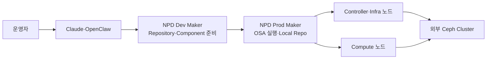
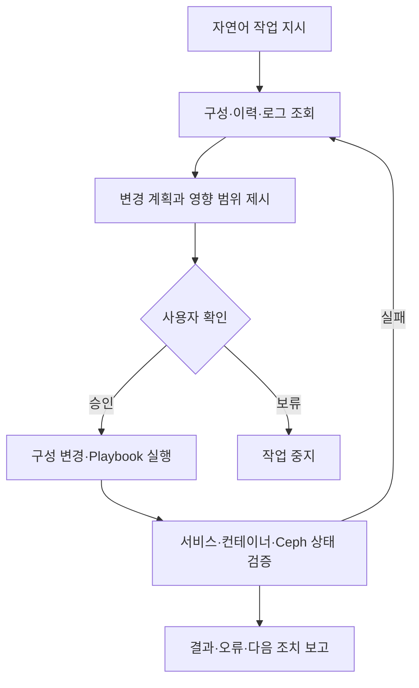

# Claude 기반 오프라인 OpenStack 자동 배포

## 프로젝트 목표

- 자연어 작업 지시를 통한 OpenStack 인프라 자동 배포 가능성 검증
- 개발 환경에서 검증한 Repository와 Component의 운영 배포 환경 이관
- 폐쇄망 OpenStack-Ansible과 외부 Ceph 연동 과정의 반복 장애 해소
- AI를 활용한 로그 분석·구성 변경·배포 재시도 시간 단축

## 적용 범위

- OpenStack-Ansible 기반 OpenStack Caracal 계열 배포
- Ceph Reef 계열 외부 스토리지 연동
- 로컬 Repository 기반 Air-Gap 설치
- 개발 Maker와 운영 Maker 사이의 산출물 이관
- OpenClaw를 통한 원격 명령 실행과 Claude 기반 분석

## 전체 배포 구조

- 개발 환경의 Ceph·Octavia Repository와 배포 Component 준비
- 검증 산출물의 운영 Maker 복사
- Office Network의 OpenClaw를 통한 운영 Maker 원격 작업
- 운영 Maker의 배포 상태 수집과 AI 분석

## AI 보조 배포 흐름

- 기존 구성과 실행 이력 확인 후 다음 작업 추론
- 변경 전 대상 파일·예상 영향·복구 방법 제시
- 위험 징후 발견 시 실행 중단과 원인 후보 보고
- 오류 로그 기반의 수정안 제시와 재실행

## 폐쇄망 배포 제약

- 인터넷 Repository 접근이 불가능한 Air-Gap 환경
- Canonical·PyPI·Container Image 의존성의 사전 확보 필요
- 패키지·Collection·Role·Image 버전 불일치 위험 존재
- OpenStack-Ansible과 Ceph-Ansible 사이의 변수 계약 차이 존재
- MON·OSD가 기존 운영 중인 외부 Ceph를 신규 배포 대상으로 오인할 위험 존재

## 사전 준비

### Repository 준비

- Ubuntu 패키지와 OpenStack-Ansible 의존 패키지의 로컬 미러 구성
- Python Wheel과 Ansible Collection의 버전 고정
- Container Image와 해시값의 사전 검증
- Ceph·Octavia 추가 Repository의 개발 환경 검증
- 운영 Maker 반입 전 파일 목록과 체크섬 비교

### 환경 정보 준비

- 노드별 관리·Storage·Tunnel·External 네트워크 정의
- Bridge와 Bond 인터페이스 연결 관계 명시
- Controller·Compute·Ceph 역할 분리
- 외부 Ceph FSID·MON 주소·Client Keyring 준비
- 배포 계정·SSH Key·권한·시간 동기화 확인

## 네트워크 설계 기준

| 용도 | 논리 연결 | 설계 기준 |
|---|---|---|
| Management | 관리 Bridge | OpenStack Control Plane과 SSH 접근 분리 |
| Ceph Public | Storage Bridge | MON·OSD 통신 경로 분리 |
| Ceph Cluster | Storage Cluster Bridge | OSD 복제 트래픽 분리 |
| Load Balancer Management | 전용 Bridge | Octavia Amphora 관리 경로 분리 |
| External | External Bridge | Provider Network와 외부망 연결 |

- 물리 NIC·Bond·Bridge·VLAN·Subnet의 단일 매트릭스 관리
- `user_variables`와 Inventory 사이의 인터페이스 명칭 일치 필요
- 배포 전 노드 간 MTU·Routing·DNS·NTP 확인 필요

## 주요 장애 사례

### 1. Ceph 사전 배포 차단

#### 증상

- OpenStack-Ansible 배포 과정에서 Ceph MON 또는 OSD 미존재 판정
- 이미 운영 중인 외부 Ceph를 신규 구성 대상으로 인식
- 존재하지 않는 장치 또는 컨테이너를 대상으로 한 검사 실패

#### 원인

- 배포 Role에 포함된 사전 검사와 실제 외부 Ceph 구성의 불일치
- OSD 장치명이 과거 구성과 다르게 남아 있는 상태
- 이전 실패 실행에서 생성된 임시 파일·Keyring·상태값 잔존

#### 조치

- 외부 Ceph 연동에 불필요한 신규 배포 Role 제거
- 실제 OSD 장치와 Inventory 정의의 재확인
- 실패 실행에서 남은 임시 상태의 제한적 정리
- 기존 Ceph 데이터 삭제를 방지하기 위한 장치별 확인 필요

### 2. Ceph MON 대기 무한 반복

#### 증상

- MON Endpoint 확인 단계의 반복 대기
- 배포 프로세스의 진행 정지와 장시간 Timeout
- 일부 MON은 실행 중이나 배포 도구가 미탐지

#### 원인

- FSID 값의 구성 파일 간 불일치
- 실행 중인 MON 목록 변수의 잘못된 덮어쓰기
- 실제 MON 주소와 자동 탐색 Endpoint의 불일치
- Messenger v1·v2 주소 형식의 혼용

#### 조치

- 단일 기준 파일에서 FSID·MON 주소 고정
- `running_mon` 변수의 초기화와 덮어쓰기 방지
- MON Endpoint의 명시적 지정
- Messenger Protocol v2 중심 주소 형식 통일
- MON 상태 조회와 접속 검증 후 다음 단계 진행

### 3. Ansible 변수 미정의

#### 증상

- `running_mon is not defined` 유형 오류 발생
- 노드별 Fact 수집 결과에 따른 조건부 실패
- 반복 실행 시 서로 다른 지점에서 오류 발생

#### 원인

- Role 내부 변수의 기본값 부재
- 일부 노드에서만 등록되는 변수의 공통 Task 참조
- 실패 후 재실행 과정의 Fact·Cache 불일치

#### 조치

- 변수 사용 전 `default` 값 적용
- Role Task의 조건과 대상 Host 재정의
- 수정 Role의 운영 반입 전 개발 환경 검증
- 패치 파일과 원본 버전의 추적 필요

### 4. 의존성 버전 충돌

#### 증상

- 동일 Playbook의 환경별 실행 결과 차이
- Collection·Python Library·Role API 차이로 인한 오류
- 폐쇄망에서 필요한 특정 버전의 추가 확보 곤란

#### 원인

- 온라인 최신 버전과 로컬 Repository 버전의 불일치
- 의존성 파일의 범위 지정으로 인한 비결정적 설치
- 검증되지 않은 Patch 또는 Fork의 혼합

#### 조치

- Release·Ansible·Collection·Python·Ceph 버전의 전체 고정
- 체크섬 기반 Repository 산출물 관리
- 개발 Maker와 운영 Maker의 동일 의존성 적용
- 버전 변경 시 전체 배포 재검증 필요

## 핵심 패치 원칙

### 설정 파일 고정

- FSID·MON 주소·Ceph Client 정보의 단일 기준화
- `ceph.conf` 자동 생성 결과와 외부 Ceph 실제값의 비교
- 배포 도중 기준 파일이 다시 생성되지 않도록 Workflow 제어
- 민감 Keyring의 별도 권한과 공개 문서 제외 필요

### Ansible Role 보완

- 외부 Ceph 환경에 맞지 않는 신규 클러스터 검사 제거
- MON Endpoint와 Protocol의 명시적 적용
- 미정의 변수에 대한 안전한 기본값 적용
- 수정된 Role·Task의 차이와 적용 이유 기록

## 권장 배포 순서

1. `setup-hosts` 계열 사전 구성 수행
2. Infrastructure 서비스 배포
3. 외부 Ceph 연동과 Client 구성
4. OpenStack 서비스 배포
5. Compute·Network·Storage 기능 검증

- Ceph 연동 전 OpenStack 전체 배포 실행 지양
- 단계별 성공 상태와 재시작 지점 기록
- 실패 단계만 재실행하기 전 선행 단계의 상태 확인

## 사전 점검 체크리스트

### 설정 파일

- `user_variables`의 네트워크·Ceph 변수 일치
- Inventory의 Hostname·IP·Container 역할 일치
- 외부 Ceph FSID·MON 주소·Client Keyring 일치
- Release와 Component Branch의 일치

### 패치

- 수정 Role과 Task 파일의 반입 여부 확인
- 패치 적용 대상 버전과 원본 해시 확인
- `running_mon` 기본값과 Endpoint 고정 적용
- 패치 제거 시 원복 파일 보존

### 인프라

- 모든 노드의 SSH·DNS·NTP 연결 확인
- Bridge·Bond·VLAN·MTU 연결 확인
- OSD 장치와 기존 데이터 존재 여부 확인
- 로컬 Repository의 패키지·Image·Wheel 접근 확인

## 표준 복구 절차

1. 실패 Playbook과 Task 이름 확인
2. 첫 번째 원인 오류와 후속 오류 분리
3. 대상 노드·파일·변수의 현재값 수집
4. AI 제안 내용과 실제 버전·구성의 일치 여부 검토
5. 최소 범위의 설정 또는 Role 수정
6. Syntax Check와 Dry Run 가능 범위 확인
7. 실패 단계 재실행
8. 서비스·컨테이너·Ceph 상태 재조회
9. 변경 사항과 재발 방지 조건 기록

## AI 사용 안전 기준

- AI가 제안한 명령의 대상 Host·Device·Path 사전 확인
- OSD 초기화·파일 삭제·DB 변경 등 파괴적 작업의 자동 실행 금지
- 실제 로그와 버전 정보를 제공한 뒤 수정안 생성
- 변경 전 Diff와 복구 절차의 사용자 확인 필요
- 실행 성공 문구보다 서비스 상태·API 응답·데이터 경로 검증 우선

## 성과

- AI를 통한 배포 이력 분석과 오류 후보 식별 시간 단축
- 반복 장애의 설정·Role·실행 순서 문제로의 구조화
- 폐쇄망 OpenStack-Ansible과 외부 Ceph 연동의 재현 가능한 절차 정리
- 개발 Maker 산출물의 운영 Maker 이관 방식 구체화

## 한계와 개선 방향

- 구독형 AI 사용에 따른 환경별 지식의 지속 학습 부재
- 내부 구성·로그의 외부 AI 전달에 대한 보안 검토 필요
- AI 제안 패치의 Release 변경 시 재검증 필요
- Local LLM을 통한 폐쇄망 내 분석·개발 지원 체계 연구 필요
- 배포 전 검증을 자동화하는 Preflight Script와 CI 적용 필요
- 검증된 Repository·Patch·Runbook의 버전별 패키징 필요
