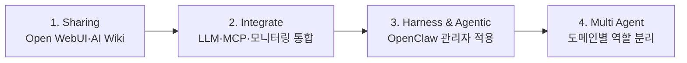
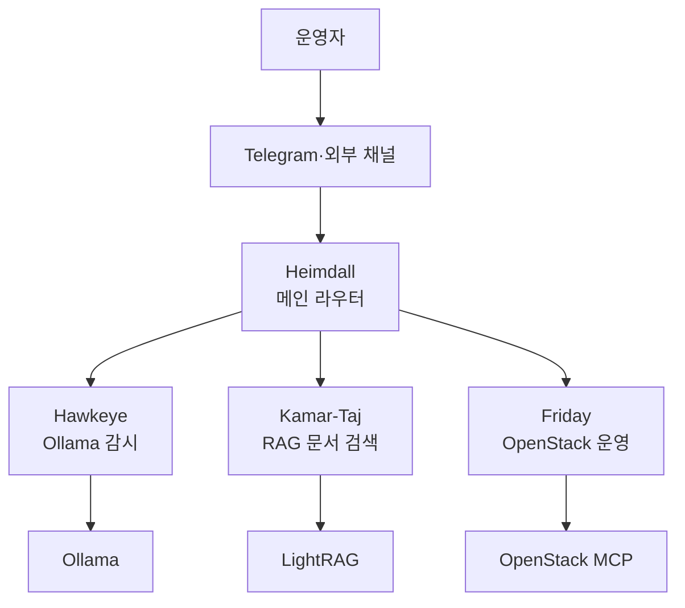

# GB10 기반 로컬 AI 서비스 통합

## 추진 배경

- NVIDIA GB10의 GPU·CPU 통합 메모리와 로컬 AI 실행 가능성 검토
- 개인별 LLM 사용, 사내 문서 검색, OpenStack 제어 기능의 단일 장비 실험
- 목적별 서비스 증가에 따른 실행 상태·모델·도구 관리 복잡성 발생
- 개별 서비스 공유에서 통합 관리와 에이전트 운영으로의 전환 필요

## 단계별 추진 흐름

- 서비스 공유, 통합 필요성 확인, 관리 에이전트 선정, 멀티 에이전트 확장의 순차 적용
- 단일 도구 도입보다 운영 과정에서 확인된 한계를 다음 단계의 요구사항으로 반영

## 1단계 · Open WebUI 기반 LLM 공유

### 구성

- 다수 사용자의 개인별 LLM 선택과 챗봇 사용을 위한 Open WebUI 적용
- Ollama 기반 복수 로컬 모델 연결
- Open WebUI Community와 사용자 정의 기능을 통한 MCP 확장
- 원격 서버 관리, 메트릭 조회, 파일 접근, OpenStack 제어용 MCP 연동

### 활용

- 사용자별 모델 선택과 대화 이력 분리
- 커뮤니티 MCP 탐색과 필요한 도구의 선택적 등록
- 자체 함수 코드 등록을 통한 업무별 기능 확장
- 자연어 요청을 MCP 도구 호출로 변환하는 실험 적용

### 확인된 한계

- 여러 사용자의 동시 모델 실행에 따른 응답 지연과 품질 편차 발생
- 단일 장비 자원 경합으로 인한 결과 신뢰도 저하 가능성
- 클러스터 구성과 고대역폭 노드 간 연결을 통한 자원 확장 검토 필요
- 커뮤니티 MCP의 권한·코드 품질·보안성에 대한 사전 검증 필요

## 1단계 · 사내 Wiki와 AI 검색 결합

### Custom Wiki v1

- 기존 Wiki 문서의 Markdown 내보내기와 청크 분할 적용
- 사용자가 선택한 LLM을 통한 대화형 문서 검색 적용
- OpenStack MCP 연동을 통한 VM·볼륨 등 자연어 제어 시제품 구현
- AI 검색과 원문 문서를 한 화면에서 제공하는 UX 검토

### Custom Wiki v1 한계

- 선택 모델에 따른 답변 품질과 표현의 일관성 부족
- 원본 문서의 추가·수정 주체와 승인 절차 부재
- AI 답변과 원본 본문의 화면 구성 최적화 필요
- 자연어 변경 작업에 대한 확인·검증 절차 보강 필요

### Custom Wiki v2

- OpenDeepWiki 기반 RAG 대화형 Wiki 적용
- 코드·Markdown·PDF 저장소의 자동 분석과 구조화 문서 생성
- 저장소 구조를 바탕으로 한 아키텍처 다이어그램 자동 생성
- 학습된 Wiki 범위 내 질의응답 기능 적용

### Custom Wiki v2 한계

- 모델별 문서 구조화 품질과 누락 범위의 편차 발생
- 자동 생성 문서와 원본 자료 사이의 정합성 확인 어려움
- 생성 결과를 원본으로 오인하지 않기 위한 검토 절차 필요
- 문서 출처·버전·학습 시점의 추적 체계 필요

## 2단계 · 로컬 AI 서비스 통합 관리

### 문제 인식

- 목적별 LLM·MCP·모니터링 서비스의 개별 실행과 종료 반복
- 서비스별 URL·모델·프로세스·도구 상태의 통합 현황 부재
- 특정 담당자의 기억과 수동 점검에 의존하는 운영 구조
- 장애 감지와 후속 조치의 일관된 실행 주체 필요

### 통합 방향

- GB10에서 실행되는 서비스·컴포넌트·LLM의 중앙 관리 체계 적용
- 서비스 맵을 통한 접속점과 역할의 단일 화면 정리
- 상태 감시와 문서 검색, 인프라 운영의 공통 진입점 구성
- 운영자 대신 반복 업무를 수행하는 관리자 에이전트 도입

## 3단계 · OpenClaw 관리자 에이전트 적용

### 선정 조건

- 기존 서버·서비스 구성과 팀의 운영 조건에 대한 지속적 이해 필요
- 서버 접속·관리 MCP를 포함한 Tool Calling 지원 필요
- Telegram 등 접근성이 높은 채널을 통한 작업 요청 필요
- 요청 의도 파악 후 적절한 도구를 선택하는 실행 능력 필요

### 모델 선정 과정

- 중형급 로컬 LLM의 메인 에이전트 적용 시도
- 일부 모델의 GB10 Blackwell·GGML·양자화 포맷 호환 문제 확인
- 한국어 응답 품질과 Tool Calling 능력 사이의 편차 확인
- 메인 모델의 Claude 적용과 서브 에이전트의 로컬 LLM 적용

### 모델 운영 원칙

- 모델 크기보다 GB10 호환성과 도구 호출 성공률 우선
- Blackwell 호환이 확인된 모델의 제한적 적용
- 로컬 모델 장애 시 외부 모델로 전환 가능한 대체 경로 필요
- 모델 교체 전 Tool Calling 템플릿과 실제 도구 실행 검증 필요

## 4단계 · 멀티 에이전트 역할 분리

### 역할 구성

- Heimdall의 사용자 요청 수신·의도 분류·전문 에이전트 위임
- Hawkeye의 Ollama 상태 감시·알림·주기 요약
- Kamar-Taj의 운영 문서 RAG 검색과 출처 기반 답변
- Friday의 복수 OpenStack 클러스터 조회·운영

### 위임 규칙

- 안내 문구만 반환하는 방식이 아닌 실제 `sessions_spawn` 호출 적용
- 전문 에이전트 결과의 원문 유지와 메인 에이전트 해석 최소화
- 에이전트별 허용 도구와 대상 시스템의 명시적 제한
- 호출 시간 초과와 응답 부재에 대한 실패 처리 필요

## 운영 절차

### 일상 점검

1. GB10 GPU·메모리·디스크 사용량 확인
2. Ollama 실행 모델과 API 응답 상태 확인
3. Open WebUI·RAG·OpenClaw 게이트웨이 상태 확인
4. MCP 연결 대상과 인증 상태 확인
5. 최근 오류·모델 종료·응답 지연 이력 확인

### 모델 추가

1. GB10·Ollama 버전과 모델 포맷 호환성 확인
2. 단일 질의 응답과 메모리 사용량 확인
3. Tool Calling 템플릿 지원 여부 확인
4. 읽기 전용 도구를 통한 호출 성공 검증
5. 제한된 에이전트에 우선 적용
6. 장애 시 기존 모델로 복귀 가능한 설정 보존

### AI Wiki 문서 반영

1. 원본 문서의 소유자·버전·공개 범위 확인
2. Markdown·PDF 등 지원 형식 변환
3. 청크 분할과 메타데이터 적용
4. 색인 완료 상태와 문서 수 확인
5. 대표 질문을 통한 검색 결과·출처 검증
6. 원본 불일치와 누락 내용의 별도 보완

## 검증 항목

| 검증 영역 | 확인 기준 |
|---|---|
| 동시 사용자 | 복수 모델 실행 시 응답 지연과 자원 경합 확인 |
| 모델 호환성 | 로딩·추론·Tool Calling 과정의 오류 부재 |
| RAG 정합성 | 답변 근거와 원본 문서의 일치 |
| MCP 안전성 | 허용된 대상·도구·권한만 호출 |
| 에이전트 위임 | 실제 서브 에이전트 호출과 결과 회수 |
| 장애 대응 | 모델·서비스 중단 시 감지와 대체 경로 동작 |

## 성과

- 단일 GB10에서 챗봇·Wiki·RAG·MCP·에이전트의 통합 가능성 확인
- 개별 AI 기능 실험에서 운영 관리자 중심 구조로의 발전
- OpenStack 운영과 Ollama 감시, 문서 검색의 역할 분리 적용
- 로컬 LLM 선택 시 성능 외 호환성·도구 호출·운영성의 중요성 확인

## 한계와 개선 방향

- 단일 GB10 사용에 따른 확장성과 고가용성 부재
- 로컬 모델별 GB10 호환성 및 Tool Calling 품질 편차 존재
- AI 생성 Wiki의 원본 정합성 자동 검증 체계 부재
- 민감정보·토큰·MCP 권한에 대한 중앙 보안정책 필요
- 모델·서비스·에이전트 상태를 통합한 운영 대시보드 보강 필요
- 다중 노드 클러스터와 모델 서빙 구조에 대한 추가 검증 필요
