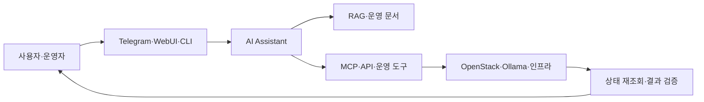

# AI Assistant

- GB10 기반 로컬 LLM·MCP·RAG 서비스의 실험과 통합
- Claude를 활용한 오프라인 OpenStack 자동 배포와 장애 복구
- OpenClaw 기반 역할 분리형 멀티 에이전트 운영 체계 적용
- 발표자료에 기록된 구성·시행착오·운영 기준 중심 재구성
- 계정·토큰·내부 주소 등 운영 민감정보의 공개 범위 제한 필요

## 프로젝트 구성

| 구분 | 핵심 주제 | 주요 기술 |
|---|---|---|
| GB10 로컬 AI 플랫폼 | 개별 AI 서비스의 공유·통합·에이전트화 | NVIDIA GB10, Ollama, Open WebUI, MCP, RAG, OpenClaw |
| Claude 기반 OpenStack 배포 | 폐쇄망 배포 자동화와 반복 장애 복구 | Claude, OpenStack-Ansible, Ceph, Ansible, Local Repository |
| OpenClaw 멀티 에이전트 | 도메인별 역할 분리와 안전한 운영 자동화 | Telegram, OpenClaw, LightRAG, MCPO, Ollama |

## 공통 설계 방향

- 자연어 요청과 실제 인프라 작업 사이의 도구 호출 계층 적용
- 조회 작업과 변경 작업의 권한·절차 분리
- 변경 전 계획, 사용자 확인, 실행 후 검증의 단계화
- 외부 AI와 로컬 LLM의 역할 및 장애 시 대체 경로 구분
- 모델 응답보다 API·상태 조회 결과를 우선하는 검증 원칙 적용

## 문서 읽는 순서

1. [GB10 기반 로컬 AI 서비스 통합](./gb10-local-ai-platform.md)
2. [Claude 기반 오프라인 OpenStack 자동 배포](./claude-openstack-deployment.md)
3. [OpenClaw 멀티 에이전트 운영](./openclaw-multi-agent-operations.md)
