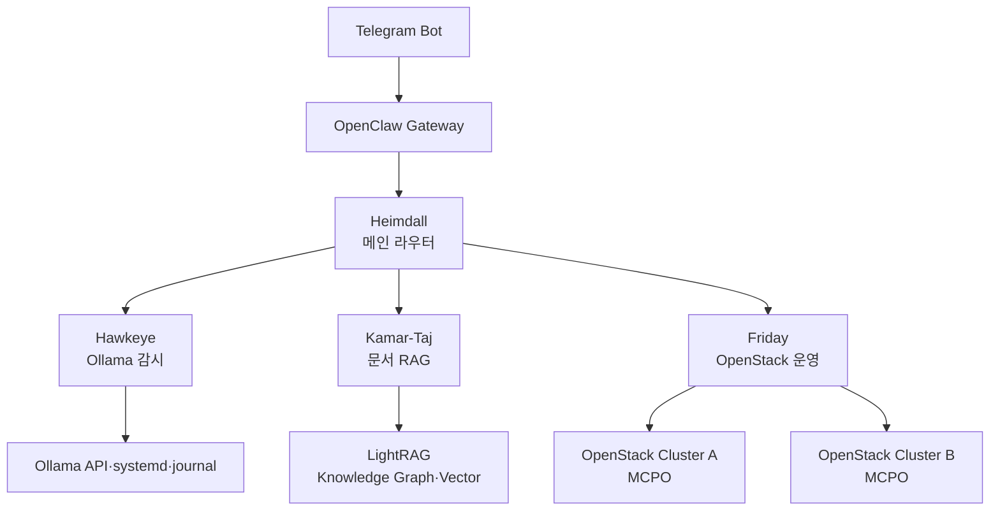
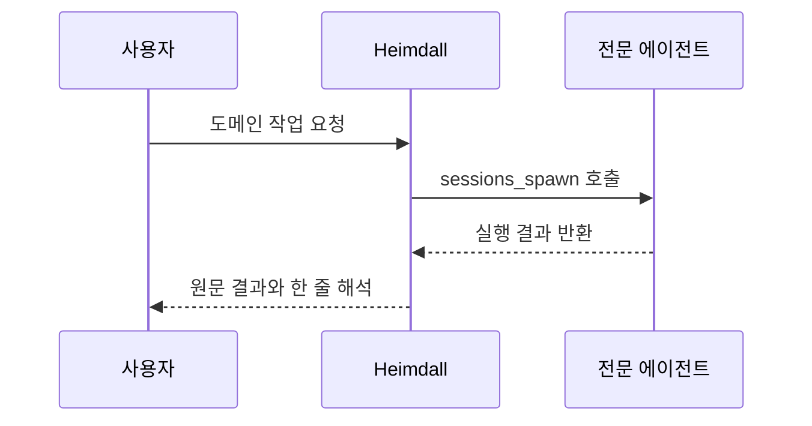
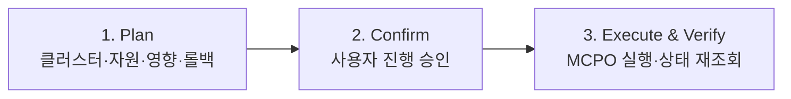

# OpenClaw 멀티 에이전트 운영

## 프로젝트 개요

- 단일 메인 에이전트를 4개 역할의 운영 시스템으로 확장
- Telegram Bot을 사용자 요청의 공통 진입점으로 적용
- Ollama 감시, 운영 문서 검색, OpenStack 운영의 전문 에이전트 분리
- 결정론적 감시와 LLM 기반 해석의 실행 경로 분리
- 변경 작업의 단계별 확인과 실행 후 검증 강제

## 핵심 구성

| 구성 요소 | 역할 |
|---|---|
| Telegram | 사용자 DM·그룹 요청 수신 |
| OpenClaw Gateway | 세션·라우팅·에이전트 실행 |
| Heimdall | 메인 라우터와 위임 |
| Hawkeye | Ollama 상태 감시 |
| Kamar-Taj | LightRAG 기반 운영 문서 Q&A |
| Friday | MCPO 기반 OpenStack 멀티 클러스터 운영 |

## 시스템 아키텍처

- Gateway와 메인 라우터를 통한 단일 요청 경로 적용
- 전문 에이전트별 Workspace·모델·도구·권한 분리
- OpenStack 클러스터별 MCPO Endpoint 분리
- 로컬 LLM과 외부 모델의 장애 대응용 Fallback 구성

## 에이전트별 역할

### Heimdall · 메인 라우터

- 모든 DM의 첫 응답과 요청 의도 분류
- 멘션·키워드 기반 전문 에이전트 선택
- `sessions_spawn`을 통한 실제 위임 실행
- 전문 에이전트 응답 원문과 최소 해석의 사용자 전달
- 허용되지 않은 요청의 WebUI 또는 운영자 절차 안내

### Hawkeye · Ollama 감시자

- 60초 간격의 결정론적 상태 프로브 적용
- Ollama API·실행 모델·Journal·메모리 상태 확인
- 즉시 알림, 주기 요약, On-demand Q&A의 3계층 구성
- 감시 대상 Ollama가 중단되어도 동작하는 비LLM 프로브 적용

### Kamar-Taj · 매뉴얼 사서

- OpenStack 운영 매뉴얼의 LightRAG 색인과 한국어 질의응답
- 답변 본문과 원본 문서 링크의 동시 제공
- 근거 미확인 시 원본 파일 미확인 상태 명시
- 신규 문서 등록의 계획·확인·실행·색인 검증 적용
- 삭제·재학습·그래프 변경의 직접 실행 제한

### Friday · OpenStack 운영자

- 복수 OpenStack 클러스터의 Compute·Volume·Network·Image·Identity 조회
- 클러스터별 MCPO Endpoint와 Backend 구분
- 조회 작업의 즉시 수행과 변경 작업의 3단계 승인 적용
- 변경 후 자원 상태 재조회와 결과 보고

## 요청 라우팅

| 요청 유형 | 담당 에이전트 | 대표 작업 |
|---|---|---|
| 일반 문의·도움말 | Heimdall | 의도 분류·위임 |
| Ollama 상태·메모리·모델 | Hawkeye | 상태 조회·알림 이력 |
| OpenStack 매뉴얼 | Kamar-Taj | RAG 검색·출처 제시 |
| 인스턴스·볼륨·네트워크 | Friday | 멀티 클러스터 조회·변경 |

- 사용자 멘션과 요청 내용의 이중 기준 적용
- 그룹 대화의 기존 Sticky Session 오라우팅 주의
- 라우팅 대상 부재 시 메인 에이전트의 임의 실행 제한

## 위임 패턴

### 필수 규칙

- 말로만 전달했다는 응답 금지
- 실제 `sessions_spawn` 호출과 결과 회수 필수
- 호출 대상의 허용 목록 등록 필수
- LLM 처리 시간을 고려한 명시적 Timeout 적용
- 응답 내용의 과도한 재가공 금지

### 실패 처리

- Timeout 시 호출 대상·요청·진행 상태의 명시
- 전문 에이전트 미등록 시 허용 목록 확인
- 반복 실패 시 메인 에이전트의 임의 대체 실행 금지
- 세션 로그와 Gateway File Log 확인 필요

## Hawkeye 감시 설계

### Layer 1 · 결정론적 프로브

- systemd timer 기반 60초 주기 실행
- Ollama Process·Model Tag·Journal 상태 수집
- 임계치 위반 시 정형 Telegram 알림 전송
- LLM 없이 실행되는 장애 독립성 적용

### Layer 2 · 시간 요약

- OpenClaw Cron 기반 1시간 요약
- 로컬 LLM을 통한 한국어 상태 요약
- 업무 시간대 중심 발송과 조용한 시간 생략
- 일정 기간 History 누적을 통한 변화 추적

### Layer 3 · On-demand Q&A

- Telegram 멘션 시 즉시 상태 보고
- 현재 모델·메모리 사용률·모델 종료 이력 제공
- 외부 모델 실패 시 로컬 모델 Fallback 적용

### 주요 임계치

- Ollama API 응답 부재의 즉시 장애 알림
- 가용 메모리 기준 미달의 경고
- 실행 모델 Eviction의 정보 알림
- Journal Error의 주요 메시지 알림

## Kamar-Taj 문서 운영

### 조회 흐름

1. 사용자 질문의 도메인과 키워드 확인
2. LightRAG Context 조회
3. 관련 Chunk·Entity·Relation 확인
4. 한국어 요약 답변 생성
5. 원본 문서 링크와 미확인 범위 표시

### 신규 문서 등록

1. 확장자·크기·중복 여부의 사전 확인
2. 사용자 승인 대기
3. 문서 Upload 실행
4. Track ID 기반 색인 상태 확인
5. Chunk 수와 Document ID 확인

- PDF·Markdown·DOCX·TXT 등 허용 형식 제한
- 대용량 파일의 사전 제한 적용
- 장시간 Polling으로 인한 Watchdog 종료 방지 필요
- 색인 완료 전 성공 판정 금지

## Friday 변경 작업 안전 절차

### Plan

- 대상 클러스터의 명시
- 인스턴스·볼륨·네트워크 등 자원 ID 명시
- 변경 영향 범위와 예상 결과 제시
- 실패 시 롤백 절차 제시

### Confirm

- 사용자의 명시적 진행 응답 대기
- 다른 입력 또는 Timeout 시 자동 취소
- DM·그룹별 Confirm Context 분리

### Execute & Verify

- 승인된 MCPO Tool만 실행
- API 응답과 자원 상태 재조회
- `active`·`ERROR` 등 최종 상태 확인
- 수행 결과와 변경 후 상태의 동시 보고

## 모델 선택과 Fallback

### 확인된 제약

- 일부 대형 모델의 GB10 Blackwell CUDA Assertion 발생
- 한국어 응답 성능과 Tool Calling 지원의 불일치
- 모델별 Ollama Template의 도구 정의 지원 차이
- 장시간 도구 호출 과정의 Watchdog Timeout 발생 가능성

### 적용 원칙

- 메인 라우팅과 변경 작업에 안정성이 검증된 모델 우선
- Ollama 감시 요약 등 제한된 역할에 로컬 모델 적용
- Fallback 모델의 Tool Calling 가능 여부 사전 검증
- 장애 모델의 자동 재선택보다 명시적 허용 목록 관리

## 운영 점검 명령 범위

- OpenClaw Gateway의 입출력 수와 최근 Update 상태 확인
- 에이전트 목록과 Binding 상태 확인
- Cron 등록과 최근 실행·전송 성공 여부 확인
- Gateway·감시 Timer의 서비스 상태 확인
- Gateway File Log의 실시간 오류 확인

## 반복 장애와 대응

| 구분 | 증상 | 대응 |
|---|---|---|
| CUDA | 특정 모델 로딩 중 Assertion | GB10 호환 확인 모델만 적용 |
| Tool Calling | 응답은 가능하나 도구 호출 불가 | 모델 Template의 Tool 지원 확인 |
| Telegram Polling | 외부 조회 시 Conflict | Gateway Polling 상태와 Offset 처리 확인 |
| Telegram Mention | 직접 입력한 멘션 미수신 | 자동완성 멘션 또는 Privacy 설정 확인 |
| OpenClaw Schema | 임의 필드 또는 Agent 경로 오류 | 허용 Schema와 Workspace 생성 확인 |
| Watchdog | 장시간 Polling 중 강제 종료 | 짧은 Polling 후 Track ID 반환 |
| Routing | 그룹 요청이 Main Session으로 고정 | Binding·Mention Pattern·Session Key 확인 |

## 운영 체크리스트

### 일일 확인

- Gateway·Timer·Cron의 정상 실행
- Ollama API와 실행 모델 상태
- LightRAG 색인 상태와 오류 문서 수
- MCPO Endpoint와 OpenStack 인증 상태
- 미완료 Confirm Session과 Timeout 상태

### 변경 전 확인

- 대상 Agent·Cluster·Resource ID 일치
- 요청자의 실행 권한 확인
- Plan과 Rollback 절차 작성
- 최근 Backup과 구성 변경 이력 확인
- 실행 후 확인할 상태 기준 정의

### 장애 시 확인

- Gateway File Log와 서비스 상태 확인
- Telegram 수신과 Session Routing 확인
- 전문 에이전트 직접 실행 가능 여부 확인
- 외부 모델과 로컬 Fallback 상태 확인
- 대상 API·MCP·MCPO의 독립 상태 확인

## 보안 개선 항목

- Gateway 인증 토큰과 Telegram Bot Token의 Secret Store 이관 필요
- 구 Token이 포함된 Backup 설정 파일의 보존 기간 제한 필요
- 팀원 DM 개방 범위와 사용자 허용 목록의 결정 필요
- 문서 Upload·OpenStack 변경 작업의 감사 로그 보존 필요
- Agent별 최소 권한 Tool Set과 Network 접근제어 필요

## 운영 개선 항목

- LightRAG 동시 처리·Rerank·한국어 요약 설정의 성능 검증 필요
- Ollama 업그레이드를 통한 GB10 CUDA 호환성 재검증 필요
- Telegram 첨부 파일의 안전한 자동 다운로드 Pipeline 필요
- Agent별 성공률·Timeout·Fallback 사용량의 지표화 필요
- Confirm Context의 사용자·대화방·작업 단위 격리 강화 필요

## 성과

- 하나의 Telegram 진입점에서 감시·문서 검색·인프라 운영 통합
- 도메인별 Agent·Model·Tool·권한의 역할 분리 적용
- 비LLM 감시를 통한 모델 장애 독립성 확보
- OpenStack 변경 작업의 계획·확인·실행·검증 절차 적용
- 멀티 에이전트 운영 과정에서 발생한 모델·라우팅·Watchdog 함정 체계화

## 한계

- 외부 모델 의존 시 폐쇄망 운영과 비용 통제 제약 존재
- 로컬 모델의 GB10 호환성과 Tool Calling 품질 편차 존재
- 토큰과 Backup 파일의 Secret 관리 미완료
- 팀 단위 사용자 권한과 감사 체계의 추가 설계 필요
- 발표자료 기준 일부 운영 수치와 모델 구성이 시점별로 상이하여 현재 상태 재확인 필요
