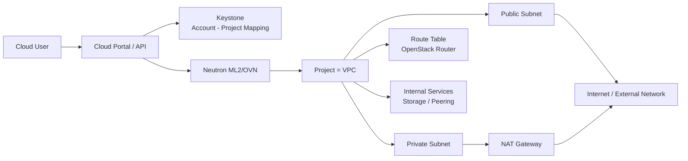
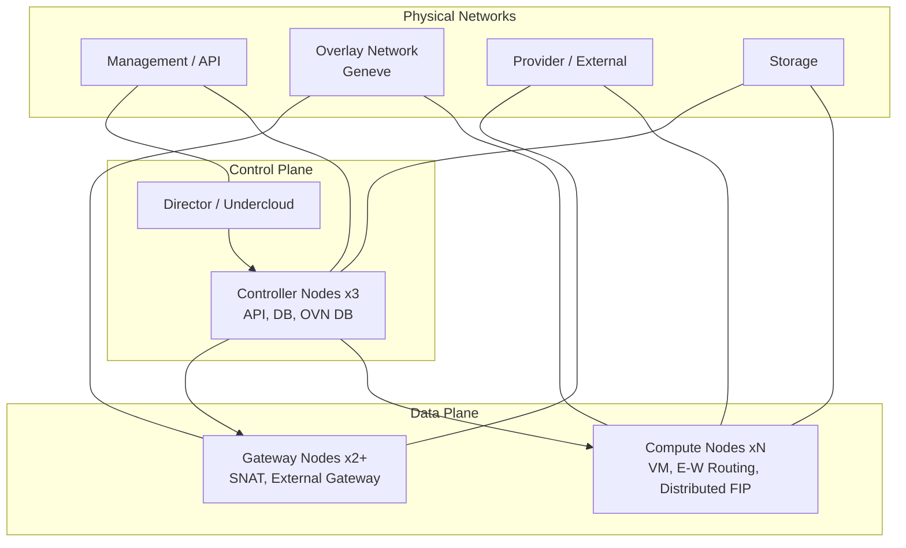
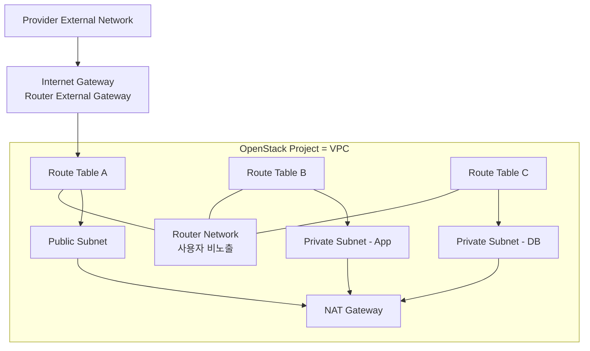

# 최종 아키텍처

1. **OpenStack Project를 VPC로 정의**
2. 사용자 네트워크는 **ML2/OVN 기반 Geneve Overlay**로 제공. 
3. East-West와 Floating IP는 Compute Node에서 분산 처리(DVR), 
4. 일반 SNAT은 전용 Gateway Node로 분리

## 시스템 컨텍스트

## 배포 구조

## VPC 내부 구조

## 설계 특성

### 분산처리 패킷

- 동일·다른 Subnet 간 East-West 라우팅
- Floating IP가 연결된 VM의 DNAT/SNAT
- Security Group Flow 적용

### 주요 트래픽 집중

- Private Subnet의 일반 SNAT
- External Gateway와 Provider Network 연결
- Gateway Chassis 우선순위와 HA

### 추상화필요 기능

- 1계정 당 N개의 Project(VPC) 매핑 기능 
- VPC CIDR와 Subnet 중복 검증 기능
- Router를 Route Table 등의 혼란방지 용어로 표현
- External Gateway와 같은 특정 용어를 범용적 용어로 표현
- 관리자 전용 Router Network와 NAT 자원 숨김 기능 
