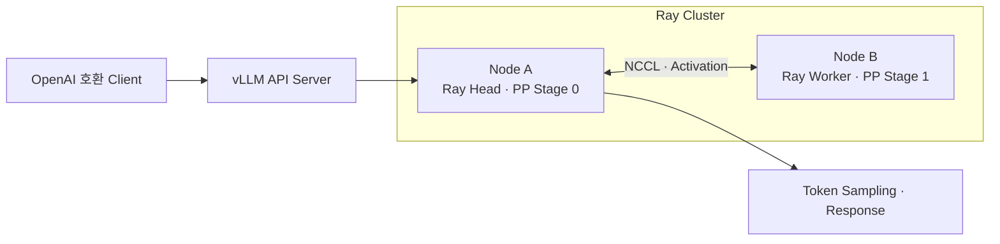
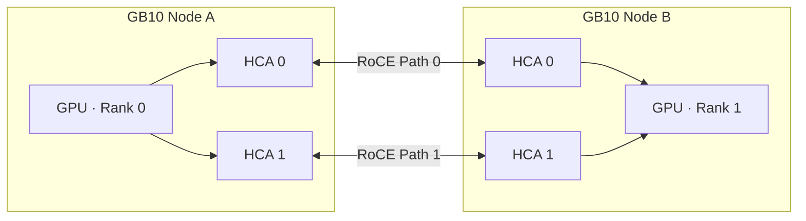
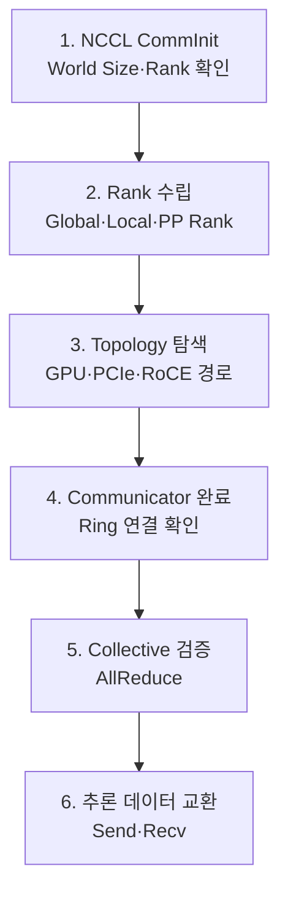
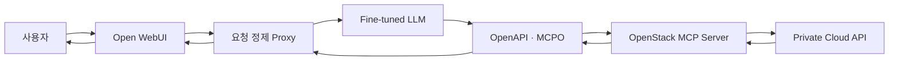

# 8. GB10 x 2 Node Cluster

- GB10 2개 노드를 연결한 분산 추론·학습 환경 구성
- 대형 언어 모델 적재를 위한 Pipeline Parallel 적용
- 듀얼 HCA와 RoCE 기반 노드 간 통신 경로 검증
- Ray·vLLM·DeepSpeed 기반 추론 및 파인튜닝 구성
- OpenStack MCP 연동을 통한 자연어 자원 제어 가능성 검증
- 원본 보고서의 주소·계정·호스트명·키 정보 제거

## 1. GB10 단일 노드 역량 분석

- ARM 기반 CPU와 Blackwell GPU의 통합 구성
- CPU·GPU가 공유하는 128GB 통합 메모리 적용
- 단일 노드에서 양자화 대형 모델을 적재할 수 있는 메모리 구조
- 운영체제·모델 가중치·KV Cache·CUDA 작업 공간의 동일 메모리 사용
- 대형 BF16 모델 전체 적재를 위한 단일 노드 메모리 여유 부재

## 2. 모델 선정 결과

- 한국어·코딩·장문 처리·Tool Calling 지원 여부 중심 검토
- Dense 모델의 높은 토큰당 연산량과 응답 지연 부담 확인
- Q4 양자화의 메모리 절감 효과와 품질 저하 가능성 확인
- 양자화 형식별 GB10 커널 및 vLLM 호환성 검증 필요
- 전체 모델 규모와 활성 파라미터를 분리하는 MoE 구조 선택
- 원본 BF16 품질과 vLLM 호환성을 우선한 모델 선정
- 2개 노드 분산 적재를 전제로 한 Qwen3-Next-80B-A3B-Instruct 적용

## 3. 병렬화 방식 선정 결과

| 구분 | Tensor Parallel | Pipeline Parallel |
|---|---|---|
| 분할 기준 | 레이어 내부 연산 분할 | 모델 레이어 구간 분할 |
| 실행 방식 | 여러 GPU의 동시 계산 | Stage별 순차 계산 |
| 통신 특성 | 레이어마다 결과 교환 | Stage 경계에서 Activation 전달 |
| 주요 장점 | 고속 연결 환경의 낮은 지연 | 낮은 통신 부담과 대형 모델 적재 |
| 주요 한계 | 노드 간 통신량 증가 | Pipeline 대기 구간 발생 |
| 적용 판단 | 단일 서버 다중 GPU에 적합 | 다중 노드·노드당 단일 GPU에 적합 |

- 노드당 GPU 1개인 물리 구성을 고려한 Pipeline Parallel 선택
- 모델 레이어를 2개 Stage로 분할하는 구조 적용
- 각 노드에 전체 모델 파일 저장 후 담당 Stage 가중치만 메모리 적재
- 노드 간 Stage 경계의 Activation 송수신 필요

## 4. 2개 노드 추론 구조

- Node A의 API·스케줄러·Ray Head 역할 적용
- Node A와 Node B의 Pipeline Stage 분담 적용
- Ray Actor 기반 분산 Worker 배치와 상태 관리 적용
- NCCL 기반 Rank 초기화와 Stage 간 데이터 교환 적용
- 한쪽 노드 또는 통신 경로 장애 시 전체 추론 중단 가능성 존재

## 5. 듀얼 HCA 네트워크 구성 결과

- 노드별 고속 HCA 2개 구성
- 관리 트래픽과 분산 연산 트래픽의 논리적 분리 적용
- HCA별 독립 RoCE 경로 적용
- SSH·OpenMPI 제어 경로와 NCCL 데이터 경로 구분
- NCCL에서 2개 HCA를 병렬 사용하도록 인터페이스 바인딩 적용
- 실제 주소·인터페이스명·호스트명은 공개 문서에서 제거

## 6. 네트워크 성능 검증 결과

| 검증 항목 | 실측 범위 | 판단 |
|---|---:|---|
| OpenMPI·단일 HCA | 88.0~102.4 Gbps | 단일 경로 성능 확인 |
| OpenMPI·듀얼 HCA | 168.0~185.1 Gbps | 병렬 경로 성능 향상 확인 |
| 클러스터 구성 도구 | 186.32 Gbps | 180 Gbps 이상 기준 충족 |
| 물리 링크 기준 | 200 Gbps | 이론상 최대값 |

- 단일 HCA 대비 듀얼 HCA의 유효 대역폭 증가 확인
- 듀얼 HCA에서 물리 링크 기준 84.0~92.5% 수준 확인
- 구성 도구 검증에서 물리 링크 기준 93.2% 수준 확인
- 워크로드 크기·통신 패턴·프로토콜 오버헤드에 따른 편차 존재
- 추론 처리량과 네트워크 대역폭 간 상관관계의 추가 검증 필요

## 7. NCCL 집합 통신 분석 결과

- 2개 노드의 Global Rank 0·1 구성
- 노드당 GPU 1개 구성에 따른 Local Rank 0 적용
- Communicator 생성 시 전체 Rank 수와 장치 매핑 확인
- Tree 방식의 단계적 집계·Broadcast 구조 확인
- Ring 방식의 인접 Rank 순환·누적 구조 확인
- 단일 GPU 노드 간에도 결과 교환을 위한 NCCL 필요
- Pipeline Stage 사이 Activation 전달을 위한 Send·Recv 동작 확인

## 8. NCCL 로그 분석 결과

- 양쪽 Rank의 NCCL 초기화 시작과 Out-of-band 연결 확인
- Process 관점 GPU와 물리 GPU 인덱스의 동일 매핑 확인
- HCA·PCIe·RoCE 장치의 Topology 등록 확인
- Ring 연결과 Communicator 초기화 완료 확인
- AllReduce 실행 구간과 Rank 간 데이터 교환 확인
- 모델 출력 직전 Pipeline 데이터 Send·Recv 동작 확인
- 운영 환경에서는 로그의 호스트명·장치 식별자 정제 필요

## 9. Ray·vLLM 서빙 분석 결과

- OpenAI 호환 API 서버를 통한 추론 요청 수신 적용
- Ray Head의 Worker 검색·스케줄링·상태 관리 적용
- vLLM Ray Distributed Executor 기반 분산 실행 적용
- Tokenizer·Sampler·KV Cache 관리의 Engine Core 통합
- Pipeline Stage별 모델 가중치와 실행 데이터 분리
- Ray와 vLLM 프로세스의 시작·종료 순서 표준화 필요
- GPU·CUDA·PyTorch·vLLM 버전 호환성 사전 검증 필요

## 10. 분산 파인튜닝 구성 결과

- Ray Train과 DeepSpeed를 결합한 2개 노드 학습 구성
- Ray Head의 Placement Group 기반 Worker 배치 적용
- 노드별 Train Worker와 DeepSpeed Engine 실행 적용
- LoRA 방식으로 학습 대상 파라미터 범위 축소
- Dataset 준비·Adapter 적용·학습·병합의 단계 구성
- 장애 발생 시 Checkpoint 기반 재시작 체계 필요

## 11. OpenStack 특화 데이터셋 분석 결과

- 자연어 기반 OpenStack 자원 제어의 적용 가능성 검증 목적
- Instance·Volume의 생성 및 삭제 요청 중심 구성
- 필수 요청 필드와 값 추출을 위한 학습 데이터 적용
- 누락 필드·지원하지 않는 동작·복합 요청·자원 부재 오류 유형 적용
- 생성·삭제·오류 처리 시나리오를 포함한 약 3천 건 규모 구성
- 제한된 전문 업무에서 8B급 모델의 함수 호출 정확도 검증 필요
- 실제 환경 정보와 자격 증명이 포함되지 않는 합성 데이터 원칙 필요

## 12. 모델 병합·배포 형식 분석 결과

- Base Model과 LoRA Adapter의 병합 적용
- 별도 Adapter 없이 사용할 수 있는 단일 모델 산출
- Hugging Face 형식에서 GGUF 형식으로 변환 적용
- 경량 서빙 환경과의 호환성을 고려한 llama-server 적용
- 변환 전후 정확도·응답 형식·Tool Calling 회귀 검증 필요
- 양자화 수준별 품질과 메모리 사용량 비교 필요

## 13. OpenStack MCP 서비스 구성 결과

- Open WebUI·Local LLM·MCPO·MCP Server·Private Cloud API 연계
- 모델의 Tool Schema 분석과 함수 호출 결과 반환 적용
- 최근 요청만 모델에 전달하는 Single-turn 변환 Proxy 적용
- Schema 검증 후 MCP 호출과 최종 응답 조합 적용
- 실행 전 권한 확인·입력 검증·감사 로그 적용 필요
- 삭제·변경 작업에 대한 사용자 승인 절차 필요

## 14. 파인튜닝 한계 분석 결과

### 파괴적 망각

- 특정 도메인과 응답 형식에 집중된 소규모 데이터셋 적용
- 기존 언어·추론·함수 호출 능력의 저하 가능성 존재
- 반복 샘플 암기에 따른 과적합 가능성 존재
- 범용 데이터 혼합·학습률 조정·정기 회귀 평가 필요

### Multi-turn 응답 누락

- Single-turn 학습 모델에 전체 대화 이력 전달 시 입력 구조 불일치 발생
- 학습하지 않은 Multi-turn Context에서 조기 종료 가능성 존재
- 최근 사용자 요청 중심의 입력 재구성 적용
- 대화 이력 요약과 Tool 결과의 별도 상태 관리 필요

## 15. 서비스 검증 결과

- 정상 요청에서 인스턴스 생성 필드 추출 확인
- 지정된 Tool 호출과 OpenStack 자원 생성 결과 확인
- 존재하지 않는 자원 요청에서 오류 코드 매칭 확인
- 오류 발생 시 임의 대체 자원을 생성하지 않는 동작 확인
- 제한된 사례 중심의 기능 검증으로 전체 정확도 판단 근거 부재
- 반복 평가·부정 요청·권한 우회·복합 요청 검증 필요

## 16. 적용 결론

- GB10 2개 노드의 Pipeline Parallel 기반 대형 모델 추론 가능성 확인
- 듀얼 HCA 병렬화에 따른 노드 간 통신 대역폭 향상 확인
- Ray·vLLM·NCCL의 분산 추론 경로와 로그 기반 동작 확인
- Ray Train·DeepSpeed·LoRA 기반 OpenStack 특화 학습 흐름 적용
- MCP를 통한 자연어 기반 Private Cloud 제어 가능성 확인
- 모델 품질·다중 대화·안전한 실행 통제를 위한 추가 검증 필요
- 운영 적용 전 장애 복구·권한 분리·감사·성능 기준의 표준화 필요
