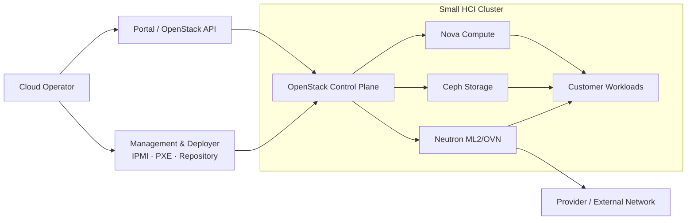
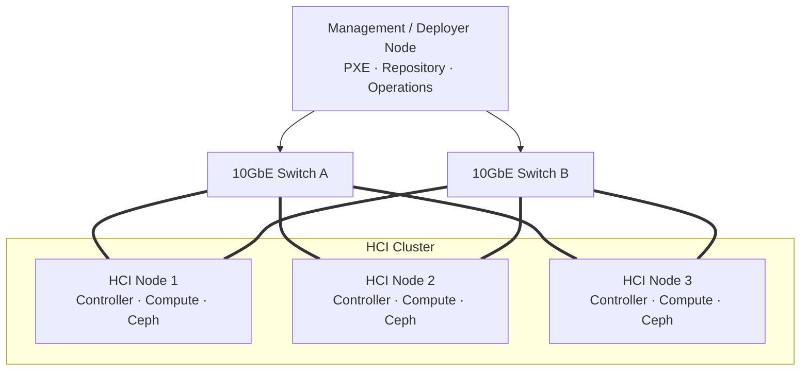
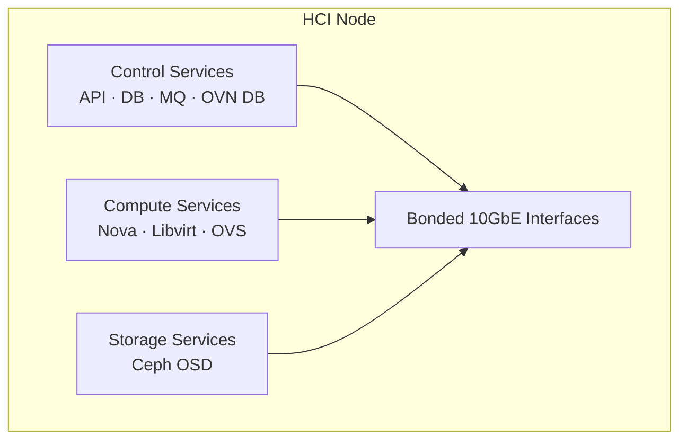

# 최종 아키텍처

최종 구조는 **관리·배포 노드 1대와 HCI 노드 3대**로 시작합니다. HCI 노드는 OpenStack Controller, Compute, Ceph 역할을 함께 수행하고, 관리 노드는 설치와 운영 기능을 분리합니다.

## 시스템 컨텍스트

## 물리 배포 구조

## HCI 노드 내부 역할

## 역할 통합의 의미

### 얻는 것

- 4대 규모로 상용 OpenStack과 분산 스토리지 구성
- 동일 노드 증설로 컴퓨트와 스토리지 용량을 함께 확장
- 표준 랙 구성 대비 공간과 초기 장비 수 절감

### 감수하는 것

- VM, Control Plane, Ceph가 CPU·메모리·NIC를 공유
- 노드 장애 시 컴퓨트와 스토리지 용량이 동시에 감소
- Ceph Recovery가 API와 VM 트래픽에 영향을 줄 가능성
- 대규모 확장 시 역할 분리형 상품으로 전환 필요

