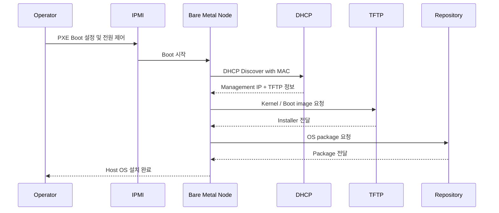
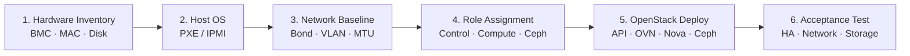

# 배포 흐름

## 배포 구성 요소

| 구성 요소 | 역할 |
| --- | --- |
| IPMI | 전원, 원격 콘솔, 일회성 설치 미디어 제어 |
| DHCP | MAC 주소 기반 관리 IP와 Boot 정보 전달 |
| TFTP | PXE Kernel과 초기 Boot 이미지 제공 |
| Repository | 운영체제와 플랫폼 패키지 제공 |
| Deployer | 노드 인벤토리, 역할, 네트워크, OpenStack 배포 관리 |

## PXE 기반 운영체제 설치

## HCI 플랫폼 배포

## IPMI 직접 설치가 필요한 경우

- PXE를 지원하지 않는 운영체제 또는 장비
- 고객이 요청한 일회성 특수 이미지
- PXE 서비스 장애 시 복구 설치
- 초기 PoC 단계에서 자동화 전 하드웨어 검증

상품의 기본 절차는 PXE로 통일하고, IPMI 직접 설치는 예외 절차로 관리합니다.

## 표준화해야 할 입력값

- 노드별 BMC 주소와 계정 관리 방식
- NIC 이름, MAC 주소, Bonding 대상
- 디스크 역할과 Ceph Device Class
- 논리 네트워크, MTU, VLAN 범위
- Controller·Compute·Gateway·Ceph 역할
- 설치 후 기능·성능·장애 Acceptance 기준

