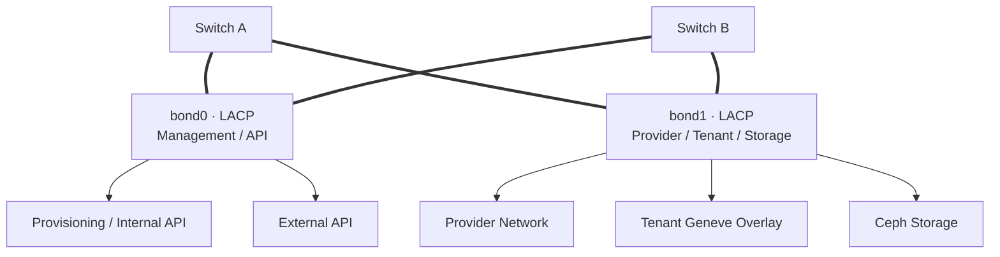
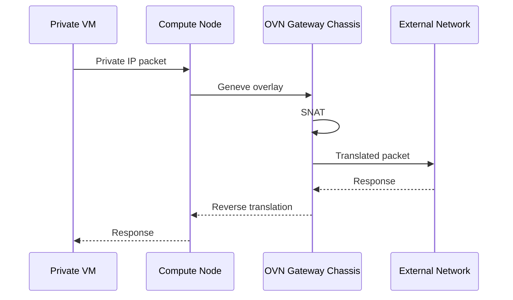
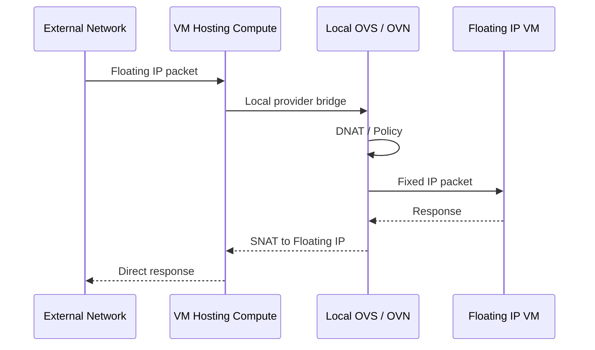

# 네트워크 설계

## 논리 네트워크 분류

| 네트워크 | 목적 | 트래픽 특성 |
| --- | --- | --- |
| Provisioning / Internal API | 설치, 노드 관리, OpenStack 내부 API | 관리 |
| External API | Horizon, CLI, 외부 연계 | 서비스 |
| Provider | VM North-South 통신 | 데이터 |
| Tenant | Geneve 기반 VM East-West 통신 | 데이터 |
| Storage | Ceph Client 및 Replication | 스토리지 |

실제 주소와 VLAN ID는 환경별 설계 값이므로 포트폴리오에서는 제외합니다.

## 물리·논리 매핑

10GbE 환경에서는 단순 VLAN 분리만으로 대역폭이 보장되지 않습니다. Ceph Recovery, VM 외부 통신, Live Migration이 겹치는 상황을 기준으로 QoS 또는 별도 NIC 확장 여부를 결정해야 합니다.

## 일반 SNAT 흐름

## Floating IP 흐름

Floating IP는 VM이 위치한 Compute Node에서 분산 처리해 Gateway 경유를 줄이고, 일반 SNAT은 Gateway Chassis에서 처리합니다.

## 주요 위험

- 두 물리 NIC 또는 스위치 장애 조합에 따른 Bonding 복구 시간
- Ceph와 Provider 트래픽 경쟁으로 인한 지연 증가
- 3노드 중 Gateway Chassis 장애 시 North-South 경로 전환
- MTU 불일치로 인한 Geneve Overlay 단편화

