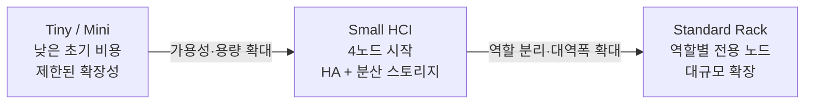
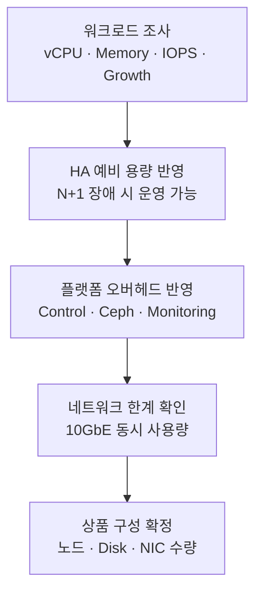

# 상품 라인업

## 포지셔닝

Small HCI는 가장 작은 제품을 대체하는 모델이 아니라, **상용 워크로드를 운영해야 하지만 표준 랙 구성이 과도한 고객**을 위한 중간 상품입니다.

## 기준 구성

| 구성 요소 | 기준 |
| --- | --- |
| 관리·배포 노드 | IPMI 연동, PXE, Repository, 운영 도구 |
| HCI 노드 | Controller + Compute + Ceph 역할 통합, 3대 이상 |
| 서버 | 1U, 듀얼 소켓, 메모리·디스크·NIC 확장 가능 모델 |
| 네트워크 | 10GbE 기반, LACP와 VLAN Tagging 지원 |
| 스토리지 | 로컬 SSD를 Ceph로 묶어 Block 중심의 분산 스토리지 제공 |
| 가상 네트워크 | ML2/OVN, Geneve Overlay, DVR |

## 용량 산정 원칙

정확한 VM 수는 CPU Overcommit만으로 결정하지 않습니다.

### 반드시 확보할 예비 자원

- HCI 노드 1대 장애 시에도 핵심 VM을 운영할 컴퓨트 여유
- Ceph Recovery 중 성능 저하를 감당할 스토리지·네트워크 여유
- Controller와 데이터베이스가 사용할 CPU·메모리 예약
- 백업, 모니터링, 로그 보관에 필요한 운영 자원

:::warning 공개 전 확인
상용 SKU별 정확한 VM 수, 장비 가격, 디스크 수량과 Overcommit 정책은 내부 상품 정보가 될 수 있으므로 공개 범위를 별도로 확인해야 합니다.
:::

