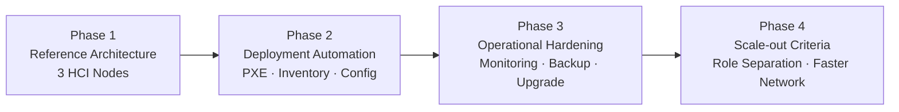

# 성과와 로드맵

## 설계 성과

- 기존 소형 제품과 표준 랙 상품 사이의 목표 고객 구간 정의
- 관리 노드 1대와 HCI 노드 3대로 시작하는 참조 구성 수립
- Controller·Compute·Ceph 통합 배치와 확장 원칙 정의
- 10GbE, LACP, OVN, Geneve 기반 네트워크 구조 정리
- IPMI·PXE 기반 반복 구축 절차와 예외 설치 방식 구분

## 포트폴리오에서 강조할 역량

### 상품 관점

- 기술 스펙을 나열하는 대신 기존 라인업의 공백과 목표 고객을 먼저 정의
- 초기 비용, 가용성, 확장성의 균형점을 상품 기준으로 변환

### 아키텍처 관점

- 제한된 노드에서 Control, Compute, Storage 역할을 통합
- OVN 데이터 플레인과 Ceph 트래픽이 공유 자원을 사용하는 위험 식별
- 상품 성장에 따라 HCI에서 역할 분리형 구조로 전환하는 기준 제시

### 운영 관점

- 하드웨어 인벤토리부터 Acceptance Test까지 배포 절차 표준화
- 설계 근거와 미검증 항목을 분리해 후속 검증의 우선순위 제공

## 단계별 로드맵

### Phase 1. 참조 모델 검증

- 하드웨어 호환성과 기본 OpenStack·Ceph 기능 확인
- 네트워크 MTU, Bonding, VLAN 기준 확정
- 장애 및 성능 합격 기준 수립

### Phase 2. 배포 자동화

- 노드 인벤토리와 네트워크 입력값 표준화
- Host OS와 OpenStack 배포 자동화
- 설치 후 자동 Acceptance Test 연결

### Phase 3. 운영 고도화

- 모니터링, 로그, 백업, 용량 예측 기준 추가
- 무중단 또는 최소 중단 업그레이드 절차 검증
- Ceph Recovery와 VM 부하가 겹치는 상황 튜닝

### Phase 4. 상위 상품 전환

- 25GbE 이상 네트워크 옵션 검토
- Controller, Compute, Storage 역할 분리 기준 수립
- 표준 랙 상품으로 확장·이관하는 절차 제공

