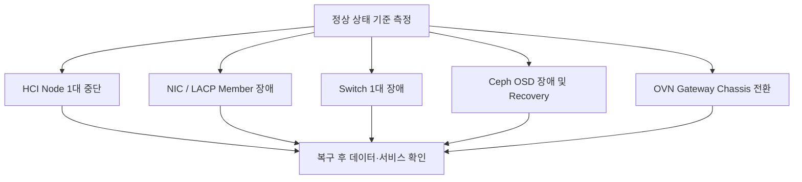

# 검증 계획

:::warning 근거 범위
원본 설계서에는 검증 시나리오와 일부 운영 명령이 포함되어 있지만, 합격 기준과 정량 결과는 충분하지 않습니다. 따라서 이 문서는 완료된 성능을 주장하지 않고 **검증해야 할 항목과 현재 근거 수준**을 구분합니다.
:::

## 근거 상태

| 항목 | 설계서 근거 | 공개 포트폴리오 상태 |
| --- | --- | --- |
| 3노드 Control Plane | 구성도와 역할 정의 | 설계 확인 |
| OVN·Geneve·DVR | 아키텍처와 트래픽 흐름 | 설계 확인 |
| PXE·IPMI 설치 | 절차와 구성 요소 | 절차 확인 |
| 처리량·IOPS | 정량 결과 없음 | 추가 결과 자료 필요 |
| 노드 장애 복구 | 상세 결과 없음 | 추가 결과 자료 필요 |
| 장기 안정성 | 결과 없음 | 추가 검증 필요 |

## 기능 검증

- OpenStack API, Horizon, 인증, 이미지, VM 생성
- Block Volume 생성·연결·삭제와 Ceph 상태 확인
- 동일·다른 Tenant Network 간 통신
- SNAT, Floating IP, Security Group 동작
- 노드 추가와 HCI 역할 배포
- PXE 재설치와 인벤토리 재등록

## 성능 검증

| 대상 | 주요 지표 | 부하 조건 |
| --- | --- | --- |
| Compute | CPU Ready, Memory Pressure | 정상 및 노드 1대 장애 |
| Storage | IOPS, Throughput, Latency | 정상, Recovery, Degraded |
| Network | East-West, SNAT, FIP 처리량 | VM 수와 동시 세션 증가 |
| Control Plane | API 응답 시간, DB·MQ 부하 | 병렬 Provisioning |

## 가용성 검증

## 추가로 필요한 증적

- 테스트 환경의 서버·NIC·디스크 사양
- Overcommit과 Ceph Replica 정책
- 각 시험의 합격 기준과 실제 측정값
- 장애 발생부터 서비스 정상화까지의 시간
- 최소 72시간 이상의 안정성 시험 결과

