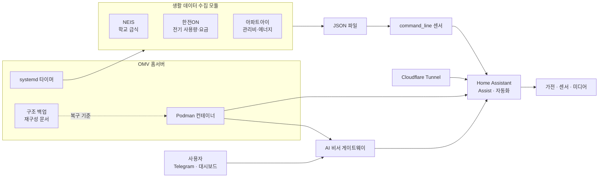
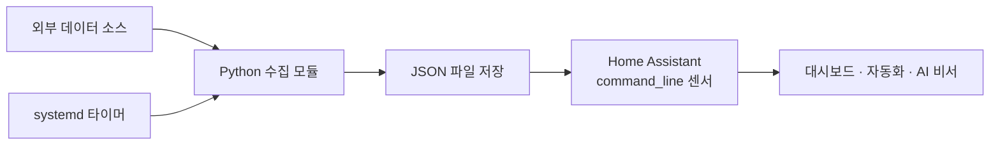

# Home Assistant

- OMV 홈서버와 Home Assistant 기반 스마트홈·생활 데이터 자동화 적용
- AI 비서, 가전 제어, 생활 정보 수집의 단일 운영 구조 통합
- 구성 백업과 재구성 문서화를 통한 장애·교체 대응 체계 적용

## 프로젝트 요약

| 항목 | 내용 |
|---|---|
| 목표 | 가정 내 서비스·생활 데이터·AI 비서의 통합 운영 |
| 운영 기반 | OpenMediaVault, Debian, Podman, systemd |
| 스마트홈 | Home Assistant, Assist, 자동화, 대시보드 |
| AI 연계 | AI 비서 게이트웨이와 Home Assistant 제어 기능 연동 |
| 데이터 수집 | 학교 급식, 전기 사용량·요금, 아파트 관리비·에너지 정보 수집 |
| 외부 접속 | Cloudflare Tunnel 기반 Home Assistant 접속 적용 |
| 운영 관리 | 시크릿 제외 구조 백업, 서비스 카탈로그, 재구성 절차 문서화 |

## 구성도

## 1. 홈랩 운영 기반

### 구조 백업 및 재구성

- OMV 호스트, 디스크, 네트워크, Podman 컨테이너 구성의 문서화
- Home Assistant 통합·엔티티·대시보드·설정 스크럽본 관리
- 서비스 위치, 포트, 볼륨, 실행 방식, 장애 대응 정보의 카탈로그화
- 시크릿 값을 제외하고 키 이름과 주입 위치만 관리하는 보안 원칙 적용
- 호스트부터 컨테이너, Home Assistant, 자체 모듈, 외부 터널까지 복구 순서 정의

### 주요 서비스

- Home Assistant 기반 스마트홈 허브 적용
- AI 비서 게이트웨이와 Home Assistant Assist 연계
- Music Assistant, PhotoPrism, 파일 관리, 시스템 모니터링 서비스 운영
- Podman 컨테이너와 systemd 타이머 기반 서비스 실행 방식 적용
- Cloudflare Tunnel 기반 외부 접속 적용

> 저장소: [homelab-backup](https://github.com/island-wq/homelab-backup)

## 2. Home Assistant 생활 데이터 모듈

| 모듈 | 수집 대상 | 처리 방식 | Home Assistant 연계 |
|---|---|---|---|
| 급식표 | NEIS 교육정보 Open API | 주간 급식 데이터의 JSON 변환 | 대시보드 표시 및 센서 활용 |
| 전기요금 | 한전ON 사용량·예상요금 | Headless Chromium 기반 수집 | `command_line` 센서 적용 |
| 관리비 | 아파트아이 관리비·에너지 | 세션 쿠키 기반 주기 수집 | 관리비·전기·수도 센서 적용 |

### 공통 처리 흐름

- 공식 통합 부재 영역의 Python 수집 모듈 구현
- 수집 결과를 JSON 파일로 저장하는 단순 결합 구조 적용
- Home Assistant 재시작 후에도 이전 값을 유지하는 파일 기반 처리 적용
- API 키, 계정 정보, 세션 쿠키의 코드 분리 및 런타임 주입 필요
- 데이터 소스별 실행 주기의 systemd 타이머 적용

> 저장소: [ha-home-modules](https://github.com/island-wq/ha-home-modules)

## 핵심 설계 판단

- 범용 스마트홈 플랫폼과 자체 수집 모듈의 느슨한 결합 적용
- 공식 API 제공 영역은 HTTP API 우선 적용
- 브라우저 실행 필요 영역은 Selenium 기반 제한적 수집 적용
- 수집 실패가 Home Assistant 전체 운영에 영향을 주지 않는 파일 경계 적용
- 인증정보 없는 구조 백업과 별도 시크릿 주입 방식 적용
- AI 도구나 운영자가 동일 문서로 시스템을 복구할 수 있는 재현성 확보

## 운영상 제약

- 외부 웹사이트 변경에 따른 스크래퍼 유지보수 필요
- 세션 쿠키 만료 시 수동 재발급 필요
- Chromium과 WebDriver 버전 호환성 점검 필요
- Home Assistant 재시작 후 AI 비서 연결 상태 재확인 필요
- 실제 데이터·계정·내부 시스템 정보의 공개 저장소 노출 방지 필요
