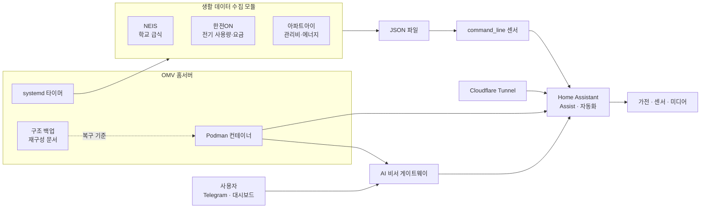
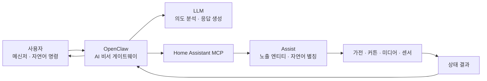
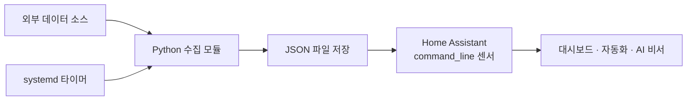

# 5. Home Assistant

- OMV 홈서버와 Home Assistant 기반 스마트홈·생활 데이터 자동화 적용
- AI 비서, 가전 제어, 생활 정보 수집의 단일 운영 구조 통합
- 구성 백업과 재구성 문서화를 통한 장애·교체 대응 체계 적용

## 프로젝트 요약

| 항목 | 내용 |
|---|---|
| 목표 | 가정 내 서비스·생활 데이터·AI 비서의 통합 운영 |
| 운영 기반 | OpenMediaVault, Debian, Podman, systemd |
| 스마트홈 | Home Assistant, Assist, 자동화, 대시보드 |
| AI 연계 | AI 비서 게이트웨이와 Home Assistant 제어 기능 연동 |
| 데이터 수집 | 학교 급식, 전기 사용량·요금, 아파트 관리비·에너지 정보 수집 |
| 외부 접속 | Cloudflare Tunnel 기반 Home Assistant 접속 적용 |
| 운영 관리 | 시크릿 제외 구조 백업, 서비스 카탈로그, 재구성 절차 문서화 |

## 구성도

## 1. Home Assistant 관리 기기

> 구조 백업 시점 기준 39개 통합과 849개 엔티티 등록. 엔티티 수는 센서·상태·제어 항목을 포함한 값으로 실제 물리 기기 수와 차이 존재.

| 기기군 | 대략적 구성 | 주요 관리 기능 |
|---|---|---|
| 냉난방·공기질 | 에어컨 2대, 공기청정기 | 전원·운전 모드·풍량·온습도·미세먼지 관리 |
| 생활가전 | 냉장고, 세탁기, 건조기, 식기세척기, 무선청소기 | 동작 상태·완료 알림·원격 제어·필터 상태 관리 |
| 청소 | 로봇청소기 1대 | 청소 실행·상태 확인·소모품 관리 |
| 커튼·전원 | 전동 커튼 2개, 스마트 플러그 2개 이상 | 개폐·전원 제어·자연어 별칭 적용 |
| 영상·미디어 | TV, 셋톱박스, 프로젝터, Music Assistant 재생기 | 전원·리모컨·미디어 재생·출력 대상 관리 |
| 카메라 | 실내 IP 카메라 1대 | 영상 확인·프라이버시 모드·조명·방향 제어 |
| 음성·대시보드 | Assist 마이크, 태블릿 대시보드, 모바일 앱 | 음성 명령·상태 표시·위치·알림 연계 |
| 운영 센서 | 날씨, 공유기, 홈서버, 네트워크 장치 | 온도·자원 사용량·접속 상태·장애 징후 확인 |
| 일정·할 일 | Google Calendar, Todoist, 로컬 할 일 | 가족 일정·쇼핑·학교 알림장 통합 |

- SmartThings, LG ThinQ, Tuya, Tapo, Ecovacs 기반 가전 통합
- Home Assistant Assist 제어 대상 103개 엔티티 노출
- 에어컨·커튼·가전·미디어 기기의 자연어 별칭 20개 적용
- 세탁기·건조기 완료 알림과 모닝 브리핑 자동화 적용
- 물리 기기 교체와 통합 재연결을 고려한 엔티티 인벤토리 관리

## 2. OpenClaw AI 연동

| 설정 영역 | 적용 내용 |
|---|---|
| 대화 채널 | 메신저 기반 자연어 질의·명령 처리 |
| AI 모델 | OpenClaw Main Agent의 LLM 직접 연동 |
| Home Assistant 연결 | MCP Server와 Long-Lived Access Token 기반 연계 |
| 제어 범위 | Home Assistant Assist에 허용한 엔티티만 선택적 노출 |
| 자연어 처리 | 실제 엔티티 이름과 사용자 표현을 연결하는 별칭 적용 |
| 부가 기능 | 날씨·검색·캘린더·할 일·생활 정보 조회 연계 |
| 서비스 운영 | `systemd --user` 기반 OpenClaw Gateway 상시 실행 |
| 재구성 | 모델·라우팅·노출 엔티티·별칭 적용 스크립트 관리 |

- AI 응답과 실제 기기 제어 경로의 MCP 기반 분리
- Home Assistant에 노출한 엔티티만 제어 가능한 최소 권한 구조 적용
- “거실 에어컨”, “침실 커튼”, “로봇청소기” 등 생활 언어 별칭 적용
- 대화·가전 제어·검색·캘린더 기능의 Main Agent 통합
- Home Assistant 재시작 후 OpenClaw MCP 연결 상태 재확인 필요
- API Key·Home Assistant Token·메신저 Token의 저장소 분리 필요

## 3. OMV 운영 서비스

| 서비스 | 실행 방식 | 역할 |
|---|---|---|
| Home Assistant | Podman, Host Network | 스마트홈 통합·자동화·대시보드 운영 |
| OpenClaw Gateway | systemd User Service | AI 비서·MCP·메신저 연결 |
| Music Assistant | Podman | 가정 내 음악 재생·출력 장치 관리 |
| Cloudflared | Podman | 외부 접속용 Cloudflare Tunnel 제공 |
| Open WebUI | Podman | LLM 웹 인터페이스 제공 |
| PhotoPrism·MariaDB | Podman | 사진 분류·검색·메타데이터 관리 |
| File Browser | Podman | 홈서버 파일 웹 관리 |
| Transmission | Podman | 다운로드 작업 관리 |
| Glances | Podman | CPU·메모리·디스크·온도 상태 모니터링 |
| KEPCO-ON | Podman | 전기 사용량·예상요금 주기 수집 |
| 급식·관리비 수집기 | systemd Timer | 생활 데이터의 정기 수집 |

- Debian 기반 OpenMediaVault 호스트 적용
- 서비스별 컨테이너·볼륨·환경변수·재시작 정책 관리
- Podman 중심 서비스 격리와 systemd 기반 주기 작업 적용
- 외부 공개 포트 최소화를 위한 Cloudflare Tunnel 적용
- 운영 서비스·장애 대응·재구성 순서의 별도 카탈로그화

## 4. Home Assistant 생활 데이터 모듈

| 모듈 | 수집 대상 | 처리 방식 | Home Assistant 연계 |
|---|---|---|---|
| 급식표 | NEIS 교육정보 Open API | 주간 급식 데이터의 JSON 변환 | 대시보드 표시 및 센서 활용 |
| 전기요금 | 한전ON 사용량·예상요금 | Headless Chromium 기반 수집 | `command_line` 센서 적용 |
| 관리비 | 아파트아이 관리비·에너지 | 세션 쿠키 기반 주기 수집 | 관리비·전기·수도 센서 적용 |

### 공통 처리 흐름

- 공식 통합 부재 영역의 Python 수집 모듈 구현
- 수집 결과를 JSON 파일로 저장하는 단순 결합 구조 적용
- Home Assistant 재시작 후에도 이전 값을 유지하는 파일 기반 처리 적용
- API 키, 계정 정보, 세션 쿠키의 코드 분리 및 런타임 주입 필요
- 데이터 소스별 실행 주기의 systemd 타이머 적용

> 저장소: [ha-home-modules](https://github.com/island-wq/ha-home-modules)

## 5. 구조 백업 및 재구성

- OMV 호스트, 디스크, 네트워크, Podman 컨테이너 구성의 문서화
- Home Assistant 통합·엔티티·대시보드·설정 스크럽본 관리
- 서비스 위치, 포트, 볼륨, 실행 방식, 장애 대응 정보의 카탈로그화
- 시크릿 값을 제외하고 키 이름과 주입 위치만 관리하는 보안 원칙 적용
- 호스트부터 컨테이너, Home Assistant, 자체 모듈, 외부 터널까지 복구 순서 정의

> 저장소: [homelab-backup](https://github.com/island-wq/homelab-backup)

## 핵심 설계 판단

- 범용 스마트홈 플랫폼과 자체 수집 모듈의 느슨한 결합 적용
- 공식 API 제공 영역은 HTTP API 우선 적용
- 브라우저 실행 필요 영역은 Selenium 기반 제한적 수집 적용
- 수집 실패가 Home Assistant 전체 운영에 영향을 주지 않는 파일 경계 적용
- 인증정보 없는 구조 백업과 별도 시크릿 주입 방식 적용
- AI 도구나 운영자가 동일 문서로 시스템을 복구할 수 있는 재현성 확보

## 운영상 제약

- 외부 웹사이트 변경에 따른 스크래퍼 유지보수 필요
- 세션 쿠키 만료 시 수동 재발급 필요
- Chromium과 WebDriver 버전 호환성 점검 필요
- Home Assistant 재시작 후 AI 비서 연결 상태 재확인 필요
- 실제 데이터·계정·내부 시스템 정보의 공개 저장소 노출 방지 필요
