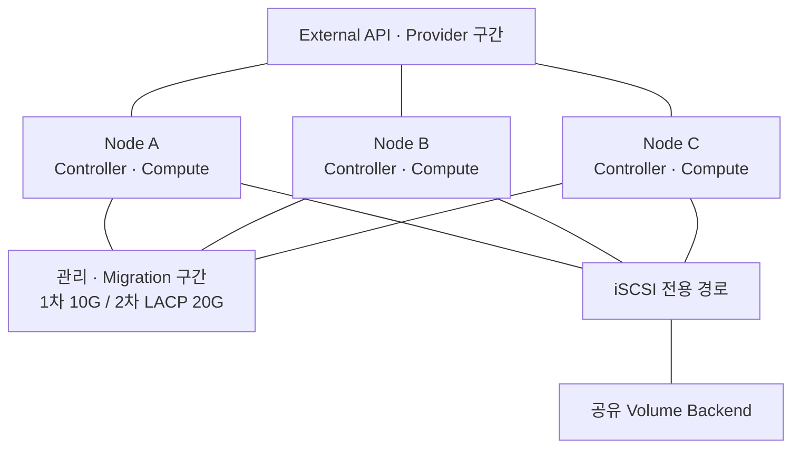

# 2. 10G·LACP 20G 라이브 마이그레이션 PoC 결과 분석

- 분석 자료: 라이브 마이그레이션 PoC 결과 보고, 자료명 기준 2026-09-30 PowerPoint
- 분석 범위: 19개 슬라이드와 내장 차트의 수치·네트워크 구성도
- 1차 다중 VM 동시 이관, 1차 단일 VM 멀티채널, 2차 LACP 20G 시험의 단계별 분석
- 발표자료 수치와 첨부 Excel 수행 기록의 교차 확인 적용

## 1. 검증 배경

- 운영 중 VM의 호스트 이관과 서비스 연속성 검증 필요
- VM 동시 이관 수 증가와 단일 VM 전송 채널 증가의 효과 분리 필요
- 10G 포화 조건의 성능 한계와 LACP 대역폭 확장 효과 확인
- VM 메모리 크기·추가 볼륨·dirty page 부하의 영향 검토

## 2. 1차·2차 환경 비교

| 항목 | 1차 PoC | 2차 PoC |
|---|---|---|
| 노드 역할 | Controller·Compute 혼합 3노드 구성 | 동일 역할의 3노드 구성 |
| 서버·CPU | PowerEdge R750, Xeon Silver 4310 적용 | 동일 서버·CPU 기록 |
| 호스트 메모리 | 256GB·64GB·64GB 기록 | 노드별 128GB 기록 |
| Migration 경로 | 관리 구간 10G 단일 링크 적용 | 관리 구간 LACP 20G 적용 |
| 외부 경로 | OVS 기반 External 구간 분리 | 동일 분리 구조 적용 |
| Volume Backend | PowerStore 3201T iSCSI 적용 | 동일 Backend 기록 |
| 비교 버전 | Epoxy·Gazpacho 비교 | Gazpacho 멀티채널 비교 |

- Epoxy: Rocky Linux 9.6, Nova 31.1.1, QEMU 9.1.0 기록
- Gazpacho: Rocky Linux 10.2, Nova 33.0.3, QEMU 10.1.0 기록
- 1차와 2차의 호스트 메모리 변경에 따른 네트워크 단독 효과의 분리 검증 필요

- 원본 4·14번 슬라이드 구성도의 역할·트래픽 구간 중심 재구성 적용
- Migration 경로와 iSCSI 경로의 분리 적용
- LACP 해시 분산 여부와 개별 물리 링크 사용량의 추가 계측 필요

## 3. 1차 다중 VM 동시 이관 결과

- `max_concurrent_live_migrations`의 1·3·6 변경 적용
- CPU·메모리·디스크 부하와 추가 볼륨 조건의 분리 시험 적용
- 회차별 5회 수행과 평균 완료시간 비교 적용

| 버전·보고서 표기 조건 | 동시성 1 평균(초) | 동시성 3 평균(초) | 동시성 6 평균(초) |
|---|---:|---:|---:|
| Epoxy, 일반 50% 부하 | 163.6 | 64.4 | 49.2 |
| Epoxy, 추가 볼륨·25% 부하 | 224.6 | 80.2 | 49.2 |
| Gazpacho, 일반 50% 부하 | 197.8 | 65.2 | 45.6 |
| Gazpacho, 추가 볼륨·25% 부하 | 238.4 | 104.4 | 62.6 |

- 표 수치는 발표자료 7번 슬라이드의 원문 값 적용
- 다중 VM 작업 묶음의 완료시간 단축 경향 확인
- 추가 볼륨 조건의 Gazpacho Drop `0→976→3,299/sec` 증가 기록
- 일반 조건과 추가 볼륨 조건의 속도·전송 안정성 평가 분리 필요
- TCP 재전송·Drop 집계만으로 게스트 서비스 장애를 판정하는 근거 부재
- 보고서의 Volume 연결 변경 지연 설명은 로그 기반 인과관계의 추가 확인 필요
- 7번 슬라이드의 `c16m32d100` 표기와 다수 소형 VM 시나리오의 사양 일치 여부 확인 필요
- Gazpacho 동시성 1의 보고서 197.8초와 Excel 원자료 평균 198.8초의 차이 확인
- 운영 동시성 증설 전 자원·네트워크 안정성 검증 필요: [Nova 동시 이관 설정](https://docs.openstack.org/nova/2026.1/configuration/config.html#max_concurrent_live_migrations)

## 4. 1차 10G 단일 VM 멀티채널 결과

- `live_migration_parallel_connections`의 2·4·8·16 변경 적용
- 32GB VM의 dirty page 부하와 링크 포화 상태 관찰
- 회차별 5회 수행 평균과 NIC Peak·재전송·Drop 비교 적용

| 채널 | 보고서 평균(초) | 보고서 최대(초) | NIC Peak(Gbps) | NIC 평균(Gbps) | TCP 재전송(/sec) | Drop(/sec) |
|---:|---:|---:|---:|---:|---:|---:|
| 2 | 78.0 | 90 | 9.40 | 4.10 | 6,711 | 1,387 |
| 4 | 85.0 | 152 | 9.43 | 3.22 | 7,558 | 1,384 |
| 8 | 73.0 | 93 | 9.61 | 3.75 | 8,463 | 0 |
| 16 | 71.0 | 152 | 9.40 | 3.00 | 6,080 | 23 |

- 表 수치는 발표자료 11번 슬라이드의 원문 값 적용
- Peak가 약 9.4~9.6Gbps에 머무는 링크 포화 경향 확인
- 채널 2→16 증가의 보고 평균 78→71초 단축과 비선형 변화 확인
- 1채널 실측 기준 부재에 따른 멀티채널 미적용 대비 효과 확정 근거 부재
- 보고서의 “효과 없음” 설명은 링크 포화로 인한 증설 효과 제한으로 해석
- NIC 평균값과 Excel BW 평균의 측정 구간·수집 방식 차이 확인 필요

### Excel 대조 결과

| 채널 | Excel 재집계 평균(초) | Excel 최대(초) | 보고서 대조 |
|---:|---:|---:|---|
| 2 | 78.4 | 90 | 평균 정수화 수준의 차이 확인 |
| 4 | 84.8 | 152 | 평균 정수화 수준의 차이 확인 |
| 8 | 73.4 | 99 | 최대값 93초와 99초의 불일치 확인 |
| 16 | 70.8 | 93 | 최대값 152초와 93초의 불일치 확인 |

- 초기 기준 최대값은 Excel 수행 행의 재집계값 우선 적용
- 후속 발표자료의 최댓값 정정과 집계 대상 일치 확인 필요

## 5. 2차 LACP 20G 단일 VM 결과

- 10G 링크 2개와 LACP 3+4 정책의 관리·Migration 경로 적용
- 32GB·64GB VM 각 1대의 채널 2~128 비교 적용
- 내장 차트와 Excel 채널 요약의 수치 일치 확인

| 채널 | 32GB 평균 시간(초) | 32GB 평균 BW(Gbps) | 64GB 평균 시간(초) | 64GB 평균 BW(Gbps) |
|---:|---:|---:|---:|---:|
| 2 | 48.4 | 10.2 | 238.8 | 10.0 |
| 4 | 40.8 | 11.8 | 212.9 | 12.8 |
| 8 | 28.7 | 13.5 | 148.0 | 15.9 |
| 16 | 27.1 | 13.29 | 80.1 | 18.1 |
| 32 | 32.9 | 14.9 | 82.6 | 18.8 |
| 64 | 34.4 | 15.9 | 81.2 | 18.0 |
| 128 | 32.0 | 15.3 | 141.7 | 17.5 |

- 32GB 16채널의 초기 10G 70.8초 대비 LACP 20G 27.1초, 약 61.7% 단축 확인
- 20G 내부 비교의 32GB 2→16채널 48.4→27.1초, 약 44.0% 단축 확인
- 64GB 2→16채널 238.8→80.1초, 약 66.5% 단축 확인
- 두 VM 사양 모두 평균 완료시간 기준 16채널 최저 확인
- 64GB 32채널 평균 BW 18.8Gbps와 평균 완료시간 82.6초 기록
- 대역폭 최고 조건과 완료시간 최저 조건의 불일치 확인
- 64GB 16채널의 최대 222초·표준편차 약 55.2초에 따른 반복 안정성 검증 필요
- 32GB 2·4채널 실제 5회 기록과 발표자료의 전 조건 10회 설명 차이 확인

## 6. 2대 VM 비교의 해석 한계

- 보고서 17번 차트의 최저 A+B 합산 평균 16채널 59.7초 확인
- 32·64채널의 합산 평균 61.5·63.9초로 추가 단축 부재
- 대다수 유효 시각의 A 종료 후 B 시작과 Excel의 `max_concurrent=1` 기록 확인
- 8채널 첫 회차 A의 역전된 종료 시각에 따른 총 경과시간 검증 보류
- “2개를 한번에 실행” 설명과 순차 이관 수행 기록 간 불일치 확인
- 59.7초를 2대 동시 실행의 전체 경과시간으로 사용하는 근거 부재
- VM1 비교 차트의 2~16채널 10G 기준과 32·64채널 20G 기준 혼재 확인
- 1대·2대의 동일 네트워크·부하·요청 방식 재시험 필요
- 합산시간·실제 작업 묶음 경과시간의 상세 정의는 [시험·검증 매뉴얼](./test-validation-manual.md#7-32gb-vm-2대-결과와-시간-정의) 참조

## 7. 소형 VM 6대의 채널 증설 효과

| 채널 | 평균 완료시간(초) | 1채널 대비 단축률 |
|---:|---:|---:|
| 1 | 167.7 | 기준값 적용 |
| 2 | 164.8 | 약 1.7% 단축 |
| 4 | 161.8 | 약 3.5% 단축 |
| 8 | 160.1 | 약 4.5% 단축 |

- 18번 슬라이드의 내장 차트 기준 적용
- 6대 조건의 채널 증설 효과 제한 확인
- 16·32·64·128채널의 유효 수행 기록 부재
- 채널 모니터 화면의 TCP `delivery_rate` 합계와 NIC 실측 대역폭의 분리 확인 필요
- 대상 VM 수 증가와 실제 Compute 동시 실행 수의 별도 확인 필요
- 단일 대형 VM 결과를 다수 소형 VM의 운영값으로 일괄 적용하는 근거 부재

## 8. 운영 적용 및 후속 검증

| 조건 | 적용 판단 | 추가 확인 |
|---|---|---|
| 10G 링크 포화 | 채널 증설보다 병목 경로 분석 우선 적용 | Peak·링크별 트래픽·재전송·CPU 계측 필요 |
| LACP 20G, 32GB 1대 | 8~16채널의 검증 후보 적용 | 양방향 반복·실제 연결 수·서비스 중단시간 확인 필요 |
| LACP 20G, 64GB 1대 | 16채널의 우선 검증 후보 적용 | 최대 지연·반복 편차·dirty page 수렴 확인 필요 |
| 소형 VM 다수 | 동시 이관 수와 채널 수의 분리 조정 적용 | 큐 대기·작업 묶음 경과시간·대상 Host 여유 확인 필요 |
| 추가 볼륨 | 메모리 전송과 Volume 연결 경로의 분리 분석 적용 | iSCSI 지연·Volume 상태·관련 로그 대조 필요 |

- 채널별 CPU 소비를 고려한 Host CPU 여유 확보 필요: [Nova 설정 문서](https://docs.openstack.org/nova/2026.1/configuration/config.html#libvirt.live_migration_parallel_connections)
- 병렬 연결과 Post-copy 동시 사용 시 QEMU 10.1.0 이상 지원 조건 확인 필요: [Nova 2026.1 릴리스 노트](https://docs.openstack.org/releasenotes/nova/2026.1.html)
- 본 PoC의 Post-copy·Auto-converge 비활성 조건과 후속 변경 시험의 분리 필요
- 다운타임·Packet Loss·Health Check의 실측 보완 전 무중단 서비스 판정 근거 부재
- 설정값 증설 전 성공·최대 지연·서비스 품질을 포함한 운영 기준 정의 필요

## 원본 근거 위치

- 1차 환경·네트워크: 3~4번 슬라이드 참조
- 다중 VM 동시 이관: 5~8번 슬라이드 참조
- 10G 단일 VM 멀티채널: 9~12번 슬라이드 참조
- 2차 LACP 환경·시험 조건: 13~15번 슬라이드 참조
- 32GB·64GB 결과: 16번 슬라이드 내장 차트 참조
- 2대 VM 비교: 17번 슬라이드 내장 차트·수행 표 참조
- 소형 VM 6대 결과: 18번 슬라이드 내장 차트 참조
- 수치 재집계·자료 공백: [Excel 시험·검증 매뉴얼](./test-validation-manual.md) 참조
