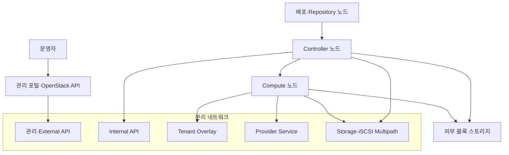
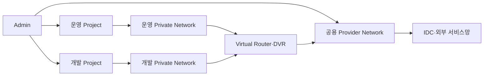
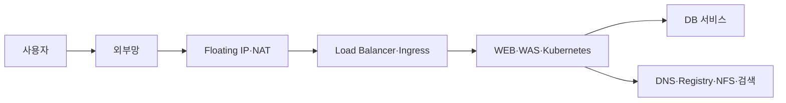

# PoC 아키텍처

## 공통 물리 구조

## 논리 자원 구조

## 서비스 흐름

## 설계 원칙

- 관리·Tenant·Provider·Storage 트래픽 분리
- Project 단위 운영·개발 자원 격리
- 외부 연결의 Provider Network 집중
- East-West 트래픽의 DVR 분산 처리
- 스토리지 경로의 Multipath 구성
- 실제 주소 대신 논리 역할 중심 공개
