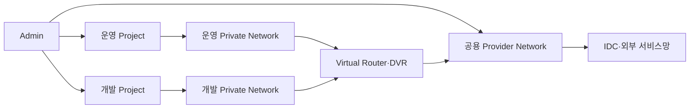
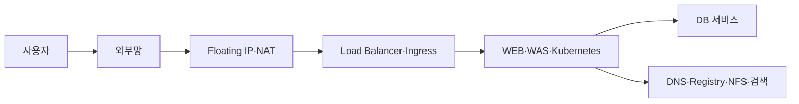

# PoC 아키텍처 (Private cloud 공통환경)

## 물리 구조

****

## 논리 구조

```mermaid
flowchart LR
  admin["Admin"] --> prod["운영 Project"]
  admin --> dev["개발 Project"]
  admin --> shared["공용 Provider Network"]

  prod --> prodNet["운영 Private Network"]
  dev --> devNet["개발 Private Network"]
  prodNet --> router["Virtual Router·DVR"]
  devNet --> router
  router --> shared
  shared --> external["IDC·외부 서비스망"]
```

## 서비스 Flow

```mermaid
flowchart LR
  user["사용자"] --> external["외부망"]
  external --> fip["Floating IP·NAT"]
  fip --> lb["Load Balancer·Ingress"]
  lb --> app["WEB·WAS·Kubernetes"]
  app --> db["DB 서비스"]
  app --> shared["DNS·Registry·NFS·검색"]
```

## 설계 원칙

- 관리·Tenant·Provider·Storage 트래픽 분리
- Project 단위 운영·개발 자원 격리
- 외부 연결의 Provider Network 집중
- East-West 트래픽의 DVR 분산 처리
- 스토리지 경로의 Multipath 구성

