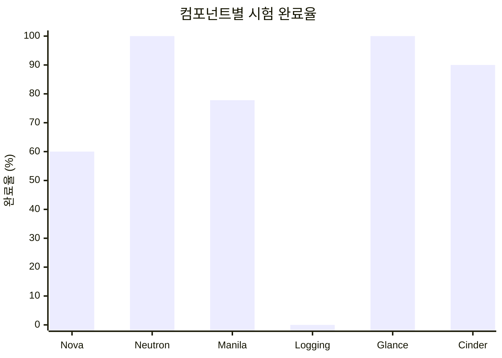
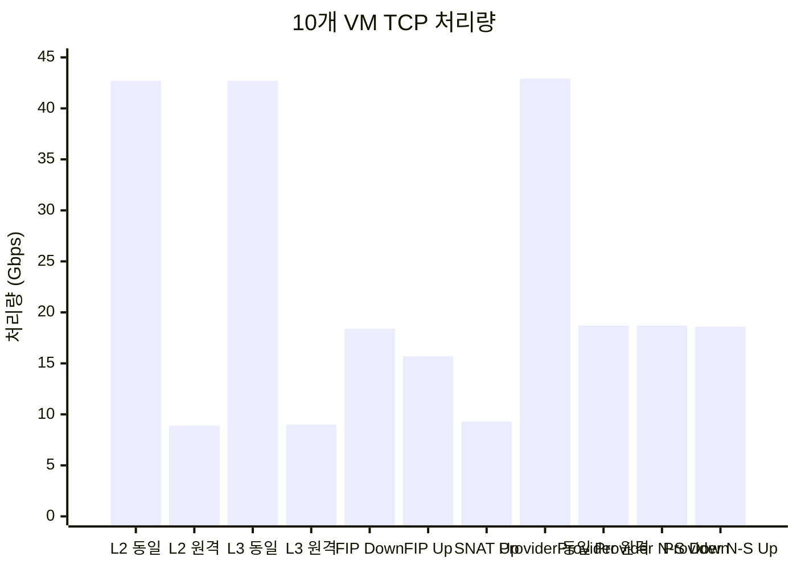
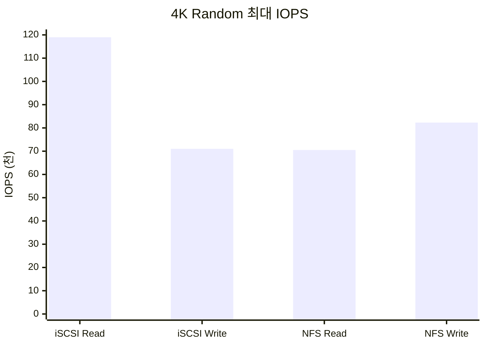

# Case C · 성능 및 고가용성 검증

## 목적

- Private Cloud 핵심 컴포넌트의 기능 완성도 확인
- Tenant·Provider Network의 처리 성능 확인
- iSCSI·NFS Storage의 IOPS·대역폭·응답시간 확인
- Server·Network·Storage·Firewall 장애 시 서비스 연속성 확인

## 시험 범위

## 1. 컴포넌트 동작시험

### 총괄 결과

| 컴포넌트 | 전체 | 완료 | 미진행 |
|---|---:|---:|---:|
| Nova | 25 | 15 | 10 |
| Neutron | 6 | 6 | 0 |
| Manila | 9 | 7 | 2 |
| Logging | 4 | 0 | 4 |
| Glance | 6 | 6 | 0 |
| Cinder | 20 | 18 | 2 |
| 합계 | 70 | 52 | 18 |

### 컴포넌트 완료율

- 전체 70개 중 52개 완료
- 완료율 약 74.3%
- Neutron·Glance 전 항목 완료
- Logging 전 항목 미진행
- Nova 대규모 생성·부하 항목 일부 미진행
- Manila·Cinder 한계 용량 시험 일부 미진행

### Nova

- 단일 VM 생성시간 약 57~63초
- 10개 동시 생성 시 소형 Image 기준 약 58~63초
- 20개 동시 생성 시 소형 Image 기준 약 59~67초
- 대용량 Image 동시 생성 시 최대 약 7분
- Compute Node당 VM 48개 생성 확인
- 49번째 이상 VM 생성 불가 확인
- 자원 Overcommit 정책과 수용량 기준 정립 필요

### Neutron

- Floating IP Inbound·Outbound 통신 확인
- Tenant Network 간 Router 통신 확인
- Tenant Network의 외부 통신 확인
- Provider Network Inbound·Outbound 통신 확인
- DVR·OVN 동작 확인

### Manila·Cinder·Glance

- Share 생성·삭제·Resize·Rule·Snapshot·Revert 확인
- Snapshot 존재 시 관리 Host 변경 제약 확인
- Cinder Service Host 변경과 Volume 생명주기 확인
- 10~100GB Root Volume 생성시간 약 56~63초
- 10GB Glance Image 등록 약 2분 30초
- 100GB Glance Image 등록 약 22분 11초

## 2. 네트워크 성능

### 시험 조건

- VM 사양 4 vCPU·8GB Memory
- 10GbE Interface 적용
- `iperf3` 60초 수행
- 단일 VM과 10개 VM 동시 부하 비교
- TCP Throughput·Retransmit 측정
- UDP PPS·Loss 측정

### 주요 결과

| 구간 | 단일 VM TCP | 10개 VM TCP | 비고 |
|---|---:|---:|---|
| L2 Tenant·동일 Node | 6.3Gbps | 42.7Gbps | 집계 성능 |
| L2 Tenant·다른 Node | 6.8Gbps | 8.9Gbps | 물리 Link 영향 |
| L3 Tenant·동일 Node | 5.7Gbps | 42.7Gbps | 집계 성능 |
| L3 Tenant·다른 Node | 5.5Gbps | 9.0Gbps | 물리 Link 영향 |
| Floating IP·Download | 6.6Gbps | 18.4Gbps | 외부 구간 |
| Floating IP·Upload | 7.5Gbps | 15.7Gbps | 외부 구간 |
| SNAT·Upload | 8.6Gbps | 9.3Gbps | Tunnel 경로 |
| Provider E-W·동일 Node | 5.9Gbps | 42.9Gbps | 집계 성능 |
| Provider E-W·다른 Node | 7.0Gbps | 18.7Gbps | Bond 대역폭 근접 |
| Provider N-S·Download | 5.4Gbps | 18.7Gbps | 외부 Simulator |
| Provider N-S·Upload | 9.3Gbps | 18.6Gbps | 외부 Simulator |

### 다중 VM TCP 성능 비교

### 분석

- 동일 Node 다중 VM의 TCP 집계 성능 최대 약 42.9Gbps
- Node 간 Tenant Network 성능 약 9Gbps
- Node 간 Provider Network 성능 약 18.7Gbps
- Floating IP 다중 VM 성능 Download 18.4Gbps·Upload 15.7Gbps
- SNAT 다중 VM 성능 약 9.3Gbps
- Tenant Tunnel의 Bond 단일 Channel 사용 가능성 확인
- Tunnel Hash·Bond 분산 방식의 추가 검증 필요
- UDP Loss 1% 미만 조건에서 대체로 50만 PPS 이상 확인

### VM·Bare Metal 비교

- East-West TCP 18.8Gbps와 18.7Gbps로 유사
- North-South TCP 17.8Gbps와 18.6Gbps로 유사
- TCP 가상화 Overhead의 영향 제한적
- Bare Metal의 UDP PPS 우위
- 고 PPS Streaming Workload의 Bare Metal 검토 필요

## 3. iSCSI·NFS 스토리지 성능

### 시험 조건

- VM 사양 4 vCPU·8GB 및 8 vCPU·16GB
- SAS 기반 외부 Storage 적용
- `fio` 60초 수행
- CPU 사용률 50% 미만 조건
- 단일 VM·10개 VM·다중 VM 비교

### iSCSI 결과

- 4K Random Read 최대 약 119,000 IOPS
- 4K Random Write 최대 약 71,000 IOPS
- 64K Sequential Read 최대 약 1,701MB/s
- 128K Sequential Read 최대 약 1,698MB/s
- 128K Write 최대 약 1,148MB/s
- 10개 VM 동시 부하에서도 단일 VM과 유사한 IOPS
- 일부 High Queue Depth 구간의 응답시간 증가

### NFS 결과

- 다중 VM 4K Random Write 약 81,700~82,300 IOPS
- 다중 VM 4K Random Read 약 70,500 IOPS
- 다중 VM 64K Sequential Read 최대 약 2,476MB/s
- 다중 VM 128K Sequential Read 최대 약 2,447MB/s
- 다중 VM 병렬 처리 시 집계 성능 증가
- 일부 Read Queue 구간의 응답시간 증가

### 4K Random IOPS 비교

### VM·Bare Metal 비교

- iSCSI 주요 항목의 성능 차이 제한적
- NFS 주요 항목의 성능 차이 제한적
- Storage Driver·Network 경로의 가상화 Overhead 영향 제한적
- 운영 Workload 기반 Latency 장기 측정 필요

## 4. 고가용성 시험

### 총괄 결과

- 보고서 기준 13개 항목 수행
- 전 항목 정상 판정
- 미진행 항목 부재

### Compute·Controller

- Live Migration 기반 VM 서비스 연속성 확인
- Compute 장애 시 Host Evacuation 확인
- Controller 단일 장애 시 관리 기능 연속성 확인
- 다중 Controller 장애의 영향 범위 확인

### Network·Firewall

- Switch 이중화 경로 Failover 확인
- Interface Module 장애 시 서비스 연속성 확인
- Firewall Link 장애 시 이중화 경로 전환 확인
- 관리·서비스·Storage Interface 이중화 확인

### Storage

- iSCSI Multipath Link Down 시험
- NFS Service Link Down 시험
- Storage Controller 강제 종료 시험
- SAN Switch Port·전원 장애 시험
- Storage 경로 장애 시 서비스 연속성 확인

## 결론

- 핵심 Network·Image·Volume 기능 정상 확인
- 컴포넌트 18개 항목 미진행으로 기능 완성도 추가 확인 필요
- Node 간 Tenant 성능의 10GbE Link 한계 확인
- Provider·Floating IP 구간의 20GbE 근접 집계 성능 확인
- iSCSI 4K Random Read 약 119K IOPS 확인
- NFS 다중 VM 약 80K IOPS 확인
- 13개 고가용성 항목 정상 판정
- 장기 부하·복합 장애·운영 Workload 추가 검증 필요
