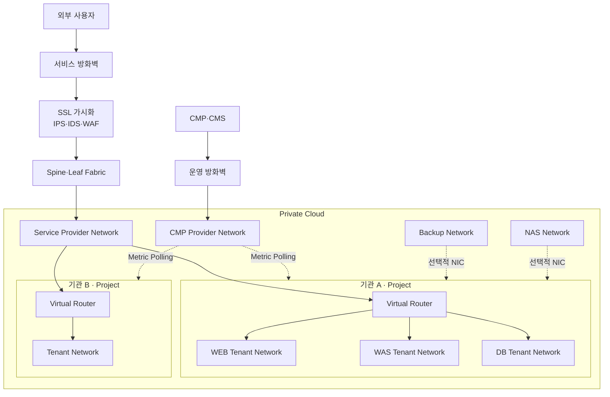
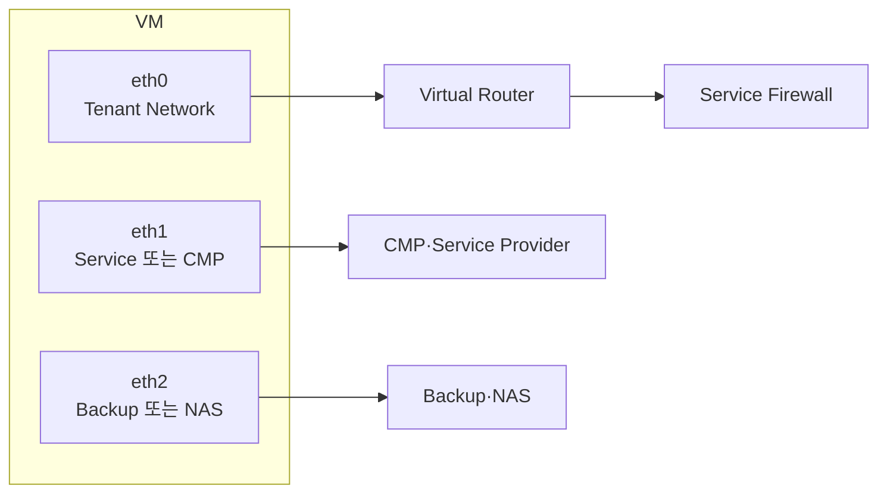
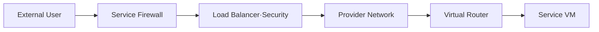
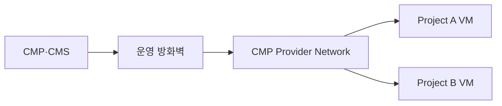

# 7. PrivateCloud의 격리네트워크(VPC) 구현 서비스 시나리오

- 기관·프로젝트·서비스 구간별 네트워크 격리 시나리오 정리
- Tenant Network와 Provider Network의 역할 분리 적용
- 외부 서비스·CMP·백업·NAS 트래픽의 독립 경로 적용
- 원본 설계안의 내부 주소·기관명·장비 식별 정보 제거

## 1. 설계 배경

- 기관별 프로젝트와 VM 간 독립 네트워크 제공 필요
- 동일 프로젝트 내부 통신과 프로젝트 간 통신 정책의 구분 필요
- 외부 서비스·운영 수집·백업·스토리지 트래픽의 혼재 방지 필요
- 서비스 방화벽을 통한 접근 제어·감사·로깅 필요
- VM 생성 시 과도한 NIC 할당과 라우팅 복잡도 최소화 필요

## 2. 설계 원칙

| 구분 | 적용 원칙 |
|---|---|
| VM 내부 격리 | 프로젝트별 Tenant Network와 Overlay Network 적용 |
| 외부 서비스 | 서비스 전용 Provider Network 적용 |
| 운영 수집 | CMP 전용 네트워크와 Polling 경로 적용 |
| 백업·NAS | 사용 대상 VM에만 추가 NIC 할당 |
| 프로젝트 간 통신 | Virtual Router 또는 서비스 방화벽 경유 적용 |
| 기관 간 통신 | 기본 차단과 승인 기반 정책 적용 |
| 외부 접근 | 방화벽·보안 장비·로드밸런서 경유 적용 |

## 3. 전체 서비스 구조

- 외부 서비스 트래픽의 방화벽·보안 장비 경유 적용
- 프로젝트별 Virtual Router와 Tenant Network 분리 적용
- CMP·백업·NAS 네트워크의 서비스 트래픽 분리 적용
- 기관 간 직접 연결 부재와 승인 정책 기반 통신 적용

## 4. VM NIC 제공 시나리오

- 기본 NIC에 Tenant Network 할당
- 외부 서비스 또는 운영 수집 필요 시 추가 NIC 할당
- 백업·NAS 이용 대상에만 데이터 전용 NIC 할당
- 다중 NIC 사용 시 Default Gateway와 정적 경로 기준 정의 필요
- 이미지·템플릿 기반 NIC 구성 자동화 필요

## 5. 외부 서비스 흐름

### In-Bound

- 승인된 외부 주소와 포트만 방화벽 정책 적용
- Public 주소와 내부 주소 간 변환 적용
- 서비스 구간별 로드밸런서와 보안 정책 적용
- 프로젝트 내부 Tenant Network의 직접 외부 노출 부재

### Out-Bound

- VM의 기본 경로를 Virtual Router로 지정
- 외부 목적지별 방화벽 허용 정책 적용
- 송신 주소 변환과 접속 로그 수집 적용
- 무제한 외부 통신 정책 부재

## 6. CMP 수집 흐름

- CMP에서 VM으로 향하는 Polling 전용 경로 적용
- 운영 수집 트래픽과 사용자 서비스 트래픽 분리
- VM 식별을 위한 프로젝트별 주소·인벤토리 관리 필요
- CMP 네트워크의 외부 서비스 경로 사용 부재
- 수집 대상 포트와 출발지의 최소 허용 정책 적용

## 7. 격리 정책과 통신 흐름

| 기관 | 프로젝트 | 네트워크 | 처리 경로 | 정책 |
|---|---|---|---|---|
| 동일 | 동일 | 동일 | 가상 스위치 내부 전달 | 직접 통신 허용 |
| 동일 | 동일 | 상이 | Virtual Router 경유 | 라우팅·보안 정책 적용 |
| 동일 | 상이 | 상이 | 방화벽 또는 승인된 Router 경유 | 명시적 허용 필요 |
| 상이 | 상이 | 상이 | 서비스 방화벽 경유 | 기본 차단 |
| 상이 | 상이 | 공유 필요 | 별도 공유 네트워크 | 예외 승인 필요 |

- 동일 네트워크 East-West 트래픽의 가상 스위치 처리
- 다른 네트워크 간 통신의 Virtual Router 경유
- 프로젝트 간 임의 Peering과 공유 네트워크 제공 부재
- 기관 간 트래픽의 서비스 방화벽 정책과 로그 적용
- 관리·백업·스토리지 망과 Tenant Network 간 직접 라우팅 부재

## 8. 네트워크별 역할

| 네트워크 | 주요 역할 | 연결 대상 |
|---|---|---|
| Tenant Network | VM 내부 East-West 통신 | 프로젝트 VM |
| Service Provider | 외부 In-Bound·Out-Bound 서비스 | 방화벽·Virtual Router |
| CMP Provider | Metric·상태 수집 | CMP·CMS·대상 VM |
| Backup Network | 백업 데이터 전송 | 백업 대상 VM |
| NAS Network | 파일 서비스 연결 | NAS 사용 VM |
| Management Network | 인프라 관리 | Controller·Compute·운영 시스템 |

## 9. 주요 설계 판단

- 단일 네트워크에 모든 트래픽을 혼합하는 구조 미적용
- Tenant Overlay와 Provider VLAN의 혼합 구조 적용
- 기관·프로젝트·서비스 구간에 따른 다단계 격리 적용
- 물리 방화벽과 가상 라우터의 역할 분리 적용
- CMP·백업·NAS 연동을 위한 선택적 추가 NIC 적용
- 기관 간 통신의 기본 차단과 승인 기반 예외 적용

## 10. 제약사항

- VM 다중 NIC 증가에 따른 운영 복잡도 발생
- Default Gateway와 정적 경로 충돌 가능성 존재
- Provider VLAN 수량과 물리 네트워크 확장 한계 존재
- 서비스 방화벽 집중에 따른 성능·가용성 검증 필요
- 프로젝트 추가 시 네트워크·방화벽 정책 자동화 필요
- 공유 네트워크 사용 시 기관 간 격리 약화 가능성 존재
- CMP Polling 경로의 대상 식별과 주소 관리 필요

## 11. 검증 항목

- 동일 프로젝트·동일 네트워크 VM 간 통신 확인
- 동일 프로젝트·상이 네트워크 간 Router 경유 확인
- 상이 프로젝트 간 기본 차단 확인
- 상이 기관 간 방화벽 정책 없는 통신 차단 확인
- 외부 In-Bound·Out-Bound 경로와 주소 변환 확인
- CMP Polling 전용 경로와 접근 포트 제한 확인
- 백업·NAS 추가 NIC의 서비스 경로 분리 확인
- 방화벽·Router 장애 시 서비스 영향과 복구 확인
- 네트워크·보안 로그의 프로젝트 식별 가능 여부 확인

## 12. 적용 결론

- 프로젝트 내부 트래픽의 Tenant Network 기반 격리 적용
- 외부 서비스와 운영 연동의 Provider Network 기반 분리 적용
- 기관 간 통신의 물리 방화벽 경유와 기본 차단 적용
- CMP·백업·NAS의 목적별 네트워크 분리 적용
- VM 생성 자동화와 네트워크 정책 표준화 필요
