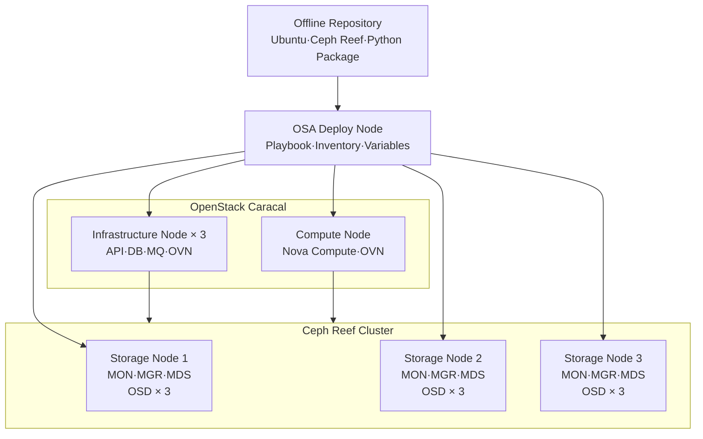
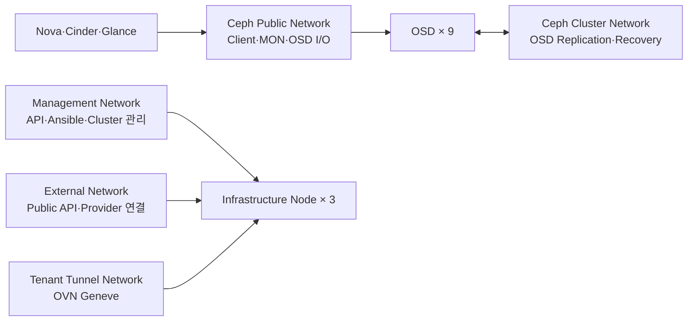
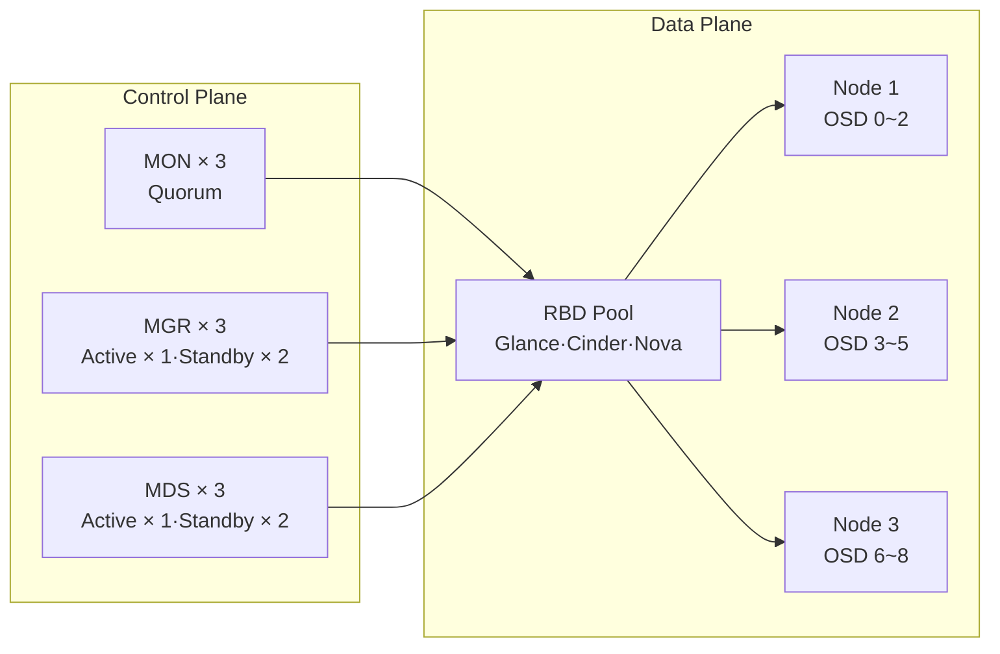
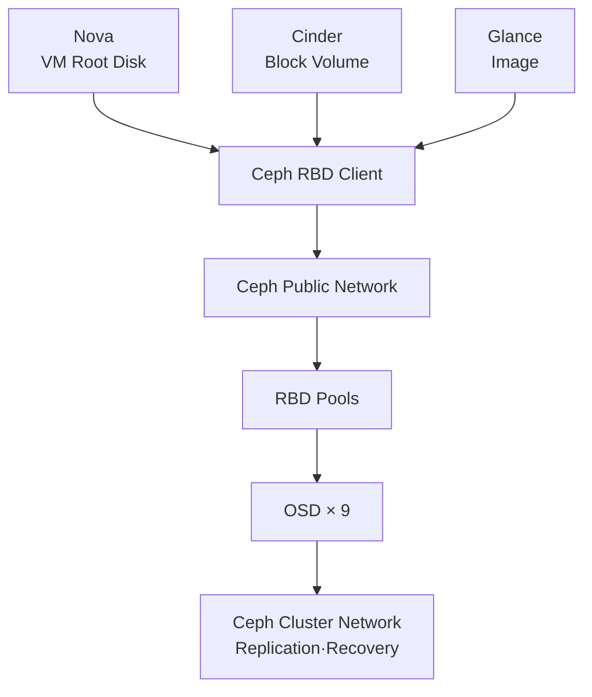

# 4. Ceph Cluster 가이드

## 목적

- 폐쇄망 OpenStack-Ansible 환경의 Ceph Reef Cluster 구축
- MON·MGR·MDS·OSD 고가용성 구성과 RBD Backend 연동
- Offline Package 의존성·배포 순서·Network 분리 기준 정립
- 반복 배포 장애의 원인 분석과 재발 방지 설정 적용

## 환경 요약

| 항목 | 구성 |
|---|---|
| 운영체제 | Ubuntu 22.04 |
| 배포 도구 | OpenStack-Ansible 29.2.0 Caracal |
| Storage | Ceph Reef 18.2.7 |
| Infrastructure Node | 3대 |
| Compute Node | 1대 |
| MON·MGR·MDS | Node별 1개, 총 3개 |
| OSD | Node별 3개, 총 9개 |
| OSD 방식 | LVM·BlueStore |
| 가용 용량 | 약 7.9TiB |
| Package 공급 | 폐쇄망 APT·Python Repository 적용 |

## 전체 구성



- Offline Repository 기반 Package 공급 적용
- OSA Deploy Node 기반 OpenStack·Ceph 자동화 적용
- Infrastructure Node 3대의 Control Plane·Storage 역할 병행 적용
- Compute Node의 RBD Client 역할 적용

## Network 구성



- Management·External·Tenant Tunnel Network 분리 적용
- Ceph Public Network의 Client I/O·MON 통신 적용
- Ceph Cluster Network의 OSD 복제·Recovery 전용 적용
- Octavia Amphora 적용 시 LB Management Network 별도 구성 필요
- Network 변경 시 `ceph_public_network`·`monitor_address` 동시 변경 필요
- Public·Cluster Network 간 MTU·Routing 정합성 확인 필요

## Ceph Cluster 구성



- MON 3개 기반 Quorum 구성
- MGR Active·Standby 구성
- MDS Active·Standby 구성
- OSD 9개 LVM·BlueStore 구성
- Glance·Cinder·Nova용 RBD Pool 적용
- Offline 의존성 제약에 따른 Dashboard·Disk Prediction 비활성화 적용

## OpenStack Storage 연동



- Nova의 Libvirt·RBD 기반 Disk 연결 적용
- Cinder의 Ceph RBD Volume Backend 적용
- Glance의 Ceph RBD Image Backend 적용
- Client Keyring·Ceph Configuration의 OpenStack Service 배포 필요
- Ceph Cluster 정상화 후 OpenStack Service 배포 필요

## Offline Repository 구성

- Ceph Reef Package와 의존성의 내부 Repository 수집 필요
- Ubuntu Cloud Archive의 Ceph Squid Package 혼입 방지 필요
- Unsigned Repository 사용 시 `trusted=yes` 정책 일관성 필요
- APT Source 중복 등록에 따른 Trusted Option 충돌 방지 필요
- Node별 시간 동기화를 통한 Release 유효성 검증 필요

```text title="Offline Repository 구조 예시"
/srv/repo/
├── ubuntu/
├── ubuntu-cloud/
├── ceph-reef/
├── mariadb/
├── rabbitmq/
└── python-simple/
```

```text title="/etc/apt/preferences.d/ceph-reef.pref"
Package: ceph* libceph* python3-ceph*
Pin: release o=Canonical, n=jammy-updates/caracal
Pin-Priority: -1
```

```ini title="/etc/pip.conf"
[global]
index-url = http://<offline-repository>:8080/simple
trusted-host = <offline-repository>
```

- APT Simulation 기반 Ceph 18.2.7 선택 여부 확인 필요
- `pip.conf` 미설정 시 외부 Python Package Index 접근 발생

## OSA·ceph-ansible 설정

### Inventory Group 매핑

- OSA Inventory와 ceph-ansible 기본 Group 이름의 불일치 해소 필요
- MON Address의 Ceph Public Network 명시 필요

```yaml title="/etc/openstack_deploy/user_variables.yml"
mon_group_name: "ceph-mon_hosts"
osd_group_name: "ceph-osd_hosts"
mds_group_name: "ceph-mds_hosts"

fsid: "<fixed-cluster-fsid>"
generate_fsid: false

dashboard_enabled: false
diskprediction_enabled: false

ceph_mgr_modules:
  - status
  - balancer
  - devicehealth
  - pg_autoscaler
  - prometheus
  - restful

devices:
  - /dev/sdb
  - /dev/sdc
  - /dev/sdd
```

```yaml title="/etc/openstack_deploy/openstack_user_config.yml"
ceph-mon_hosts:
  storage01:
    ip: <management-ip-1>
    monitor_address: <ceph-public-ip-1>
  storage02:
    ip: <management-ip-2>
    monitor_address: <ceph-public-ip-2>
  storage03:
    ip: <management-ip-3>
    monitor_address: <ceph-public-ip-3>
```

- `ceph_osd_devices`가 아닌 ceph-ansible `devices` 변수 적용
- FSID 자동 재생성 방지를 위한 고정값 적용
- 실제 MON Map과 `ceph.conf` FSID 일치 필요

## 배포 순서


- `setup-openstack` 이전 Ceph Cluster 정상화 필요
- Ceph 미설치 상태의 `ceph-facts` 조회 시 대기 발생 가능
- MON Quorum·OSD Up/In·PG Active+Clean 확인 후 OpenStack 배포 필요

```bash title="Ceph 배포"
cd /opt/openstack-ansible/playbooks
openstack-ansible ceph-install.yml
```

```bash title="Ceph 상태 확인"
ceph -s
ceph health detail
ceph osd tree
ceph pg stat
```

## 주요 장애와 해결

| 장애 | 원인 | 조치 |
|---|---|---|
| Python Package 설치 실패 | Node의 내부 `pip.conf` 부재 | 내부 Python Repository 적용 |
| Ceph Version 충돌 | Cloud Archive의 Squid 19.x 우선 선택 | APT Pinning 적용 |
| `_monitor_addresses` 미정의 | Inventory Group·Monitor Address 불일치 | Group 매핑·주소 명시 |
| `ceph-mgr` 의존성 실패 | Offline Repository의 Dashboard·ML Package 부재 | 선택 Module 비활성화 |
| OSD 0개 | `devices` 변수 부재 | OSD Device 직접 지정 |
| OSD 초기화 실패 | 기존 GPT·LVM·Filesystem Signature 잔존 | Device 초기화 후 재배포 |
| MON Quorum 불능 | FSID·MON Map·Address 불일치 | FSID 고정·MON Address 정렬 |
| Keyring 단계 Timeout | 불안정한 Running MON 선택 | 최초 정상 MON 고정 조건 적용 |
| MON Probing 고착 | 환경 내 Messenger v2 경로 문제 | v1 Messenger 우회 적용 |
| APT Trusted 충돌 | 동일 Source의 Trusted Option 불일치 | 중복 Source 제거·정책 통일 |
| Release 유효성 오류 | Node Clock Skew | NTP 동기화 적용 |

## ceph-ansible 보완

### Disk Prediction Package 조건화

- Ubuntu 환경의 `ceph-mgr-diskprediction-local` 강제 설치 방지 필요

```yaml title="roles/ceph-mgr/tasks/pre_requisite.yml"
when:
  - ansible_facts["os_family"] != "RedHat"
  - ansible_facts["distribution_major_version"] | int != 7
  - diskprediction_enabled | default(true) | bool
```

### Running MON 선택 고정

- Loop 진행 중 정상 MON 값 덮어쓰기 방지 필요

```yaml title="roles/ceph-facts/tasks/facts.yml"
when:
  - running_mon is not defined
```

### MON 접속 대상 명시

- Keyring·MON Bootstrap 단계의 접속 대상 명시 필요

```yaml title="roles/ceph-mon/tasks/deploy_monitors.yml"
environment:
  CEPH_ARGS: >-
    --mon-host
    {{ hostvars[running_mon]["monitor_address"] }}:6789
```

```yaml title="MON Bootstrap 추가 인자"
--public-addr {{ monitor_address }}:6789
```

- Custom Role Patch의 Upgrade 시 재적용 필요
- 사용 중인 ceph-ansible Version별 Task 구조 재확인 필요

## OSD Device 준비

:::danger 운영 데이터 삭제 주의

아래 명령은 대상 Disk의 Partition·Filesystem Metadata 제거 적용. 장치명과 데이터 보존 여부 확인 후 실행 필요.

:::

```bash title="OSD Disk 상태 확인"
lsblk -f /dev/sdb /dev/sdc /dev/sdd
wipefs -n /dev/sdb
```

```bash title="OSD Disk 초기화"
sgdisk --zap-all /dev/sdb
wipefs -a /dev/sdb
```

- 모든 Storage Node의 대상 Disk 상태 확인 필요
- 기존 LVM·GPT·Filesystem Signature 완전 제거 필요
- 초기화 후 `lsblk -f` 기반 잔존 Signature 재확인 필요

## 검증 명령

```bash title="OSA Inventory·Variable 확인"
ansible --list-hosts ceph-mon_hosts
ansible --list-hosts ceph-osd_hosts
ansible storage01 -m debug -a "var=devices"
```

```bash title="Ceph Service 확인"
ceph -s
ceph mon stat
ceph mgr stat
ceph osd stat
ceph fs status
ceph osd pool ls
```

```bash title="OpenStack RBD 연동 확인"
openstack image list
openstack volume service list
openstack volume create --size 1 ceph-rbd-test
openstack volume show ceph-rbd-test
```

## 최종 결과

- MON 3개 Quorum 형성 확인
- MGR Active 1개·Standby 2개 확인
- MDS Active 1개·Standby 2개 확인
- OSD 9개 Up·In 확인
- 약 7.9TiB 가용 용량 확인
- 10개 Pool·273 PG Active+Clean 확인
- Ceph RBD 기반 Glance·Cinder·Nova 연동 구조 적용
- Offline Repository 의존성 보강과 Version Pinning 적용
- 반복 배포를 위한 FSID·Group·MON Address 고정 필요
- Role Customizing 최소화와 Patch 이력 관리 필요

## 운영 체크리스트

- [ ] Offline Repository Package·Release·시간 동기화 확인
- [ ] Ceph Reef Version Pinning 확인
- [ ] FSID·MON Map·`ceph.conf` 일치 확인
- [ ] OSA·ceph-ansible Inventory Group 매핑 확인
- [ ] MON Address의 Ceph Public Network 적용 확인
- [ ] OSD Device Signature 부재 확인
- [ ] MON Quorum·OSD Up/In·PG Active+Clean 확인
- [ ] Glance·Cinder·Nova RBD 연동 확인
- [ ] Role Patch의 Version별 재검증 필요

