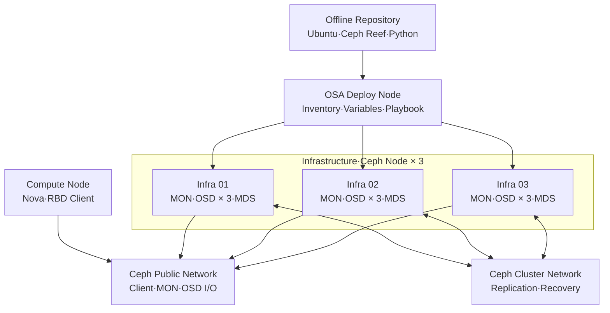
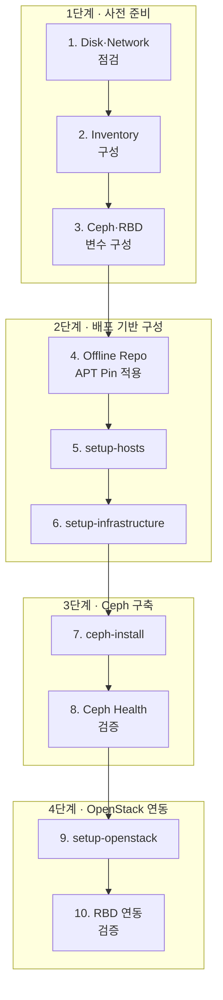

# Deploy Config

## 구성 목적

- OpenStack-Ansible Inventory 기반 Ceph 역할 배치
- Infrastructure 3 Node 기반 MON·OSD·MDS 고가용성 구성
- Ceph Public·Cluster Network 분리 적용
- Cinder Volume·Glance Image의 RBD Backend 전환
- 폐쇄망 Ceph Reef Package 고정 적용
- 실제 IP·Password·내부 Repository 정보의 환경별 치환 필요

## 배포 구성



- Infrastructure Node 3대의 OpenStack Control Plane·Ceph 역할 병행
- MON 3개 기반 Quorum 구성
- Node별 OSD 3개·전체 OSD 9개 구성
- Compute Node의 RBD Client 역할 적용

## 배포 흐름



## 1. 사전 준비

- Ubuntu 22.04 기반 대상 Node 준비 필요
- Ceph OSD용 미사용 Block Device 3개 이상 준비 필요
- OSD Device의 기존 Partition·Filesystem·LVM Signature 부재 확인 필요
- Public·Cluster Network의 MTU·Routing·Bond 상태 확인 필요
- Node 간 Hostname 해석·NTP 동기화 적용 필요
- 기존 `/etc/openstack_deploy` 설정 파일 백업 필요

```bash title="설정 파일 백업"
cp -a /etc/openstack_deploy/openstack_user_config.yml \
  /etc/openstack_deploy/openstack_user_config.yml.bak

cp -a /etc/openstack_deploy/user_variables.yml \
  /etc/openstack_deploy/user_variables.yml.bak
```

```bash title="OSD Device 사전 점검"
lsblk -o NAME,SIZE,TYPE,FSTYPE,MOUNTPOINTS
pvs
vgs
lvs
wipefs -n /dev/sdb
wipefs -n /dev/sdc
wipefs -n /dev/sdd
```

- `wipefs -n` 기반 비파괴 Signature 확인 적용
- 실제 초기화 작업 전 Device 식별·데이터 보존 여부 재확인 필요

## 2. Host·Role 설정

**적용 파일:** `/etc/openstack_deploy/openstack_user_config.yml`

```yaml title="OpenStack Host Group 예시"
_infrastructure_hosts: &infrastructure_hosts
  infra01:
    ip: <management-ip-1>
  infra02:
    ip: <management-ip-2>
  infra03:
    ip: <management-ip-3>

compute_hosts: &compute_hosts
  compute01:
    ip: <compute-management-ip>

shared-infra_hosts: *infrastructure_hosts
repo-infra_hosts: *infrastructure_hosts
haproxy_hosts: *infrastructure_hosts
identity_hosts: *infrastructure_hosts
storage-infra_hosts: *infrastructure_hosts
storage_hosts: *infrastructure_hosts
image_hosts: *infrastructure_hosts
compute-infra_hosts: *infrastructure_hosts
network_hosts: *infrastructure_hosts

network-northd_hosts: *infrastructure_hosts
network-gateway_hosts: *compute_hosts
```

- Infrastructure 3 Node 기반 API·DB·MQ·Storage Service 배치
- Compute 전용 Node 기반 Nova Compute·OVN Gateway 배치
- Bare Metal 직접 배포 방식의 `no_containers: true` 적용

## 3. Ceph Inventory 설정

```yaml title="/etc/openstack_deploy/openstack_user_config.yml"
ceph-mon_hosts:
  infra01:
    ip: <management-ip-1>
    container_vars:
      monitor_address: <ceph-public-ip-1>
  infra02:
    ip: <management-ip-2>
    container_vars:
      monitor_address: <ceph-public-ip-2>
  infra03:
    ip: <management-ip-3>
    container_vars:
      monitor_address: <ceph-public-ip-3>

ceph-osd_hosts:
  infra01:
    ip: <management-ip-1>
    container_vars:
      ceph_osd_devices:
        - /dev/sdb
        - /dev/sdc
        - /dev/sdd
  infra02:
    ip: <management-ip-2>
    container_vars:
      ceph_osd_devices:
        - /dev/sdb
        - /dev/sdc
        - /dev/sdd
  infra03:
    ip: <management-ip-3>
    container_vars:
      ceph_osd_devices:
        - /dev/sdb
        - /dev/sdc
        - /dev/sdd

ceph-mds_hosts:
  infra01:
    ip: <management-ip-1>
  infra02:
    ip: <management-ip-2>
  infra03:
    ip: <management-ip-3>
```

- MON의 Management IP·Ceph Public IP 분리 적용
- Node별 OSD Device 직접 지정 적용
- CephFS 사용을 위한 MDS 3 Node 배치
- `ceph_osd_devices` 지원 여부의 적용 ceph-ansible Role 확인 필요
- 자동 Device 검색보다 명시적 Device 지정 우선 적용

## 4. Network 설정

```yaml title="/etc/openstack_deploy/openstack_user_config.yml"
cidr_networks:
  management: <management-cidr>
  tunnel: <geneve-cidr>
  storage: <ceph-public-cidr>

global_overrides:
  no_containers: true
  management_bridge: br-mgmt
  provider_networks:
    - network:
        container_bridge: br-mgmt
        container_type: veth
        container_interface: eth1
        ip_from_q: management
        type: raw
        group_binds:
          - all_containers
          - hosts
        is_management_address: true

    - network:
        container_bridge: br-vxlan
        container_type: veth
        container_interface: eth10
        ip_from_q: tunnel
        type: geneve
        range: 1:1000
        net_name: vxlan
        group_binds:
          - neutron_ovn_controller

    - network:
        container_bridge: br-stcl
        container_type: veth
        container_interface: eth2
        ip_from_q: storage
        type: raw
        group_binds:
          - glance_api
          - cinder_api
          - cinder_volume
          - nova_compute
          - ceph-osd
```

- `br-stcl` 기반 Ceph Public Network 적용
- OpenStack Service·MON·OSD의 Client I/O 경로 적용
- `br-stsvc` 기반 Ceph Cluster Network의 OSD 복제 전용 적용
- Cluster Network의 OSA `provider_networks` 등록 불필요
- Host Network 구성에서 `br-stsvc`·고정 IP 별도 적용 필요

## 5. Ceph 기본 변수

**적용 파일:** `/etc/openstack_deploy/user_variables.yml`

```yaml title="Ceph Reef·Group·Network 설정"
ceph_stable_repo: >-
  [trusted=yes] http://<offline-repository>/ceph-reef/
ceph_stable_release: reef

mon_group_name: ceph-mon_hosts
osd_group_name: ceph-osd_hosts
mds_group_name: ceph-mds_hosts

ceph_public_network: <ceph-public-cidr>
ceph_cluster_network: <ceph-cluster-cidr>

ceph_osd_scenario: lvm
ceph_osd_objectstore: bluestore

ceph_conf_overrides:
  global:
    osd_pool_default_size: 3
    osd_pool_default_min_size: 2
    osd_pool_default_pg_num: 128
```

- Ceph Reef Release 고정 적용
- OSA Inventory와 ceph-ansible Group Name 매핑
- LVM·BlueStore 기반 OSD 구성
- Replica 3·Minimum Replica 2 정책 적용
- PG 수의 OSD·Pool·예상 Object 수 기준 재산정 필요

## 6. Offline Repository·APT Pin 설정

```yaml title="/etc/openstack_deploy/user_variables.yml"
openstack_hosts_package_repos:
  - repo: >-
      deb [trusted=yes]
      http://<offline-repository>/ceph-reef/
      jammy main
    state: present
    filename: ceph-reef-offline

openstack_hosts_package_apt_preferences:
  - package: >-
      ceph cephadm ceph-base ceph-common ceph-mds ceph-mgr
      ceph-mon ceph-osd ceph-volume librados2 librbd1
      python3-ceph python3-rados python3-rbd
    pin: release l=Ceph-Reef
    priority: 1001
    file: ceph-reef

  - package: >-
      ceph* libcephfs* librados* librbd* librgw* python3-ceph*
    pin: release o=Canonical, n=jammy-updates/caracal
    priority: -1
    file: ceph-reef
```

- 내부 Ceph Reef Repository 우선순위 1001 적용
- Ubuntu Cloud Archive Ceph Package 우선순위 -1 적용
- Ceph Reef와 Squid Package 혼합 설치 방지
- `trusted=yes` 사용 시 내부 Repository 신뢰 경계 관리 필요

```bash title="Package 후보 Version 확인"
apt-get update
apt-cache policy ceph ceph-common ceph-osd librbd1 python3-rbd
apt-get -s install ceph-common ceph-osd
```

- Simulation 결과의 Reef Version 선택 확인 필요
- 외부 Repository 접근 부재 확인 필요

## 7. Cinder RBD Backend 설정

```yaml title="/etc/openstack_deploy/user_variables.yml"
cinder_backends:
  ceph_rbd:
    volume_driver: cinder.volume.drivers.rbd.RBDDriver
    volume_backend_name: ceph-rbd
    rbd_pool: volumes
    rbd_ceph_conf: /etc/ceph/ceph.conf
    rbd_flatten_volume_from_snapshot: false
    report_discard_supported: true
    rbd_max_clone_depth: 5
    rbd_store_chunk_size: 4
    rados_connect_timeout: -1

cinder_cinder_conf_overrides:
  DEFAULT:
    image_upload_use_cinder_backend: True
    image_upload_use_internal_tenant: True
    use_multipath_for_image_xfer: True
  backend_defaults:
    image_volume_cache_enabled: True
    image_volume_cache_max_count: 200
    image_volume_cache_max_size_gb: 500

cinder_service_backup_program_enabled: False
```

- Cinder RBD 단독 Backend 적용
- `volumes` Pool 기반 Block Volume 저장
- Image Upload의 Cinder Backend·Internal Tenant 사용 적용
- Image Volume Cache 최대 200개·500GiB 적용
- NFS Backup Service 비활성화 적용

```bash title="Cinder Volume Type 연결"
openstack volume type create ceph-rbd
openstack volume type set \
  --property volume_backend_name=ceph-rbd \
  ceph-rbd
```

## 8. Glance RBD Backend 설정

```yaml title="/etc/openstack_deploy/user_variables.yml"
glance_default_store: rbd
glance_additional_stores:
  - name: cinder
  - name: http

glance_glance_api_conf_overrides:
  glance_store:
    stores: rbd, cinder, http
    default_store: rbd
    rbd_store_pool: images
    rbd_store_ceph_conf: /etc/ceph/ceph.conf
    rbd_store_chunk_size: 8
```

- Glance 기본 Store의 RBD 전환 적용
- `images` Pool 기반 Image 저장
- Cinder·HTTP Additional Store 적용
- 기존 NFS Image Mount 비활성화 필요

## 9. Nova RBD Client 설정

```yaml title="/etc/openstack_deploy/user_variables.yml"
nova_nova_conf_overrides:
  libvirt:
    cpu_mode: host-model
    volume_use_multipath: True
    live_migration_permit_auto_converge: True
    live_migration_permit_post_copy: False
```

- Nova의 Cinder RBD Volume 연결 적용
- Multipath 사용 설정 적용
- Live Migration Auto Converge 적용
- Compute Node의 Ceph Configuration·Keyring 배포 필요

## 10. 설정 검증

```bash title="YAML·Inventory 검증"
python3 - <<'PY'
import yaml

for path in (
    "/etc/openstack_deploy/openstack_user_config.yml",
    "/etc/openstack_deploy/user_variables.yml",
):
    with open(path, encoding="utf-8") as stream:
        yaml.safe_load(stream)
    print(f"YAML OK: {path}")
PY

cd /opt/openstack-ansible/playbooks
openstack-ansible-inventory --check
```

- `ceph-mon_hosts` 3개·`ceph-osd_hosts` 3개 포함 확인
- MON Address의 Ceph Public Network 소속 확인
- OSD Device 경로의 전체 Node 동일 여부 확인
- Public·Cluster CIDR의 Host Interface 구성 일치 확인 필요

## 11. 배포

```bash title="OpenStack-Ansible 배포 순서"
cd /opt/openstack-ansible/playbooks

openstack-ansible setup-hosts.yml
openstack-ansible setup-infrastructure.yml
openstack-ansible ceph-install.yml
```

- Host·Repository 구성 완료 후 Ceph 배포
- OpenStack Service 배포 전 Ceph Cluster 정상화 필요
- 실패 시 최초 Error Task·대상 Node·Package Version 확인 필요

```bash title="Ceph 정상화 후 OpenStack Service 배포"
openstack-ansible setup-openstack.yml
```

## 12. Ceph Cluster 검증

```bash title="Cluster 상태 확인"
ceph -s
ceph health detail
ceph quorum_status --format json-pretty
ceph mon dump
ceph osd tree
ceph osd df tree
ceph pg stat
```

- MON 3개 Quorum 형성 확인
- OSD 9개 `up·in` 상태 확인
- PG `active+clean` 상태 확인
- Public·Cluster Network Address 정합성 확인

```bash title="Pool·RBD 확인"
ceph osd pool ls detail
rbd pool init volumes
rbd pool init images
rbd ls -p volumes
rbd ls -p images
```

- `volumes`·`images` Pool 존재 확인
- Pool Application `rbd` 적용 확인
- Pool 초기화 명령의 최초 1회 적용 필요

## 13. OpenStack 연동 검증

```bash title="Cinder·Glance 상태 확인"
openstack volume service list
cinder get-pools --detail
openstack image list
```

```bash title="Volume 생성 확인"
openstack volume create \
  --type ceph-rbd \
  --size 1 \
  ceph-rbd-deploy-test

openstack volume show ceph-rbd-deploy-test
rbd ls -p volumes
```

```bash title="Image 저장 확인"
openstack image create \
  --disk-format raw \
  --container-format bare \
  --file <test-image.raw> \
  ceph-rbd-image-test

rbd ls -p images
```

- Cinder `ceph_rbd` Service의 `enabled·up` 확인
- `ceph-rbd` Pool의 Cinder Scheduler 노출 확인
- Volume 생성 후 `volumes` Pool RBD Object 확인
- Image Upload 후 `images` Pool RBD Object 확인

## 14. 장애 확인 기준

| 증상 | 확인 항목 | 조치 기준 |
|---|---|---|
| Ceph Package Version 충돌 | `apt-cache policy`·APT Pin | Reef 우선순위·Cloud Archive 차단 수정 |
| MON Quorum 불능 | MON Address·Public Network·시간 | Address·Routing·NTP 정합성 수정 |
| OSD 미생성 | Device 경로·Signature·Role 변수 | Device 식별·초기화·변수명 확인 |
| OSD `down` | Public·Cluster Network·Daemon Log | Network·Service·Device 상태 복구 |
| PG 비정상 | OSD `up/in`·Replica·용량 | OSD 상태·Pool 정책·용량 보완 |
| Cinder Backend 미등록 | Keyring·Ceph Config·Pool | Client 인증·Pool·Backend 설정 수정 |
| Glance Upload 실패 | `images` Pool·Keyring·Store | Pool 권한·Store 설정 수정 |
| RBD 접근 Timeout | Public Network·MON Endpoint | Routing·Firewall·MON 상태 수정 |

## 완료 기준

- MON 3개 Quorum 구성 완료
- OSD 9개 `up·in` 및 PG `active+clean` 상태 확인
- Ceph Public·Cluster Network 분리 적용
- Cinder `volumes` Pool 기반 RBD Volume 생성 성공
- Glance `images` Pool 기반 Image Upload 성공
- Compute Node의 RBD Volume 연결 성공
