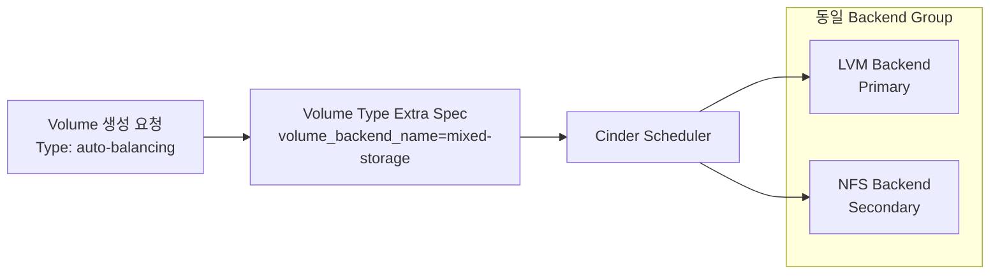
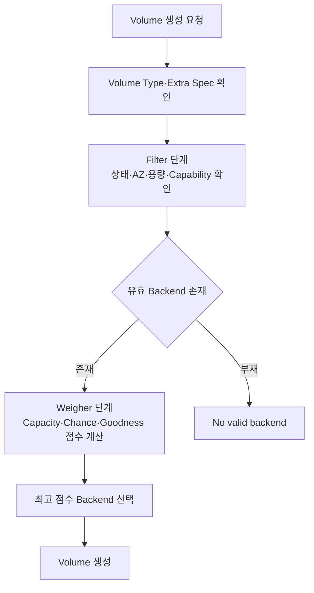
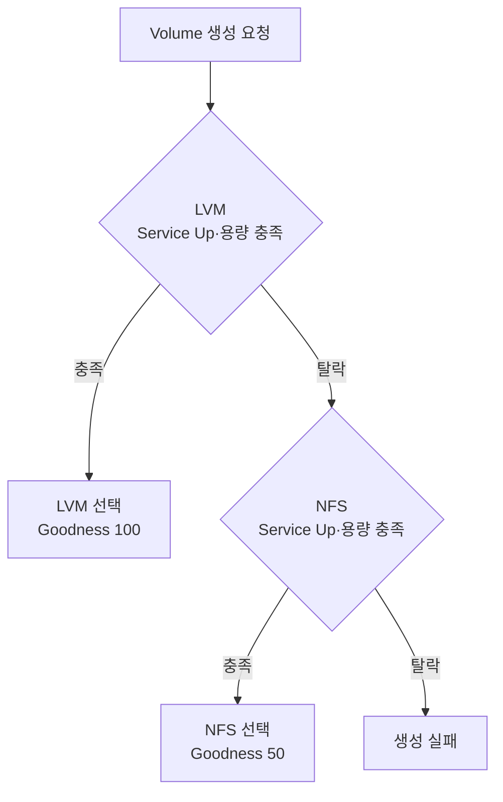

# 6. Cinder MultiBackend 가중치

## 목적

- LVM·NFS Backend의 단일 Volume Type 기반 통합 선택
- Cinder Scheduler의 Filter·Weigher 처리 과정 확인
- Capacity·Random·Goodness 정책별 Backend 선택 기준 정립
- Primary LVM·Secondary NFS 자동 전환 구조 적용

## 구성 맥락

- LVM·NFS Backend별 상이한 `volume_backend_name` 적용 상태
- Volume Type의 Extra Spec과 일치하는 단일 Backend만 후보로 선정
- Weigher 설정만으로 복수 Backend 후보 생성 불가
- LVM Service Host의 설정 미반영에 따른 후보 제외 발생
- Backend Name 통일과 Capability 재보고 후 복수 후보 구성 확인
- 운영 목적에 따른 Random 분산과 고정 우선순위 방식 비교 필요

## 전체 구조



- Backend Section 이름과 Scheduler Group 이름의 역할 분리 필요
- `enabled_backends`의 Section 이름 기반 Service 실행 적용
- `volume_backend_name`의 Volume Type 연결과 후보 Group화 적용

## Scheduler 처리 흐름



- Filter 단계의 Down Service·용량 부족 Backend 제거 적용
- Weigher 단계의 남은 후보 간 점수 비교 적용
- Backend Group화 부재 시 Weigher 비교 대상 부재
- Primary Backend 탈락 시 Secondary Backend 자동 선택 가능

## Backend Group화

### Scheduler·Backend 기본 설정

```ini title="cinder-scheduler의 /etc/cinder/cinder.conf"
[DEFAULT]
enabled_backends = lvm_lio_mp,nfs_volume
default_volume_type = auto-balancing
```

```ini title="LVM cinder-volume Host의 /etc/cinder/cinder.conf"
[lvm_lio_mp]
volume_driver = cinder.volume.drivers.lvm.LVMVolumeDriver
volume_backend_name = mixed-storage
volume_group = cinder-vol
target_helper = lioadm
target_protocol = iscsi
```

```ini title="NFS cinder-volume Host의 /etc/cinder/cinder.conf"
[nfs_volume]
volume_driver = cinder.volume.drivers.nfs.NfsDriver
volume_backend_name = mixed-storage
nfs_shares_config = /etc/cinder/nfs_shares
```

- LVM·NFS의 `volume_backend_name` 동일값 적용
- 각 `cinder-volume` 실행 Host의 실제 설정 파일 변경 필요
- Controller 설정만 변경할 경우 Remote Storage Node 반영 부재
- 설정 변경 후 `cinder-volume` Service 재기동 필요

## Volume Type 연결

```bash title="통합 Volume Type 생성"
openstack volume type create auto-balancing

openstack volume type set \
  --property volume_backend_name=mixed-storage \
  auto-balancing
```

```bash title="Volume Type 확인"
openstack volume type show auto-balancing
```

- Volume Type Extra Spec과 Backend의 `volume_backend_name` 일치 필요
- Type 미지정 요청의 자동 분산을 위한 `default_volume_type` 적용

## 가중치 정책 비교

| 정책 | 선택 기준 | 용도 | 주요 위험 |
|---|---|---|---|
| CapacityWeigher | 가용 용량 | 용량 균형 | 대용량 Backend 편중 가능 |
| ChanceWeigher | Random 점수 | 확률적 분산 | 연속 선택·용량 편차 가능 |
| GoodnessWeigher | 정의된 Goodness 점수 | Primary·Secondary | 점수 설정 오류 가능 |

### CapacityWeigher

- Virtual·Actual Free Capacity 기반 가중치 적용
- 기본 분산 정책으로 사용 가능
- LVM·NFS 용량 차이가 큰 경우 대용량 Backend 우선 선택 가능
- 완전한 1:1 분산 보장 부재

```ini title="용량 기반 선택"
[DEFAULT]
scheduler_default_weighers = CapacityWeigher
```

### ChanceWeigher

- 유효 후보별 Random Weight 적용
- 동일하게 적합한 Backend 간 확률적 분산 목적
- Round-Robin 기반 교대 선택 기능 부재
- 소량 요청의 1:1 분포 보장 부재
- 용량 부족 Backend의 Filter 탈락 여부 확인 필요

```ini title="Random 선택"
[DEFAULT]
scheduler_default_weighers = ChanceWeigher
```

### GoodnessWeigher

- Backend별 `goodness_function` 결과의 0~100 점수 적용
- 고정 Primary·Secondary 우선순위 구현 가능
- LVM 용량 부족·Service Down 시 Filter 단계 탈락 적용
- 남은 NFS Backend의 자동 선택 적용

```ini title="Scheduler 설정"
[DEFAULT]
scheduler_default_weighers = GoodnessWeigher
```

```ini title="LVM Primary 점수"
[lvm_lio_mp]
volume_backend_name = mixed-storage
goodness_function = 100
```

```ini title="NFS Secondary 점수"
[nfs_volume]
volume_backend_name = mixed-storage
goodness_function = 50
```

- Cinder Caracal 환경에서 `GoodnessWeigher` 단축 이름 적용 확인
- 전체 Python Module 경로 사용 시 `SchedulerHostWeigherNotFound` 발생 가능
- Driver별 `goodness_function` 지원 여부 확인 필요

## 권장 구성



- 운영 기본 정책의 LVM Primary·NFS Secondary 적용
- LVM 우선 사용을 위한 Goodness 100 적용
- NFS Backup·Overflow 역할을 위한 Goodness 50 적용
- 무작위 분산 시험 시 ChanceWeigher의 임시 적용 권장
- 시험 종료 후 GoodnessWeigher 원복 필요

## OpenStack-Ansible 설정

```yaml title="/etc/openstack_deploy/user_variables.yml"
cinder_backends:
  nfs_volume:
    volume_backend_name: mixed-storage
    volume_driver: cinder.volume.drivers.nfs.NfsDriver
    nfs_shares_config: /etc/cinder/nfs_shares
    nfs_mount_options: "rsize=65535,wsize=65535,timeo=1200,actimeo=120"
    goodness_function: "50"

  lvm_lio_mp:
    volume_backend_name: mixed-storage
    volume_driver: cinder.volume.drivers.lvm.LVMVolumeDriver
    volume_group: cinder-vol
    target_helper: lioadm
    target_protocol: iscsi
    target_ip_address: <primary-storage-ip>
    target_secondary_ip_addresses: <secondary-storage-ip>
    target_port: 3260
    goodness_function: "100"

cinder_cinder_conf_overrides:
  DEFAULT:
    scheduler_default_weighers: GoodnessWeigher
    default_volume_type: auto-balancing

cinder_enabled_backends:
  - nfs_volume
  - lvm_lio_mp

cinder_target_helper_mapping:
  Debian: lioadm
  RedHat: lioadm

cinder_target_helper: lioadm
cinder_target_protocol: iscsi
```

- iSCSI Secondary Address의 Python List 문자열 변환 방지 필요
- 실제 Role Template이 요구하는 Scalar·List 형식 확인 필요
- 내부 주소·NFS Share·Volume Group의 환경별 치환 필요

```bash title="OSA 설정 반영"
cd /opt/openstack-ansible/playbooks
openstack-ansible os-cinder-install.yml
```

## 설정 검증

### Service 상태

```bash
openstack volume service list
```

- Scheduler와 모든 `cinder-volume` Service의 `enabled·up` 확인
- 과거 Backend Service의 `down` Record와 현재 Service 구분 필요

### Backend Capability

```bash
cinder get-pools --detail
```

- LVM·NFS Pool 모두 조회 필요
- 두 Pool의 `volume_backend_name=mixed-storage` 일치 확인
- `goodness_function`과 Free Capacity Report 확인 필요

### Volume 생성 결과

```bash title="Volume 생성"
openstack volume create \
  --type auto-balancing \
  --size 1 \
  weight-test
```

```bash title="선택 Backend 확인"
openstack volume show weight-test \
  -c status \
  -c type \
  -c os-vol-host-attr:host
```

- GoodnessWeigher 적용 시 LVM Backend 선택 확인
- LVM Service 비활성화·용량 부족 조건의 NFS 선택 확인 필요
- ChanceWeigher 적용 시 다수 Volume 기반 분포 확인 필요

## 주요 장애와 해결

| 장애 | 원인 | 조치 |
|---|---|---|
| NFS만 계속 선택 | LVM Backend Name 불일치 | Storage Node 설정 수정 |
| LVM Pool 조회 부재 | LVM `cinder-volume` Down | Volume Group·Driver 상태 복구 |
| 설정 변경 미반영 | 잘못된 Node의 `cinder.conf` 수정 | 실제 Service Host 설정 변경 |
| Weigher Load 실패 | 전체 Python Module 경로 적용 | `GoodnessWeigher` 단축 이름 적용 |
| Random 적용 효과 부재 | 후보 Backend Group화 부재 | Backend Name·Volume Type 일치 |
| LVM Volume 생성 실패 | LIO Target·Portal 설정 오류 | Scalar IP 형식과 Port 점검 |
| 용량 기반 NFS 편중 | NFS Free Capacity 우위 | 정책 목적에 따른 Weigher 변경 |

## 운영 고려사항

- ChanceWeigher의 Random 분포와 Round-Robin 간 차이 존재
- 서로 다른 Storage 성능·장애 특성의 단일 Type 노출 위험
- Backend별 Snapshot·Clone·Encryption 지원 차이 확인 필요
- GoodnessWeigher와 CapacityWeigher 병용 시 정규화·Multiplier 영향 확인 필요
- Scheduler 정책 변경 전 기존 Volume 배치 영향 부재
- 신규 Volume 요청에만 변경 정책 적용
- Scheduler Log와 Pool Capability의 지속 모니터링 필요

## 확인 결과

- 동일 `volume_backend_name` 기반 LVM·NFS 후보 Group화 확인
- Volume Type 기반 MultiBackend 선택 적용
- ChanceWeigher 기반 확률적 분산 가능
- GoodnessWeigher 기반 LVM Primary·NFS Secondary 구성 적용
- Primary Backend Filter 탈락 시 Secondary Backend 선택 가능
- Service Host별 설정과 Capability 재보고의 중요성 확인
- Random 방식의 완전한 1:1 배치 보장 부재
- 운영 적용 전 Backend별 기능·성능·용량 검증 필요

## 참고 문서

- [OpenStack Cinder Scheduler Weights](https://docs.openstack.org/cinder/latest/contributor/api/cinder.scheduler.weights.html)
- [OpenStack Driver Filter·GoodnessWeigher 설정](https://docs.openstack.org/cinder/2023.2/admin/driver-filter-weighing.html)

