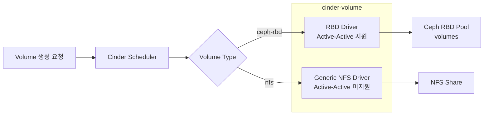
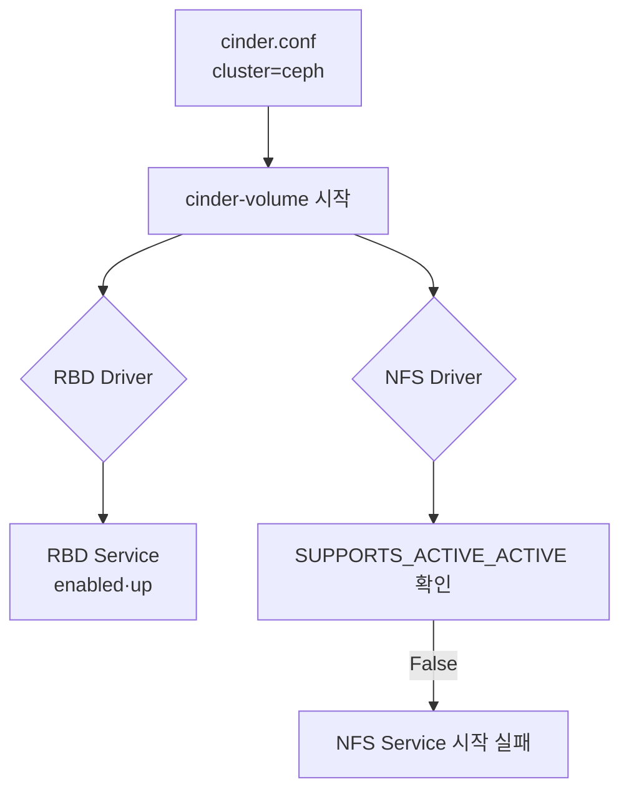
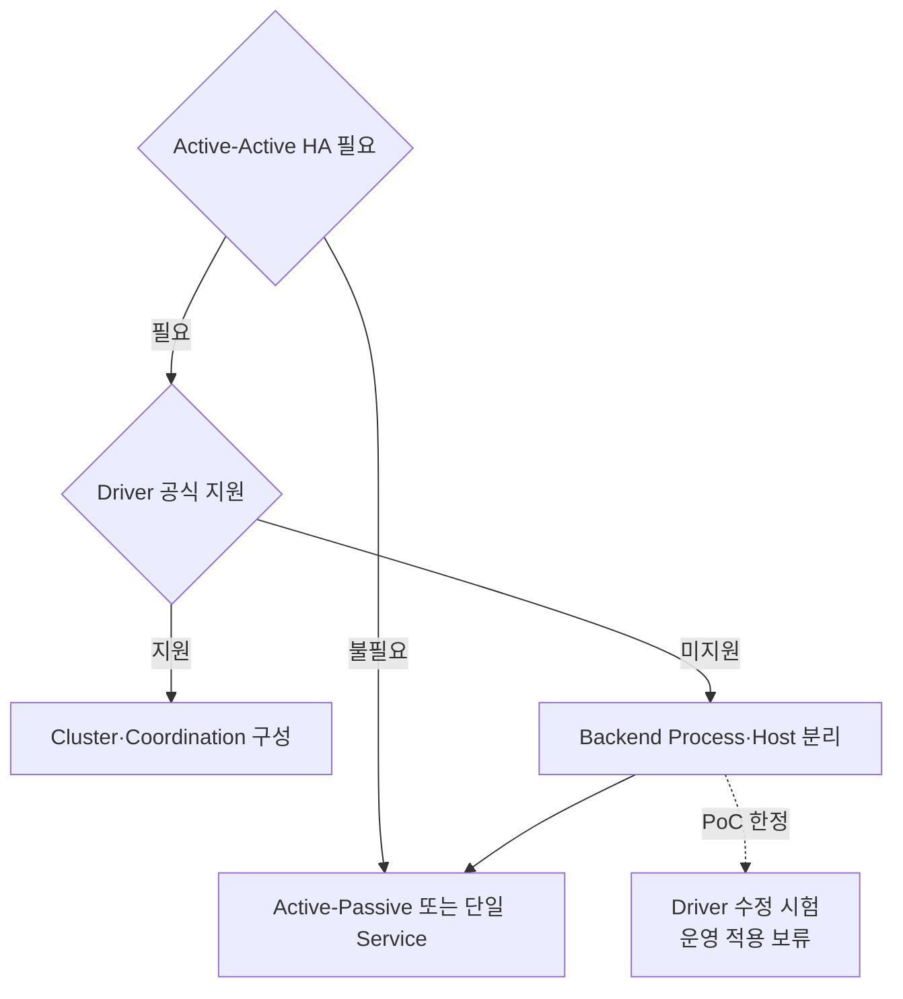
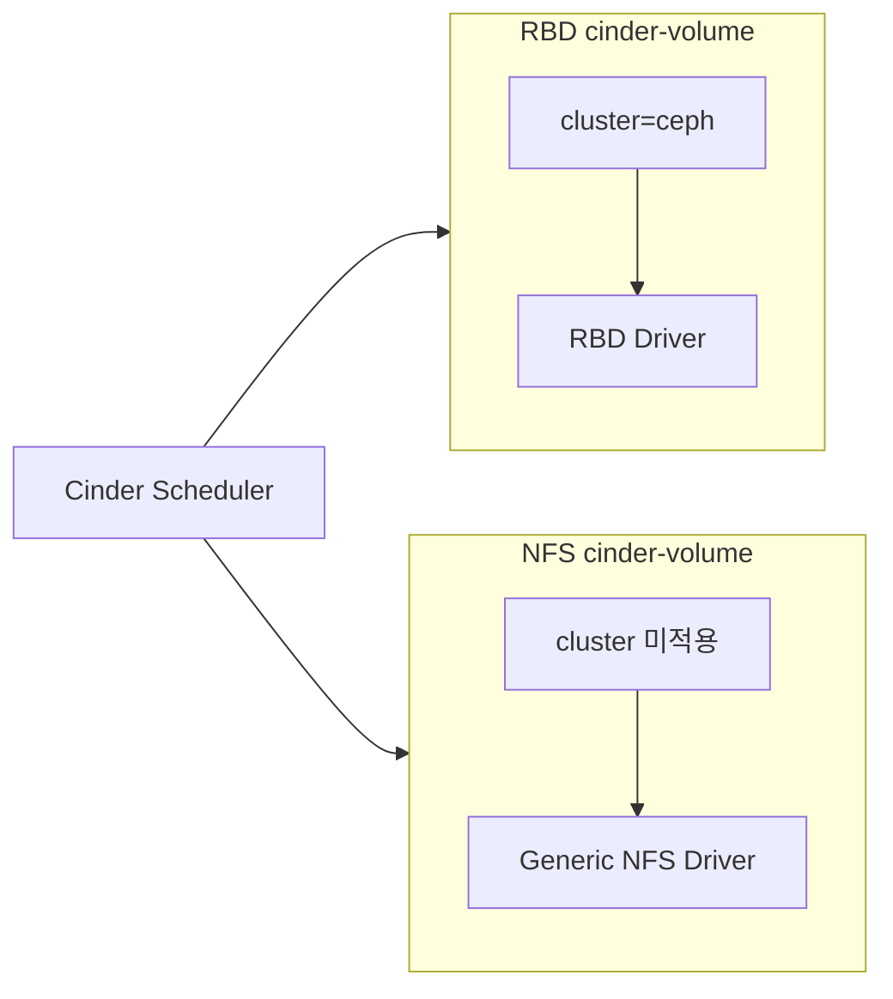

# 8. Cinder MultiBackend

## 검증 목적

- Ceph RBD·Generic NFS Backend의 단일 Cinder 환경 동시 구성
- Backend별 Active-Active 지원 차이 확인
- 전역 `cluster` 설정에 따른 NFS Service 기동 실패 원인 확인
- Driver 수정·Backend 분리 대안의 적용 범위와 위험 비교

## 시험 환경

| 항목 | 구성 |
|---|---|
| Hypervisor | KVM |
| OpenStack Node | Control·Compute 통합 1대 |
| Cinder Backend | Ceph RBD·Generic NFS |
| RBD Backend Name | `rbddriver` |
| NFS Backend Name | `NFS_VOLUME1` |
| 배포 방식 | OpenStack-Ansible |

- 단일 Node 시험 환경 적용
- 실제 IP·UUID·내부 경로의 공개용 일반화 적용
- 운영 적용 전 Release·Driver Support Matrix 재확인 필요

## 구성 구조



## 핵심 제약

| 구분 | Ceph RBD | Generic NFS |
|---|---|---|
| MultiBackend 등록 | 가능 | 가능 |
| 독립 Volume Type 선택 | 가능 | 가능 |
| Active-Active HA | 지원 | 지원 선언 부재 |
| `cluster` 설정 적용 | 가능 | Service 기동 실패 |
| 운영 권장 방식 | Cluster 구성 가능 | Active-Passive·독립 Process 검토 필요 |

- MultiBackend 기능과 Active-Active HA의 별도 개념
- `enabled_backends` 등록만으로 Active-Active 요구 발생 부재
- `cluster` Option 적용 시 동일 Cluster의 Service를 Active-Active로 간주
- Generic NFS Driver의 Active-Active 지원 선언 부재
- Driver별 공식 Support Matrix 확인 필요

## 장애 발생 흐름



### 확인된 오류

```text title="cinder-volume 기동 오류"
Active-Active configuration is not currently supported by driver
cinder.volume.drivers.nfs.NfsDriver.

Volume service <host>@nfs_volume failed to start.
```

- NFS Share 접근 실패가 아닌 Driver Capability 검증 단계 오류
- Scheduler 선택 이전의 `cinder-volume` 초기화 단계 실패
- RBD Service 정상·NFS Service 실패의 비대칭 상태 발생

## OpenStack-Ansible Backend 구성

```yaml title="openstack_user_config.yml 예시"
storage_hosts:
  storage01:
    ip: <management-ip>
    container_vars:
      cinder_backends:
        limit_container_types: cinder_volume

        nfs_volume:
          volume_backend_name: NFS_VOLUME1
          volume_driver: cinder.volume.drivers.nfs.NfsDriver
          nfs_mount_options: "rsize=65535,wsize=65535,timeo=1200,actimeo=120"
          nfs_shares_config: /etc/cinder/nfs_shares
          shares:
            - ip: "<nfs-server-ip>"
              share: "/export/cinder"

        rbd_volumes:
          volume_backend_name: rbddriver
          volume_driver: cinder.volume.drivers.rbd.RBDDriver
          rbd_pool: volumes
          rbd_ceph_conf: /etc/ceph/ceph.conf
          rbd_user: "{{ cinder_ceph_client }}"
          rbd_secret_uuid: "{{ cinder_ceph_client_uuid }}"
          rbd_store_chunk_size: 16
          report_discard_supported: true
```

- `nfs_volume`·`rbd_volumes` Section 분리 적용
- Backend별 고유 `volume_backend_name` 적용
- NFS Share·Ceph 인증값의 외부 공개 방지 필요
- Backend별 Volume Type 연결 필요

## 배포 후 설정 확인

```ini title="cinder.conf 핵심 항목"
[DEFAULT]
enabled_backends = rbd_volumes,nfs_volume
cluster = ceph

[nfs_volume]
volume_backend_name = NFS_VOLUME1
volume_driver = cinder.volume.drivers.nfs.NfsDriver
nfs_shares_config = /etc/cinder/nfs_shares

[rbd_volumes]
volume_backend_name = rbddriver
volume_driver = cinder.volume.drivers.rbd.RBDDriver
rbd_pool = volumes
rbd_ceph_conf = /etc/ceph/ceph.conf
rbd_user = cinder
```

- 전역 `cluster = ceph`의 모든 Backend Service 적용
- RBD만을 대상으로 한 Cluster 의도와 실제 적용 범위 불일치
- NFS Driver 초기화 시 Active-Active Capability 검사 발생

## 대안 비교

| 대안 | 적용 방식 | 장점 | 위험·제약 |
|---|---|---|---|
| A. Driver 직접 수정 | `SUPPORTS_ACTIVE_ACTIVE=True` | 단일 Process 기동 가능성 | 공식 지원 부재·전수시험 필요 |
| B. Backend Process 분리 | RBD·NFS의 Host·Config 분리 | Capability별 독립 운영 | 배포 구조·운영 복잡도 증가 |
| C. NFS Cluster 제외 | NFS Service에 `cluster` 미적용 | Driver 원형 유지 | Process별 설정 분리 필요 |
| D. 지원 Driver 전환 | Active-Active 지원 Storage 사용 | 공식 HA 구성 가능 | Storage·Migration 비용 필요 |

### 권장 판단 흐름



## 대안 A. Driver 직접 수정

```python title="PoC 한정 변경 예시"
SUPPORTS_ACTIVE_ACTIVE = True
```

:::danger 운영 적용 주의

상수 변경은 실제 동시성 안전성 구현이 아닌 Capability 검사 우회에 해당.
NFS Driver의 Local Lock·Snapshot·Clone·Delete·Failover 전체 동작 검증 필요.

:::

- Package Upgrade·재배포 시 변경 유실 가능
- 공식 Support 범위 이탈 가능
- 동일 Volume 동시 작업의 Race Condition 검증 필요
- 장애 복구·Service Cleanup·Lock 동작 전수시험 필요
- 운영 표준안보다 PoC 검증용 적용

## 대안 B. Backend 분리



- RBD와 NFS의 Service Host·Process·Config 분리 적용
- RBD Service에만 Cluster·Coordination 설정 적용
- NFS Service의 단일 Active 또는 Active-Passive 운영 필요
- OpenStack-Ansible Host Group·Container Variable 분리 필요
- Scheduler의 두 Backend Service 동시 인식 확인 필요

## Volume Type 연결

```bash title="RBD Volume Type 생성"
openstack volume type create ceph-rbd
openstack volume type set ceph-rbd \
  --property volume_backend_name=rbddriver
```

```bash title="NFS Volume Type 생성"
openstack volume type create nfs
openstack volume type set nfs \
  --property volume_backend_name=NFS_VOLUME1
```

```bash title="Volume Type 확인"
openstack volume type list
openstack volume type show ceph-rbd
openstack volume type show nfs
```

- Backend별 독립 Volume Type 적용
- Extra Spec과 `volume_backend_name`의 정확한 일치 필요
- 기존 Volume의 Backend 변경과 Type 변경의 별도 Migration 검토 필요

## 검증 절차

```bash title="Cinder Service 확인"
openstack volume service list
openstack volume pool list --detail
```

```bash title="Backend별 Volume 생성"
openstack volume create \
  --size 1 \
  --type ceph-rbd \
  rbd-test

openstack volume create \
  --size 1 \
  --type nfs \
  nfs-test
```

```bash title="생성 결과 확인"
openstack volume show rbd-test
openstack volume show nfs-test
```

### 판정 기준

- `cinder-volume <host>@rbd_volumes`의 `enabled·up` 확인
- `cinder-volume <host>@nfs_volume`의 `enabled·up` 확인
- RBD Volume의 Ceph `volumes` Pool 생성 확인
- NFS Volume의 지정 Share 파일 생성 확인
- Backend별 Snapshot·Clone·Extend·Attach·Detach·Delete 확인 필요

## Active-Active 전수시험 항목

| 시험 항목 | 주요 확인 내용 |
|---|---|
| 동시 생성 | 동일 Backend의 병렬 Volume 생성 |
| 동시 삭제 | 사용·미사용 Volume의 병렬 삭제 |
| Snapshot | 생성·삭제·Volume 복원 |
| Clone | Volume·Snapshot 기반 Clone |
| Extend | Online·Offline 확장 |
| Attach | 복수 Compute 연결·해제 |
| Service 장애 | Process 종료·재기동·Failover |
| Lock | 중복 작업·Race Condition 부재 |
| DB 정합성 | Service·Volume·Attachment 상태 일치 |
| Upgrade | Package 재배포 후 설정 유지 |

## 장애 확인

| 증상 | 원인 | 확인·조치 |
|---|---|---|
| NFS Service 기동 실패 | 전역 `cluster` 적용 | Backend별 Config·Process 분리 |
| RBD만 `up` | NFS Active-Active 미지원 | NFS Service Log·Driver Matrix 확인 |
| `No valid backend` | Service Down·Type 불일치 | Service·Pool·Extra Spec 확인 |
| 잘못된 Backend 선택 | `volume_backend_name` 중복 | Backend Name·Volume Type 분리 |
| Driver 수정 유실 | Package Upgrade·재배포 | 배포 자동화·Patch 관리 검토 |
| NFS 데이터 충돌 | 동시성 안전성 미검증 | Active-Passive 전환·전수시험 필요 |

## 정리

- Ceph RBD·Generic NFS MultiBackend 동시 등록 가능
- MultiBackend와 Active-Active HA의 독립 개념
- RBD Driver의 Active-Active 지원 적용
- Generic NFS Driver의 Active-Active 지원 선언 부재
- 전역 `cluster` 설정에 따른 NFS Service 기동 실패 확인
- Driver 상수 수정의 PoC 한정 적용 필요
- 운영 환경의 Backend Process 분리 또는 지원 Driver 전환 권장

## 참고 자료

- [Cinder Driver Support Matrix](https://docs.openstack.org/cinder/latest/reference/support-matrix.html)
- [Cinder High Availability](https://docs.openstack.org/cinder/latest/contributor/high_availability.html)
- [Cinder NFS Backend](https://docs.openstack.org/cinder/latest/admin/nfs-backend.html)
