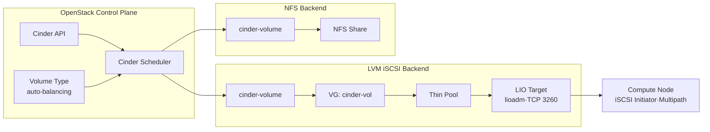
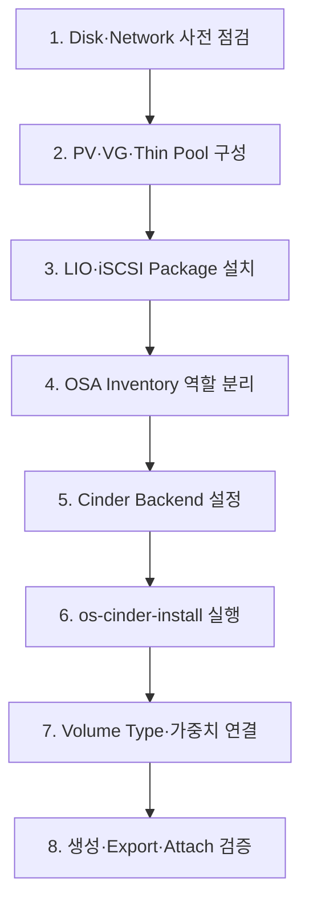
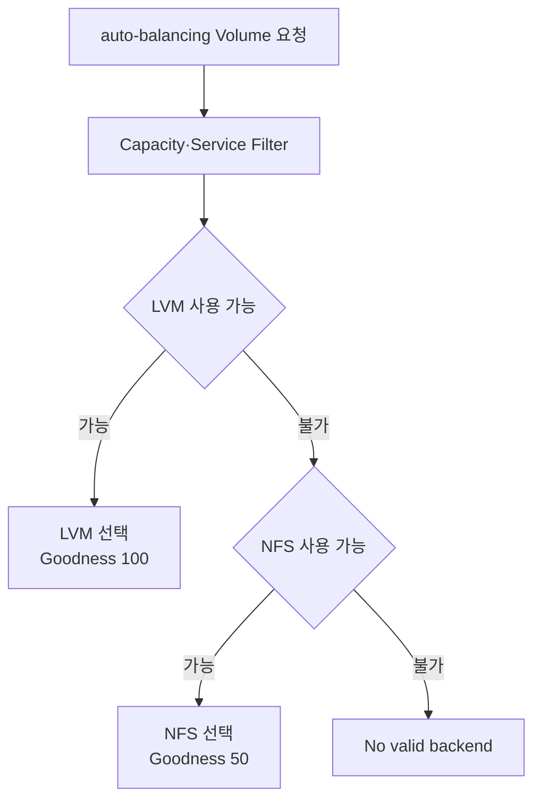
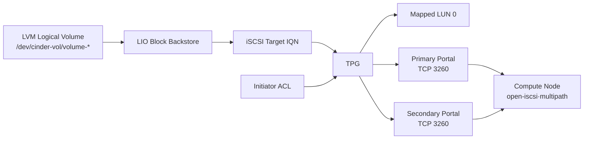

# 7. LVM iSCSI Cinder Backend

## 목적

- 전용 Storage Node 기반 Cinder LVM Backend 구축
- LIO 기반 iSCSI Target·Multipath 경로 구성
- NFS Backend와 MultiBackend 동시 운영
- Goodness 가중치 기반 LVM Primary 선택 적용

## 원본 구성도


*OpenStack Cluster·전용 LVM Storage Node·NFS Backend 구성*

## 논리 구성



- Cinder API·Scheduler의 Control Plane 역할 적용
- 전용 Storage Node의 `cinder-volume`·LVM·LIO 역할 적용
- Compute Node의 iSCSI Initiator·Multipath 역할 적용
- NFS Backend의 Secondary Storage 역할 적용

## 설치 순서



## 1. 사전 점검

- 전용 Storage Node의 Data Disk 식별 필요
- Management·iSCSI Primary·Secondary Network 연결 확인 필요
- TCP 3260 Port의 접근 정책 확인 필요
- 기존 Partition·Filesystem·LVM Signature 확인 필요
- Compute Node의 iSCSI Initiator IQN 확인 필요

```bash title="Disk·Network 확인"
lsblk -f
pvs
vgs
lvs
ip -br address
ss -lntp | grep 3260
```

:::danger 대상 Disk 데이터 삭제 주의

PV 생성 전 장치명·기존 데이터·운영 사용 여부 확인 필요.

:::

## 2. LVM 구성

### PV·VG 생성

```bash title="Package 설치"
apt-get update
apt-get install -y \
  lvm2 \
  thin-provisioning-tools \
  parted
```

```bash title="PV·VG 생성 예시"
pvcreate /dev/vdb /dev/vdc /dev/vdd
vgcreate cinder-vol /dev/vdb /dev/vdc /dev/vdd
```

- Data Disk별 Physical Volume 생성 적용
- Cinder 전용 Volume Group `cinder-vol` 구성 적용
- OS Disk와 Cinder Data Disk의 분리 필요

### Thin Pool 구성

```bash title="Thin Pool 생성 예시"
lvcreate \
  --type thin-pool \
  --name cinder-vol-pool \
  --extents 95%VG \
  cinder-vol
```

- Cinder Volume의 Thin Provisioning 적용
- Metadata 여유공간과 Volume Group Free Space 확보 필요
- 실제 Cinder Driver의 Thin Pool 생성·관리 방식 확인 필요

```bash title="LVM 상태 확인"
pvs
vgs
lvs -a -o +seg_monitor,data_percent,metadata_percent
```

```text title="확인 기준"
PV  : /dev/vdb, /dev/vdc, /dev/vdd
VG  : cinder-vol
Pool: cinder-vol-pool
```

## 3. LIO iSCSI 구성

### TGT·LIO 비교

| 항목 | TGT | LIO |
|---|---|---|
| 처리 위치 | User Space | Kernel Space |
| 관리 도구 | `tgtadm` | `targetcli` |
| Cinder Helper | `tgtadm` | `lioadm` |
| Linux 표준 | Legacy | Kernel Mainline |
| 적용 목적 | 단순 Target | 고성능·다중 Protocol |

- Kernel 기반 LIO Target 적용
- Cinder LVM Driver의 `target_helper=lioadm` 적용
- TGT Package·Service와 LIO의 동시 사용 방지 필요

### LIO Package 설치

```bash
apt-get install -y \
  targetcli-fb \
  python3-rtslib-fb \
  open-iscsi
```

```bash title="Kernel Target·Service 확인"
modprobe target_core_mod
modprobe iscsi_target_mod
targetcli ls
systemctl status rtslib-fb-targetctl
```

- Kernel ConfigFS Mount 확인 필요
- TCP 3260 Port 충돌 부재 확인 필요
- `targetcli` 기반 기존 Target·Portal 잔존 여부 확인 필요

## 4. OSA Inventory 구성

```yaml title="/etc/openstack_deploy/openstack_user_config.yml"
_control_nodes: &control_nodes
  control01:
    ip: <management-ip-1>
  control02:
    ip: <management-ip-2>
  control03:
    ip: <management-ip-3>

_storage_nodes: &storage_nodes
  storage01:
    ip: <storage-management-ip>

compute_hosts:
  <<: *control_nodes

storage-infra_hosts:
  <<: *control_nodes

storage_hosts:
  <<: *storage_nodes

image_hosts:
  <<: *control_nodes
```

- Cinder API·Scheduler의 Control Node 배치 적용
- LVM `cinder-volume`의 전용 Storage Node 배치 적용
- LVM Device가 없는 Control Node의 LVM Backend 실행 방지 필요
- Inventory 변경 후 Dynamic Inventory 재생성 필요

## 5. Cinder Backend 설정

```yaml title="/etc/openstack_deploy/user_variables.yml"
cinder_backends:
  nfs_volume:
    volume_backend_name: mixed-storage
    volume_driver: cinder.volume.drivers.nfs.NfsDriver
    nfs_shares_config: /etc/cinder/nfs_shares
    goodness_function: "50"

  lvm_lio_mp:
    volume_backend_name: mixed-storage
    volume_driver: cinder.volume.drivers.lvm.LVMVolumeDriver
    volume_group: cinder-vol
    lvm_type: thin

    target_helper: lioadm
    target_protocol: iscsi
    target_ip_address: <iscsi-primary-ip>
    target_secondary_ip_addresses: <iscsi-secondary-ip>
    target_port: 3260

    goodness_function: "100"

cinder_cinder_conf_overrides:
  DEFAULT:
    scheduler_default_weighers: GoodnessWeigher
    default_volume_type: auto-balancing

cinder_enabled_backends:
  - nfs_volume
  - lvm_lio_mp

cinder_target_helper_mapping:
  Debian: lioadm
  RedHat: lioadm

cinder_target_helper: lioadm
cinder_target_protocol: iscsi
```

- LVM·NFS의 동일 `volume_backend_name` 적용
- LVM Primary Goodness 100 적용
- NFS Secondary Goodness 50 적용
- `target_secondary_ip_addresses`의 Scalar 형식 적용 필요
- Python List 문자열 형태의 `cinder.conf` 렌더링 방지 필요
- 환경별 iSCSI Address·NFS Share 치환 필요

### Backend별 독립 Type 사용

- LVM·NFS 강제 선택이 필요한 경우 Backend Name 분리 적용 가능
- 가중치 자동 선택과 Backend 강제 선택의 Volume Type 분리 필요

```bash title="독립 Volume Type 예시"
openstack volume type create lvm-iscsi
openstack volume type set \
  --property volume_backend_name=LVM_LIO_MP \
  lvm-iscsi
```

## 6. Cinder 배포

```bash title="OSA Cinder 배포"
cd /opt/openstack-ansible/playbooks
openstack-ansible os-cinder-install.yml
```

```bash title="Service 상태 확인"
openstack volume service list
```

- `cinder-scheduler`의 `enabled·up` 확인
- `storage01@lvm_lio_mp`의 `enabled·up` 확인
- NFS `cinder-volume` Service의 `enabled·up` 확인
- 과거 Inventory 기반 Down Service Record 정리 검토 필요

## 7. Volume Type·가중치 적용

```bash title="가중치 Volume Type 생성"
openstack volume type create auto-balancing

openstack volume type set \
  --property volume_backend_name=mixed-storage \
  auto-balancing
```



- LVM 정상 상태의 Primary 선택 적용
- LVM 용량 부족·Service Down 시 Filter 탈락 적용
- NFS Secondary Backend 자동 선택 적용
- 자세한 Scheduler 정책은 [Cinder MultiBackend 가중치](./cinder-multibackend-weighting.md) 참고

## 8. Volume 생성·Export 검증

### Pool·Volume 생성

```bash title="Backend Pool 확인"
cinder get-pools --detail
```

```bash title="LVM 우선 Volume 생성"
openstack volume create \
  --type auto-balancing \
  --size 1 \
  lvm-iscsi-test
```

```bash title="선택 Backend 확인"
openstack volume show lvm-iscsi-test \
  -c status \
  -c type \
  -c os-vol-host-attr:host
```

- `storage01@lvm_lio_mp#mixed-storage` 형태의 Host 확인
- Volume Status `available` 확인

### LVM·LIO 상태

```bash title="Storage Node 확인"
lvs cinder-vol
targetcli ls
ss -lntp | grep 3260
```

- Cinder Volume별 Logical Volume 생성 확인
- Volume별 LIO Backstore·Target IQN·LUN Mapping 확인
- Primary·Secondary Portal 등록 확인

## LIO Object 구조



- Logical Volume 기반 LIO Block Backstore 생성 적용
- OpenStack Volume UUID 기반 Target IQN 생성 적용
- TPG의 LUN·Portal·Initiator ACL 구성 적용
- 다중 Portal 기반 Multipath 연결 가능

## Compute Node 연결 검증

```bash title="iSCSI Discovery·Session 확인"
iscsiadm -m discovery -t sendtargets -p <iscsi-primary-ip>
iscsiadm -m session
multipath -ll
```

- Primary·Secondary Portal Discovery 확인
- iSCSI Session 연결 확인
- 동일 LUN의 Multipath Device 통합 확인
- Nova의 `volume_use_multipath=True` 적용 확인 필요

## 주요 장애와 해결

| 장애 | 원인 | 조치 |
|---|---|---|
| LVM Service Down | Storage Node의 VG 부재 | `cinder-vol` 생성·활성화 |
| LVM Backend 후보 제외 | Backend Name 불일치 | `volume_backend_name` 통일 |
| iSCSI Export 실패 | LIO Package·Kernel Module 부재 | LIO Package 설치·Module 확인 |
| Portal 생성 실패 | Secondary Address의 List 문자열 렌더링 | Scalar IP 형식 적용 |
| TCP 3260 충돌 | TGT·LIO 동시 실행 | TGT 중지·LIO 단일화 |
| Volume Attach 실패 | Initiator·ACL·Network 경로 오류 | IQN·Portal·Firewall 확인 |
| Multipath 단일 경로 | Secondary Network·Portal 부재 | Portal·Routing·Multipath 설정 확인 |
| NFS만 선택 | LVM Service Down·Goodness 미보고 | Pool Capability·Service 재확인 |

## 운영 고려사항

- LVM Backend의 Storage Node 단일 장애 위험
- Production 환경의 Storage Node·Path 이중화 필요
- Thin Pool Data·Metadata 사용률 임계치 모니터링 필요
- VG Free Space와 Cinder Capacity Report 정합성 확인 필요
- iSCSI CHAP·Network 분리·Firewall 정책 적용 필요
- Target Configuration과 Cinder DB 간 정합성 관리 필요
- Cinder Upgrade 시 LIO Helper·Package 호환성 검증 필요

## 확인 결과

- 전용 Storage Node의 LVM Thin Pool 구성 확인
- LIO 기반 iSCSI Target Export 적용
- Primary·Secondary iSCSI Portal 구성 가능
- LVM·NFS MultiBackend 동시 운영 적용
- Goodness 가중치 기반 LVM Primary 선택 적용
- LVM 불가 시 NFS Secondary 선택 가능
- Compute Node의 iSCSI·Multipath 경로 검증 필요
- 운영 적용 전 Storage Node·Network 이중화 필요
