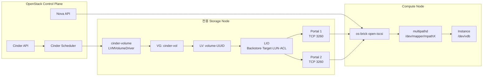
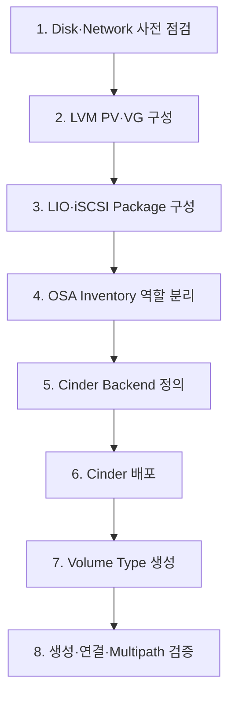
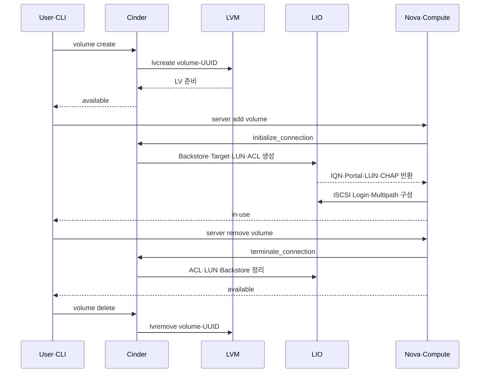
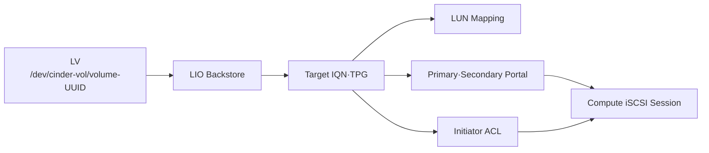
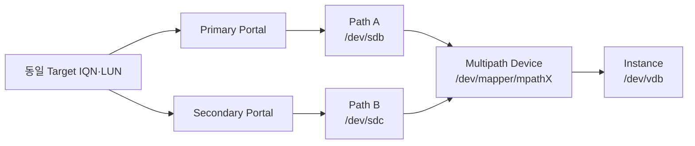

# 7. LVM iSCSI Cinder Backend

## 검증 목적

- 전용 Storage Node 기반 Cinder LVM Backend 구성
- LIO 기반 iSCSI Target 자동 생성·정리 구조 확인
- Primary·Secondary Portal 기반 Multipath 경로 적용
- Volume 생성·연결·해제·삭제 전체 생명주기 검증
- NFS·LVM MultiBackend의 독립 운영 구조 적용

## 핵심 결과

| 검증 항목 | 적용 내용 | 판정 기준 |
|---|---|---|
| Backend | LVM `cinder-vol`·LIO `lioadm` | `cinder-volume` Service `up` |
| Target | Backstore·Target·LUN·ACL 자동 구성 | `targetcli ls` Object 확인 |
| Network | iSCSI Portal 2개·TCP 3260 | 동일 IQN·LUN의 이중 Session 확인 |
| Compute | `open-iscsi`·`multipathd` | `/dev/mapper/mpathX` 생성 |
| Instance | Nova Volume Attach | VM 내부 Block Device 인식 |
| MultiBackend | `LVM_LIO_MP`·`NFS_VOLUME1` 분리 | Volume Type별 Backend 선택 |

## 원본 구성도


*OpenStack Cluster·LVM Storage Node·NFS Backend 구성*


*첨부 원본의 Management·External·iSCSI 이중 경로 구성*


*첨부 원본의 LIO Target Object와 Initiator 연결 구조*

## 논리 아키텍처



### 구성요소 역할

| 구성요소 | 역할 | 생성 시점 |
|---|---|---|
| LVM PV·VG | 물리 Disk와 Cinder 저장공간 Pool 구성 | Backend 준비 |
| Logical Volume | Cinder Volume별 Block Device 제공 | Volume 생성 |
| LIO Backstore | Logical Volume을 Target Object로 등록 | Volume 연결 |
| Target·TPG | IQN과 Portal Group 제공 | Volume 연결 |
| LUN | Backstore의 논리 번호 Mapping | Volume 연결 |
| ACL | Compute Initiator IQN 접근 허용 | Volume 연결 |
| Multipath Device | 동일 LUN의 복수 경로 통합 | Compute Login |

## 구축 흐름



## 1. 사전 점검

- Storage Data Disk와 OS Disk의 명확한 분리 필요
- Management·Storage·iSCSI Primary·Secondary Network 연결 필요
- Storage·Compute Node 간 TCP 3260 허용 필요
- 기존 Partition·Filesystem·LVM Signature 확인 필요
- Compute Node의 Initiator IQN 확인 필요

:::danger Disk 초기화 주의

`pvcreate` 대상 장치의 기존 데이터·Mount·운영 사용 여부 확인 필요.

:::

**실행 명령 — Disk·Network 상태 확인**

```bash title="Storage Node 사전 점검"
lsblk -f
pvs
vgs
lvs
ip -br address
ss -lntp | grep 3260
```

**실행 명령 — Compute Initiator 확인**

```bash title="Compute Node Initiator IQN 확인"
cat /etc/iscsi/initiatorname.iscsi
```

## 2. LVM Backend 구성

**실행 명령 — 필수 Package 설치**

```bash title="LVM Package 설치"
sudo apt-get update
sudo apt-get install -y \
  lvm2 \
  thin-provisioning-tools \
  parted
```

**실행 명령 — PV·VG 생성**

```bash title="Cinder Volume Group 생성"
sudo pvcreate /dev/vdb /dev/vdc /dev/vdd
sudo vgcreate cinder-vol /dev/vdb /dev/vdc /dev/vdd
```

- Cinder 전용 Volume Group `cinder-vol` 적용
- 환경별 실제 Data Disk 장치명 치환 필요
- VG Free Space와 Cinder Capacity Report 정합성 확인 필요

**실행 명령 — LVM 상태 검증**

```bash title="PV·VG·LV 확인"
sudo pvs
sudo vgs
sudo lvs -a -o +seg_monitor,data_percent,metadata_percent
```

## 3. LIO iSCSI 구성

### TGT·LIO 비교

| 항목 | TGT | LIO |
|---|---|---|
| 처리 위치 | User Space | Kernel Space |
| 관리 도구 | `tgtadm` | `targetcli` |
| Cinder Helper | `tgtadm` | `lioadm` |
| 적용 기준 | Legacy Target | Linux Kernel 표준 Target |

- Kernel 기반 LIO Target 적용
- Cinder LVM Driver의 `target_helper: lioadm` 적용
- TGT Service와 LIO의 Port 중복 사용 방지 필요

**실행 명령 — LIO Package 설치**

```bash title="LIO·iSCSI Package 설치"
sudo apt-get install -y \
  targetcli-fb \
  python3-rtslib-fb \
  open-iscsi \
  multipath-tools
```

**실행 명령 — Kernel·Target 상태 확인**

```bash title="LIO 상태 확인"
sudo modprobe target_core_mod
sudo modprobe iscsi_target_mod
sudo targetcli ls
sudo systemctl status rtslib-fb-targetctl
```

## 4. OpenStack-Ansible 배포 설정

중복된 Inventory·Backend YAML은 별도 설치 문서로 통합.

- Control·Compute 혼합 Node 3대와 Storage 전용 Node 1대 역할 분리
- `storage_hosts`에 전용 Storage Node 배치
- `NFS_VOLUME1`·`LVM_LIO_MP` 독립 Backend 적용
- Primary·Secondary iSCSI Portal 목록 적용
- Nova `volume_use_multipath: true` 적용
- 실제 IP·비밀번호·내부 Endpoint의 공개 문서 제외

[Deploy Config 상세 설치 가이드](./lvm-iscsi-deploy-config.md)

### 핵심 Backend 항목

```yaml title="LVM·LIO Backend 핵심 설정"
cinder_backends:
  lvm_lio_mp:
    volume_backend_name: LVM_LIO_MP
    volume_driver: cinder.volume.drivers.lvm.LVMVolumeDriver
    volume_group: cinder-vol
    target_helper: lioadm
    target_protocol: iscsi
    target_ip_address: <iscsi-primary-ip>
    target_secondary_ip_addresses:
      - <iscsi-secondary-ip>
    target_port: 3260
```

- `target_secondary_ip_addresses`의 YAML List 형식 적용
- Storage·Compute Node의 동일 iSCSI Network 접근성 확보 필요
- Cinder Role·Release별 변수명 지원 여부 사전 확인 필요

## 5. Volume 생명주기



### 단계별 동작

| 단계 | Cinder·LVM 동작 | LIO·Compute 동작 |
|---|---|---|
| 생성 | DB Row·Logical Volume 생성 | 개입 최소화 |
| 연결 | Connector IQN 기반 연결정보 생성 | Backstore·LUN·ACL·Portal 생성 |
| 사용 | Volume 상태 `in-use` | iSCSI Session·Multipath Device 유지 |
| 해제 | 연결정보 종료·상태 `available` | Session·ACL·LUN Mapping 정리 |
| 삭제 | Logical Volume 삭제 | 잔존 Object 정리 |

## 6. Volume 생성·연결

**실행 명령 — Volume Type 생성**

```bash title="LVM Backend 전용 Volume Type"
openstack volume type create lvm-iscsi
openstack volume type set lvm-iscsi \
  --property volume_backend_name=LVM_LIO_MP
```

**실행 명령 — Volume 생성**

```bash title="검증 Volume 생성"
openstack volume create \
  --size 10 \
  --type lvm-iscsi \
  lvm-iscsi-test

openstack volume show lvm-iscsi-test
```

**실행 명령 — Instance 연결**

```bash title="Instance에 Volume 연결"
openstack server add volume <SERVER_NAME> lvm-iscsi-test
openstack volume show lvm-iscsi-test
```

## 7. LVM·LIO Object 검증



**실행 명령 — Cinder Service·Pool 확인**

```bash title="Cinder Backend 확인"
openstack volume service list
openstack volume pool list --detail
```

**실행 명령 — Logical Volume 확인**

```bash title="Storage Node LVM 확인"
sudo lvs -o lv_name,vg_name,lv_size,lv_attr
```

**실행 명령 — LIO Object 확인**

```bash title="Target·LUN·ACL·Portal 확인"
sudo targetcli ls
sudo ss -lntp | grep 3260
```

- Cinder Volume별 Logical Volume 생성 확인
- LV와 LIO Backstore의 UUID Mapping 확인
- Target별 LUN·Initiator ACL 생성 확인
- 동일 Target의 Primary·Secondary Portal 확인

## 8. Compute Multipath 검증



**실행 명령 — Service 상태 확인**

```bash title="Compute iSCSI·Multipath Service"
systemctl status open-iscsi
systemctl status multipathd
```

**실행 명령 — iSCSI Session 확인**

```bash title="이중 Portal Session 확인"
sudo iscsiadm -m session
sudo iscsiadm -m session -P 3
```

**실행 명령 — Multipath 확인**

```bash title="Multipath Device·경로 확인"
sudo multipath -ll
lsblk
ls -l /dev/disk/by-path/ | grep iscsi
```

### 판정 기준

- 동일 Target IQN·LUN의 서로 다른 Portal Session 2개 이상 확인
- 하나의 WWID 아래 `active ready running` Path 2개 이상 확인
- `/dev/mapper/mpathX` Device 생성 확인
- 특정 Path 차단 시 잔여 Path 기반 I/O 유지 확인 필요

## 9. Instance 연결 검증

**실행 명령 — Instance Host 확인**

```bash title="Instance 배치 Compute 확인"
openstack server show <SERVER_NAME> \
  -c OS-EXT-SRV-ATTR:host \
  -f value
```

**실행 명령 — Hypervisor Block Mapping 확인**

```bash title="Compute Node Libvirt 확인"
virsh list
virsh domblklist <INSTANCE_NAME>
```

**실행 명령 — Guest Disk 확인**

```bash title="Instance 내부 확인"
lsblk
sudo fdisk -l /dev/vdb
```

- Hypervisor의 Multipath Device와 VM Block Device Mapping 확인
- VM 내부 `/dev/vdb` 정상 인식 확인
- Read·Write 시험과 연결 해제 후 상태 복구 확인 필요

## 장애 확인

| 증상 | 주요 원인 | 확인·조치 |
|---|---|---|
| LVM Service `down` | `cinder-vol` 부재·비활성 | `vgs`·`lvs` 확인 후 VG 활성화 |
| LIO Export 실패 | `lioadm`·Kernel Module 부재 | Package·Module·`targetcli ls` 확인 |
| TCP 3260 미수신 | Portal IP·Firewall 오류 | `ss`·Routing·보안정책 확인 |
| 단일 iSCSI Session | Secondary Portal 설정 부재 | Backend List·Network 경로 수정 |
| Multipath Device 부재 | `multipathd` 비활성·WWID 불일치 | Service·`multipath -ll` 확인 |
| Instance Attach 실패 | ACL·CHAP·Initiator IQN 불일치 | Cinder Log·LIO ACL 확인 |
| NFS만 선택 | Volume Type Extra Spec 오류 | `volume_backend_name` 정합성 수정 |
| Detach 후 Object 잔존 | Session·Cinder DB 불일치 | 사용 여부 확인 후 안전한 정리 필요 |

## 검증 체크리스트

- [ ] `cinder-volume` Service `enabled·up` 확인
- [ ] `LVM_LIO_MP` Pool 노출 확인
- [ ] `cinder-vol` 내부 Logical Volume 생성 확인
- [ ] LIO Backstore·Target·LUN·ACL 생성 확인
- [ ] Primary·Secondary Portal의 동일 IQN 확인
- [ ] Compute iSCSI Session 2개 이상 확인
- [ ] `/dev/mapper/mpathX` 생성 확인
- [ ] Instance 내부 Block Device 인식 확인
- [ ] Volume Detach 후 Session·Mapping 정리 확인
- [ ] Volume Delete 후 LV·LIO Object 정리 확인

## 정리

- 전용 Storage Node의 LVM Block Storage 구성 적용
- Kernel 기반 LIO iSCSI Target 자동화 적용
- Cinder의 LV·Backstore·LUN·ACL 생명주기 관리 확인
- Primary·Secondary Portal 기반 Multipath 구성 적용
- Volume Type 기반 LVM·NFS Backend 분리 적용
- 단일 Storage Node 장애에 대한 별도 HA 설계 필요

## 참고 자료

- [OpenStack Cinder LVM Volume Driver](https://docs.openstack.org/cinder/latest/configuration/block-storage/drivers/lvm-volume-driver.html)
- [targetcli-fb](https://github.com/open-iscsi/targetcli-fb)
- [rtslib-fb](https://github.com/open-iscsi/rtslib-fb)
- [Debian LIO](https://wiki.debian.org/iSCSI/LIO)
