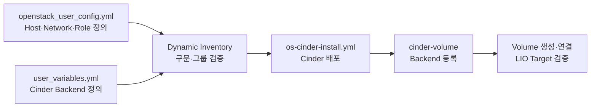

# Deploy Config

## 구성 목적

- OpenStack-Ansible Inventory 기반 Control·Storage 역할 분리
- 전용 Storage Node의 LVM·LIO iSCSI Backend 배치
- NFS·LVM MultiBackend 동시 운영 설정 적용
- Bare Metal 직접 배포 방식의 `no_containers: true` 적용
- 실제 IP·인증 정보의 환경별 치환 필요

## 배포 흐름



## 1. 사전 준비

- Storage Node의 Management·iSCSI Primary·Secondary IP 확보 필요
- Cinder용 Block Device·Volume Group `cinder-vol` 구성 필요
- Storage·Compute Node 간 TCP 3260 통신 허용 필요
- 기존 `/etc/openstack_deploy` 설정 파일 백업 필요
- 설정 파일 내 Password·Endpoint·내부 IP의 외부 공개 방지 필요

```bash title="설정 파일 백업"
cp -a /etc/openstack_deploy/openstack_user_config.yml \
  /etc/openstack_deploy/openstack_user_config.yml.bak

cp -a /etc/openstack_deploy/user_variables.yml \
  /etc/openstack_deploy/user_variables.yml.bak
```

## 2. Host·Role 설정

**적용 파일:** `/etc/openstack_deploy/openstack_user_config.yml`

```yaml title="Host Group 구성 예시"
_cluster_node1: &cluster_node1
  control-compute01:
    ip: <management-ip-1>
_cluster_node2: &cluster_node2
  control-compute02:
    ip: <management-ip-2>
_cluster_node3: &cluster_node3
  control-compute03:
    ip: <management-ip-3>

_storage_node1: &storage_node1
  storage01:
    ip: <storage-management-ip>

_cluster_nodes: &cluster_nodes
  <<: *cluster_node1
  <<: *cluster_node2
  <<: *cluster_node3

compute_hosts:
  <<: *cluster_nodes

storage-infra_hosts:
  <<: *cluster_nodes

storage_hosts:
  <<: *storage_node1

image_hosts:
  <<: *cluster_nodes
```

- `storage-infra_hosts`의 Cinder API·Scheduler 역할 배치
- `storage_hosts`의 전용 `cinder-volume` 역할 배치
- Control·Compute 혼합 3 Node와 Storage 전용 1 Node 구조 적용
- LVM Device 부재 Control Node의 Volume Backend 실행 방지
- 실제 Host Name·Management IP 기준 치환 필요

## 3. Network 설정

```yaml title="Network 정의 예시"
cidr_networks:
  management: <management-cidr>
  tunnel: <geneve-cidr>
  storage: <storage-cidr>

global_overrides:
  no_containers: true
  management_bridge: br-mgmt
  provider_networks:
    - network:
        container_bridge: br-mgmt
        container_type: veth
        container_interface: eth1
        ip_from_q: management
        type: raw
        group_binds:
          - all_containers
          - hosts
        is_management_address: true

    - network:
        container_bridge: br-vxlan
        container_type: veth
        container_interface: eth10
        ip_from_q: tunnel
        type: geneve
        range: 1:1000
        net_name: vxlan
        group_binds:
          - neutron_ovn_controller

    - network:
        container_bridge: br-ext
        container_type: veth
        container_interface: eth2
        ip_from_q: storage
        type: raw
        group_binds:
          - glance_api
          - cinder_api
          - cinder_volume
          - nova_compute
```

- Management Network의 Container·Host 통신 경로 적용
- `br-vxlan` 기반 OVN Geneve Tunnel Network 적용
- `br-ext` 기반 Storage Service Network 적용
- Storage Network의 Cinder·Nova·Glance 통신 경로 적용
- iSCSI 전용망 사용 시 Storage Node와 Compute Node의 동일 L2·Routing 연결 필요
- 실제 Bridge·Interface·CIDR 구조 기준 조정 필요

## 4. Cinder Backend 설정

**적용 파일:** `/etc/openstack_deploy/user_variables.yml`

```yaml title="LVM·NFS MultiBackend 설정"
cinder_backends:
  nfs_volume:
    volume_backend_name: NFS_VOLUME1
    volume_driver: cinder.volume.drivers.nfs.NfsDriver
    nfs_mount_options: rsize=65535,wsize=65535,timeo=1200,actimeo=120
    nfs_shares_config: /etc/cinder/nfs_shares
    shares:
      - ip: <nfs-server-ip>
        share: /export/nfs
    nfs_snapshot_support: "True"
    nas_secure_file_operations: "False"
    nas_secure_file_permissions: "False"

  lvm_lio_mp:
    volume_backend_name: LVM_LIO_MP
    volume_driver: cinder.volume.drivers.lvm.LVMVolumeDriver
    volume_group: cinder-vol
    target_helper: lioadm
    target_protocol: iscsi
    target_ip_address: <iscsi-primary-ip>
    target_secondary_ip_addresses:
      - <iscsi-secondary-ip>
    target_port: 3260

cinder_cinder_conf_overrides:
  DEFAULT:
    glance_api_insecure: False
    auth_strategy: keystone
    nas_secure_file_operations: auto
    nas_secure_file_permissions: auto
    backup_share: <nfs-server-ip>:/export/nfs
  key_manager:
    api_class: castellan.key_manager.barbican_key_manager.BarbicanKeyManager

cinder_service_backup_program_enabled: True
cinder_service_backup_driver: cinder.backup.drivers.nfs.NFSBackupDriver

cinder_enabled_backends:
  - nfs_volume
  - lvm_lio_mp

cinder_target_helper_mapping:
  Debian: lioadm
  RedHat: lioadm

cinder_target_helper: lioadm
cinder_target_protocol: iscsi
```

- LVM Driver의 Volume Group `cinder-vol` 연결 적용
- Kernel 기반 LIO Target Helper `lioadm` 적용
- Primary·Secondary iSCSI Portal 구성 적용
- NFS Volume·Backup Share 동시 활용 적용
- Barbican 기반 Cinder Key Manager 적용
- `target_secondary_ip_addresses`의 YAML 목록 형식 적용
- LVM·NFS의 독립 `volume_backend_name` 적용
- NFS Backend 미사용 시 관련 Backend·Share 설정 제거 필요

### Volume Type 연결

```bash title="Backend별 Volume Type 생성"
openstack volume type create lvm-iscsi
openstack volume type set \
  --property volume_backend_name=LVM_LIO_MP \
  lvm-iscsi

openstack volume type create nfs-volume
openstack volume type set \
  --property volume_backend_name=NFS_VOLUME1 \
  nfs-volume
```

- `lvm-iscsi` Type의 LVM Backend 고정 적용
- `nfs-volume` Type의 NFS Backend 고정 적용
- 동일 Backend Name 기반 자동 가중치 방식 부재

## 5. Nova Multipath 설정

```yaml title="/etc/openstack_deploy/user_variables.yml"
nova_nova_conf_overrides:
  libvirt:
    volume_use_multipath: True
```

- Instance Volume 연결 시 libvirt Multipath 사용 적용
- Compute Node별 `open-iscsi`·`multipath-tools` 설치 필요
- Primary·Secondary iSCSI Network의 독립 경로 구성 필요

## 6. LIO·iSCSI Package 준비

```bash title="Storage Node"
apt-get update
apt-get install -y targetcli-fb python3-rtslib-fb open-iscsi

modprobe target_core_mod
modprobe iscsi_target_mod
targetcli ls
```

```bash title="Compute Node"
apt-get update
apt-get install -y open-iscsi multipath-tools

systemctl enable --now iscsid
systemctl enable --now multipathd
```

- Storage Node의 LIO Kernel Module·ConfigFS 활성화 필요
- Compute Node의 iSCSI Initiator·Multipath Service 활성화 필요
- TGT와 LIO의 TCP 3260 동시 점유 방지 필요

## 7. 설정 검증

```bash title="YAML·Inventory 검증"
python3 - <<'PY'
import yaml

for path in (
    "/etc/openstack_deploy/openstack_user_config.yml",
    "/etc/openstack_deploy/user_variables.yml",
):
    with open(path, encoding="utf-8") as stream:
        yaml.safe_load(stream)
    print(f"YAML OK: {path}")
PY

cd /opt/openstack-ansible/playbooks
openstack-ansible-inventory --check
```

- YAML 들여쓰기·중복 Key 오류 부재 확인
- `storage_hosts`의 전용 Storage Node 포함 확인
- `storage-infra_hosts`의 Control Node 포함 확인
- 실제 Network Queue·Provider Network 정의와의 일치 확인 필요

## 8. Cinder 배포

```bash title="Cinder Playbook 실행"
cd /opt/openstack-ansible/playbooks
openstack-ansible os-cinder-install.yml
```

- Inventory 검증 완료 후 Cinder Playbook 실행
- 실패 시 최초 Error Task·대상 Host 중심 원인 확인 필요
- 전체 재배포 전 실패 Task의 Package·Network·Variable 상태 확인 필요

## 9. 배포 결과 검증

```bash title="Cinder Service·Pool 확인"
openstack volume service list
cinder get-pools --detail
```

```bash title="LVM·LIO 상태 확인"
vgs cinder-vol
lvs
targetcli ls
ss -lntp | grep ':3260'
```

```bash title="Volume 생성 검증"
openstack volume create \
  --type lvm-iscsi \
  --size 1 \
  lvm-iscsi-deploy-test

openstack volume show lvm-iscsi-deploy-test
```

- `storage01@lvm_lio_mp` Service의 `enabled·up` 확인
- `LVM_LIO_MP`·`NFS_VOLUME1` Pool의 독립 노출 확인
- 신규 Volume의 LVM Backend 선택 확인
- Instance 연결 후 iSCSI Session·Multipath 경로 확인 필요

## 10. 장애 확인 기준

| 증상 | 확인 항목 | 조치 기준 |
|---|---|---|
| LVM Backend 미등록 | `storage_hosts`·`cinder_enabled_backends` | Inventory·Backend Name 정합성 수정 |
| Volume 생성 실패 | `cinder-vol`·Thin Pool·용량 | VG·Thin Pool 상태 복구 |
| iSCSI 연결 실패 | Portal IP·TCP 3260·LIO Target | Network·Firewall·LIO 상태 수정 |
| Secondary Portal 미반영 | 변수 렌더링 결과 | YAML 목록·`cinder.conf` 확인 |
| 의도와 다른 Backend 선택 | Volume Type Extra Spec | `volume_backend_name` 정합성 수정 |
| Multipath 단일 경로 | Compute NIC·Route·Portal | Secondary Network 경로 보완 |

## 완료 기준

- OSA Inventory의 Control·Storage 역할 분리 적용
- LVM·LIO Backend Service의 `enabled·up` 상태 확인
- LVM Volume 생성·iSCSI Export·Instance 연결 성공
- Primary·Secondary Portal 기반 Multipath 경로 확인
- Volume Type 기반 NFS·LVM Backend 선택 확인
