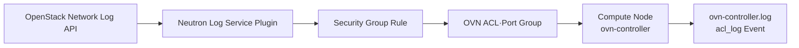

# 5. Security Group Logging 방법

## 목적

- Neutron Security Group의 Packet ACCEPT·DROP Event 수집
- ML2/OVN 환경의 ACL Log 생성과 Compute Node별 기록 확인
- Resource 범위·Event 유형·Rate Limit 기반 로그량 제어
- 운영 환경의 성능·보관·검색 기준 정립

## 동작 구조



- Neutron Packet Logging Service Plugin 기반 Packet Event 수집
- ML2/OVN의 Security Group Rule과 OVN ACL 간 Mapping 적용
- Security Group 소속 Port를 포함하는 OVN Port Group 기반 정책 적용
- 실제 Traffic 처리 Compute Node의 `ovn-controller` 기반 Log 기록

## Driver별 지원 범위

| 항목 | ML2/OVN | ML2/OVS |
|---|---|---|
| Security Group Logging | Wallaby 이후 지원 | Rocky 이후 지원 |
| Firewall Group Logging | 미지원 | 지원 |
| 개별 Port `--target` | 미사용 | 사용 가능 |
| 기본 Log 위치 | Compute Node별 `ovn-controller.log` | System Journal 또는 지정 경로 |
| Agent Extension | 별도 `log` Extension 설정 부재 | OVS Agent의 `log` Extension 필요 |

- 실제 환경의 ML2 Driver 확인 후 설정 구분 필요
- `openstack network loggable resources list` 기반 지원 Resource 확인 필요

## ML2/OVN 설정

### Neutron Log Service Plugin 활성화

```ini title="/etc/neutron/neutron.conf"
[DEFAULT]
service_plugins = router,metering,log
```

- 기존 `service_plugins` 값 유지 후 `log` 추가 적용
- 설정 반영을 위한 `neutron-server` 재기동 필요

### Log Rate Limit 설정

```ini title="/etc/neutron/plugins/ml2/ml2_conf.ini"
[network_log]
rate_limit = 150
burst_limit = 50
```

- `rate_limit`의 초당 OVN Controller 전송 Packet Log 제한 적용
- `burst_limit`의 단시간 추가 Log 허용량 적용
- `rate_limit` 최소값 100 적용
- `burst_limit` 최소값 25 적용
- 값 미설정 시 과도한 Packet Log 생성 가능

```bash title="OVN Meter Band 확인"
ovn-nbctl list meter-band
```

- Log Object 1개 이상 생성 후 Meter Band Record 확인 가능

## ML2/OVS 설정

### Agent Extension 활성화

```ini title="Controller Node의 ml2_conf.ini"
[agent]
extensions = log
```

```ini title="Compute·Network Node의 openvswitch_agent.ini"
[agent]
extensions = log

[network_log]
rate_limit = 100
burst_limit = 25
# local_output_log_base = /var/log/neutron/network-log
```

- OVS Agent 기반 Security Group Logging Extension 적용
- `local_output_log_base` 미설정 시 System Journal 기록 적용
- Firewall Group Logging 사용 시 L3 Agent의 `fwaas_v2_log` Extension 필요

## 지원 Resource 확인

```bash
openstack network loggable resources list
```

```text title="출력 예시"
+-----------------+
| Supported types |
+-----------------+
| security_group  |
+-----------------+
```

- ML2 Driver·설치 Plugin에 따른 지원 Resource 차이 존재
- 명령 출력에 `security_group` 부재 시 Service Plugin·Driver 설정 재확인 필요

## Log Object 생성

### 특정 Security Group의 전체 Event

```bash
openstack network log create sg-log \
  --resource-type security_group \
  --resource <security-group-id> \
  --event ALL
```

### ACCEPT Event만 수집

```bash
openstack network log create sg-accept-log \
  --resource-type security_group \
  --resource <security-group-id> \
  --event ACCEPT
```

### DROP Event만 수집

```bash
openstack network log create sg-drop-log \
  --resource-type security_group \
  --resource <security-group-id> \
  --event DROP
```

- `--resource` 미지정 시 전체 Security Group 대상 적용 가능
- `--event` 미지정 시 `ALL` 적용
- Resource·Target 미지정 시 대규모 Log Event 생성 위험
- 운영 환경의 특정 Security Group 지정 적용 권장

### ML2/OVS의 특정 Port 지정

```bash
openstack network log create port-sg-log \
  --resource-type security_group \
  --resource <security-group-id> \
  --target <port-id> \
  --event ALL
```

- ML2/OVS 환경의 Resource·Target 조합 적용 가능
- ML2/OVN 환경의 개별 Port `--target` 미사용

## Log Object 관리

```bash title="목록·상세 확인"
openstack network log list
openstack network log show <log-name-or-id>
```

```bash title="활성화·비활성화"
openstack network log set --disable <log-name-or-id>
openstack network log set --enable <log-name-or-id>
```

```bash title="삭제"
openstack network log delete <log-name-or-id>
```

- Log Object 생성 시 기본 활성화 적용
- 동일 Resource 대상 Log Object가 복수인 경우 하나 이상 활성화 시 기록 지속
- 시험 종료 후 비활성화·삭제를 통한 불필요한 Log 생성 차단 필요

## ML2/OVN Log 확인

```bash title="Compute Node별 ACL Log 확인"
journalctl -u ovn-controller --since "10 minutes ago"
```

```bash title="File 기반 배포의 ACL Log 확인"
grep "acl_log" /var/log/ovn/ovn-controller.log
```

```text title="Log 형식 예시"
acl_log(ovn_pinctrl0)|INFO|
name="neutron-<log-object-id>",
verdict=drop,
severity=info,
direction=to-lport:
icmp,
nw_src=<source-ip>,
nw_dst=<destination-ip>,
icmp_type=8,
icmp_code=0
```

- `name`의 Neutron Log Object 식별자 확인
- `verdict`의 `allow`·`drop` 판정 확인
- `direction`의 `from-lport`·`to-lport` 방향 확인
- MAC·IP·Protocol·Port 등 L2·L3·L4 정보 확인
- Traffic을 처리하는 Compute Node별 Log File 분산 발생
- 중앙 수집을 위한 Log Pipeline 구성 필요

## ACCEPT·DROP Event 특성

- DROP 대상 Session의 차단 Packet Event 기록 적용
- ACCEPT 대상의 신규 Session 중심 Event 기록 적용
- North-South Session의 단일 ACCEPT Event 발생 가능
- East-West 허용 Session의 송신·수신 관점 ACCEPT Event 발생 가능
- 송신 허용·수신 차단 시 ACCEPT·DROP Event 동시 발생 가능

## ML2/OVN 주요 제약

- OVN의 Drop Traffic용 단일 집계 ACL 구조 적용
- 특정 Security Group의 DROP Logging 선택 시 전체 Security Group DROP Traffic 기록 가능
- `ALL` 선택 시 지정 Security Group의 ACCEPT와 전체 Security Group의 DROP 기록 가능
- ACL 단위보다 작은 개별 Port Logging 단위 부재
- Router·VPC 간 정책의 Security Group만을 통한 제어 한계 존재
- VPC 간 Firewall·Logging 요구 시 Router ACL·Firewall Service 별도 검토 필요

## 운영 고려사항

- Packet 단위 Logging에 따른 Log Volume 급증 가능
- ACCEPT·DROP 동시 수집 시 Compute Node I/O와 CPU 부담 증가 가능
- `rate_limit`·`burst_limit` 기반 수집량 제한 필요
- Log Rotation·보존 기간·압축·중앙 수집 정책 필요
- Log Object별 소유 Project와 관리자 권한 정책 확인 필요
- 기본 Policy에서 일반 Project의 Log Object 관리 권한 부재 가능
- Tenant 자체 관리 허용 시 `policy.yaml` 변경과 권한 검토 필요

## 검증 절차

1. `log` Service Plugin 활성화 확인
2. ML2 Driver별 Agent·Rate Limit 설정 확인
3. 지원 가능한 Loggable Resource 확인
4. 특정 Security Group의 `ACCEPT`·`DROP` Log Object 생성
5. 허용·차단 Traffic 생성
6. Traffic 처리 Compute Node의 ACL Log 확인
7. Log Object ID·판정·방향·Protocol·주소 정보 비교
8. 시험 종료 후 Log Object 비활성화·삭제

## 확인 결과

- Security Group 기준 ACCEPT·DROP Packet Event 확인 가능
- ML2/OVN의 Compute Node별 `ovn-controller.log` 기록 적용
- Security Group Rule과 OVN ACL 간 Mapping 확인 가능
- 개별 Port `--target` 기반 OVN Logging 기능 부재
- OVN Drop ACL 집계 구조에 따른 Resource 범위 확대 가능
- Packet Logging 활성화에 따른 성능·저장공간 영향 검증 필요
- VPC·Router 구간 Logging을 위한 별도 Network Policy 검토 필요
- 운영 적용 전 Rate Limit·보존·중앙 수집 정책 수립 필요

## 참고 문서

- [OpenStack Neutron 최신 Packet Logging Framework](https://docs.openstack.org/neutron/latest/admin/config-logging.html)
- [OpenStack Neutron 2023.1 Packet Logging Framework](https://docs.openstack.org/neutron/2023.1/admin/config-logging.html)

