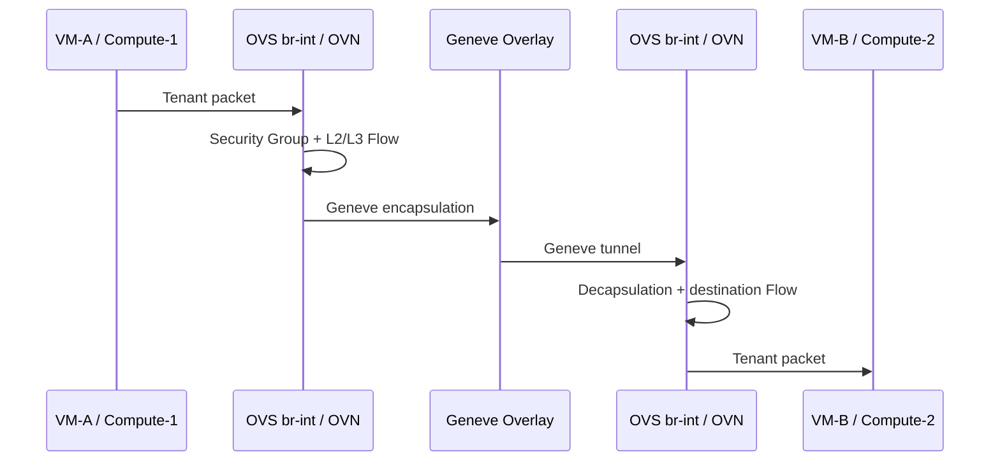
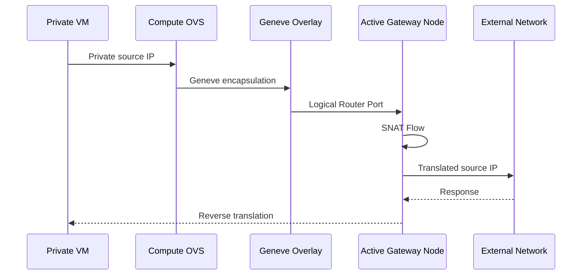
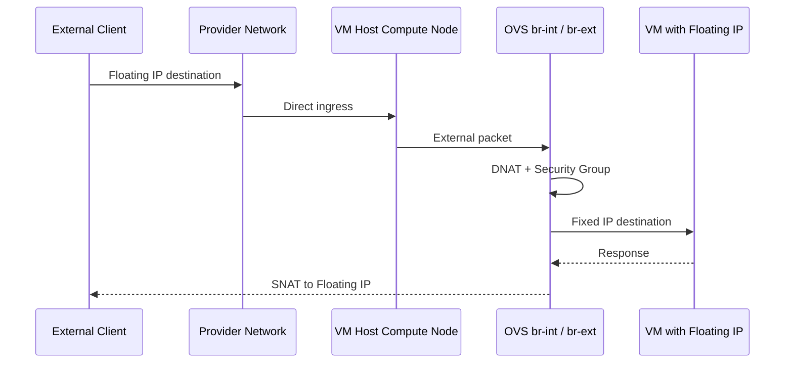
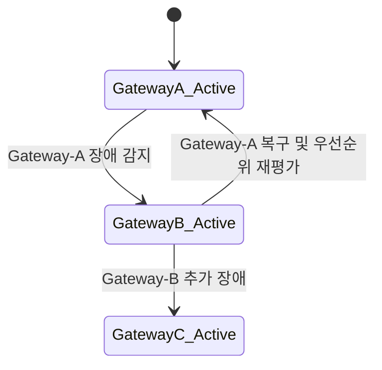

# 트래픽 흐름

## East-West: 분산 라우팅

동일 Subnet과 다른 Subnet의 VM 통신은 Network/Gateway Node를 거치지 않고 Compute Node의 `br-int`와 OVN Flow에서 처리

**효과:** 중앙 Gateway 병목 없이 Compute 수와 함께 East-West 처리 용량 확장 가능

## North-South: 일반 SNAT

Private Subnet의 인터넷 트래픽은 전용 Gateway Node에서 SNAT 처리

**효과:** Controller Node에서 사용자 트래픽을 분리

**제약:** SNAT은 Gateway에 집중되므로 NIC 수, 대역폭, 장애 시 잔여 용량을 기준으로 수용량을 산정 필요

## North-South: Distributed Floating IP

Floating IP가 할당된 VM은 해당 VM이 실행 중인 Compute Node에서 DNAT/SNAT가 처리

**효과:** Gateway Node를 우회하고 Compute의 LACP 경로를 활용해 높은 합산 처리량 확보

## Gateway HA

각 Logical Router는 여러 Gateway Chassis에 우선순위를 갖습니다. Active Gateway가 중단되면 BFD 상태를 기반으로 다음 Gateway가 역할을 인계

